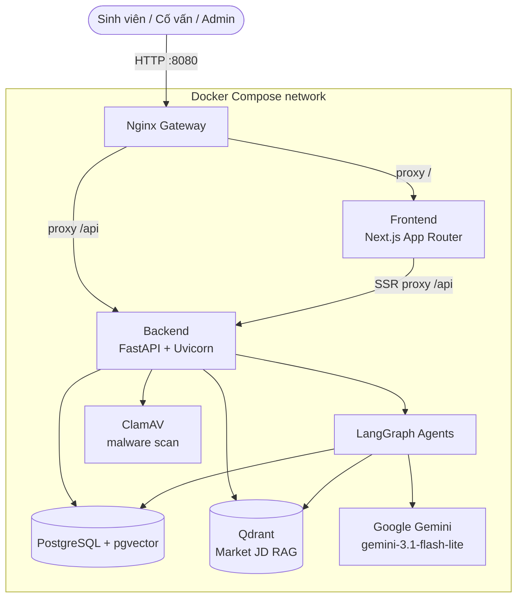
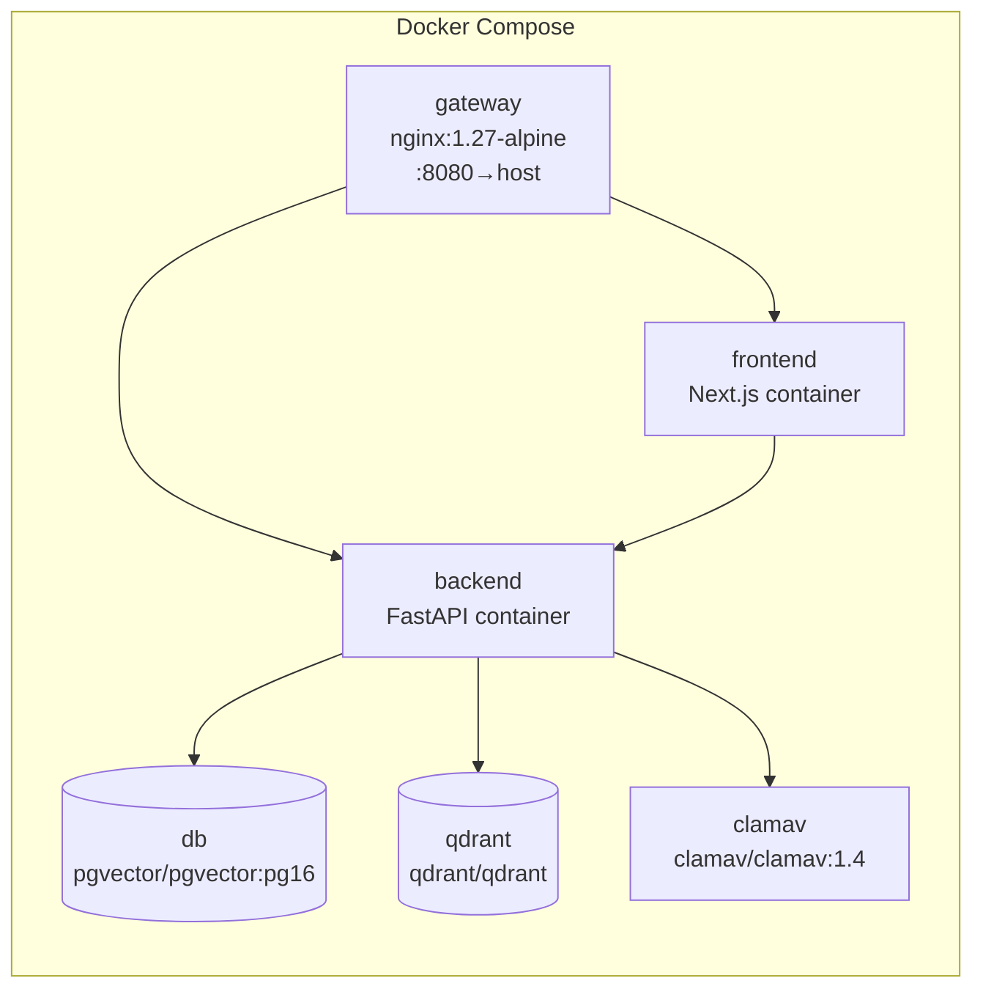

# Architecture Document — Career Assistant X (P-041)

## System Overview

Career Assistant X là web app 2 tầng (Next.js frontend + FastAPI backend) đứng sau một Nginx Gateway duy nhất, dùng LangGraph để orchestrate 4 AI agent (CV Parser, Gap Analysis, Mock Interview, Career Assistant "Nova") chạy trên Google Gemini. Toàn bộ gợi ý AI liên quan tới nội dung CV/phỏng vấn đều đi qua evidence guardrail (chỉ dùng dữ liệu sinh viên đã cung cấp, không bịa đặt) và yêu cầu sinh viên Accept/Reject (HITL) trước khi áp dụng.

## Architecture Diagram

## Components

### 1. Frontend (Next.js)
- **Purpose:** UI cho 3 vai trò (Sinh viên / Cố vấn / Admin), gồm upload CV, chọn JD, xem Gap Analysis, phòng phỏng vấn thử, dashboard cố vấn, chatbot Nova.
- **Stack:** Next.js 15 (App Router), React 18, TypeScript, Tailwind CSS; phần tương tác chính nằm ở `src/frontend/app.js` bên cạnh các route trong `src/frontend/app/`.
- **Giao tiếp backend:** gọi REST API qua Nginx Gateway; khi chạy trong Docker, frontend proxy `/api` thẳng tới `backend:8000`.

### 2. Backend (FastAPI)
- **Purpose:** REST API server, điều phối agent, quản lý dữ liệu.
- **API Design:** RESTful, namespace `/api/v1/`, chia theo domain trong `src/api/v1/`: `auth`, `cvs`, `jds`, `jobs`, `analysis`, `matches`, `interviews`, `assistant`, `candidates`, `counselor`, `enterprise`, `admin`, `metrics`.
- **Authentication:** JWT (PyJWT) + bcrypt password hashing (`src/core/security.py`), token có `ver` (jwt_token_version) để hỗ trợ revoke hàng loạt; hỗ trợ thêm Google OAuth (`google-auth`). `ApiProtectionMiddleware` (`src/middleware/security.py`) chặn ở tầng middleware trước khi vào route handler.
- **File security:** mọi CV upload bị quét qua ClamAV (`src/services/file_security.py`, biến `MALWARE_SCAN_MODE=required` trong Docker).

### 3. AI Agents (LangGraph)
Mỗi agent là một `StateGraph` riêng trong `src/agents/`, không dùng chung 1 graph tổng — mỗi agent có state schema và chuỗi node riêng (`src/agents/state.py`).

#### 3.1 CVParserAgent (`cv_parser_agent.py`)
- **State:** `CVParserAgentState`
- **Nodes:** `validate_input` → `extract_local_evidence` → `llm_structured_parse` → `evidence_guardrail` → `ats_quality_gate`
- **Vai trò:** bóc tách CV thô (PDF/DOCX) thành JSON có cấu trúc (học vấn/kỹ năng/kinh nghiệm/dự án), guardrail kiểm tra bằng chứng trước khi coi là hợp lệ.

#### 3.2 GapAnalysisAgent (`gap_analysis_agent.py`)
- **State:** `GapAnalysisState`
- **Nodes:** `validate_input` → `extract_evidence` → `draft_analysis` → `integrity_guardrail`
- **Vai trò:** so khớp CV đã parse với JD, sinh Gap Analysis + gợi ý tối ưu; `integrity_guardrail` đảm bảo không tự thêm skill/kinh nghiệm ngoài evidence.

#### 3.3 InterviewAgent (`interview_agent.py`)
- **State:** `InterviewAgentState`
- **Nodes:** `validate_input` → `generate_questions` → `guard_questions` → `evaluate_answer` → `generate_report`
- **Vai trò:** sinh 5–7 câu hỏi theo CV+JD, hỏi follow-up khi câu trả lời thiếu ý, chấm rubric STAR, xuất báo cáo.

#### 3.4 CareerAssistantAgent — "Nova" (`career_assistant_agent.py`)
- **State:** `CareerAssistantState`
- **Nodes:** `plan` → (`weather` | `datetime` | `respond` | `orchestrate`)
- **Vai trò:** chatbot hội thoại, trả lời dựa trên CV/JD của sinh viên đang đăng nhập, có tool tra thời tiết/thời gian và orchestration để gọi các agent khác khi cần.

> Ghi chú: `src/agents/graph.py` + `src/agents/nodes/example_node.py` là boilerplate mẫu còn sót lại từ template gốc, không được 4 agent thật ở trên sử dụng.

### 4. Database (PostgreSQL + pgvector)
- **Migrations:** Alembic.
- **Nhóm bảng chính** (`src/db/models.py`):
  - **Người dùng & auth:** `users`, `password_reset_otps`
  - **CV/JD gốc:** `cvs`, `job_descriptions`, `cv_analyses`
  - **CV–JD Matching pipeline (evidence-based, có trace đầy đủ):** `matches` (MatchRun), `cv_chunks`, `jd_requirements`, `retrieval_results`, `evidences`, `criterion_evaluations`, `rubrics`, `rubric_criteria`, `match_results`
  - **Hồ sơ CV có cấu trúc:** `cv_profiles`, `cv_experiences`, `cv_projects`, `cv_skills`, `cv_education`, `cv_certifications`, `cv_languages`
  - **Phỏng vấn:** `interview_sessions`, `interview_questions`, `interview_reports`, `interview_feedback`
  - **Chatbot Nova:** `chat_conversations`, `chat_messages`
  - **HITL / cố vấn:** `counselor_assignments`, `counselor_feedback`, `cv_optimization_decisions`
  - **Doanh nghiệp (Phase 2) & khác:** `candidates`, `jobs`, `documents`, `job_applications`
  - **Audit & vận hành:** `ai_audit_logs`, `usage_events`

### 5. Vector Store (Qdrant)
- **Embeddings:** Gemini Embedding (`src/services/job_rag.py`), fallback offline hashing nếu thiếu `GEMINI_API_KEY`.
- **Purpose:** RAG cho ~98 JD thị trường mẫu (`data/jds`) — đồng bộ tự động lúc backend khởi động, hoặc thủ công qua `python -m scripts.index_market_jds` / endpoint admin `POST /api/v1/jobs/rag/sync`. Nếu Qdrant/embedding lỗi, API tự fallback sang tìm kiếm theo catalog (`src/services/job_catalog.py`) để không mất chức năng tìm việc theo từ khóa.

### 6. CV–JD Matching Pipeline (`src/services/cv_jd_pipeline.py`, `cv_jd_matching.py`, `match_persistence.py`)
Pipeline riêng, tách khỏi 4 agent ở trên, dùng cho tính năng Match Score chi tiết có evidence trace:
1. BM25 (keyword) + Vector search (semantic, Gemini embedding) trên CV chunks
2. RRF (Reciprocal Rank Fusion) gộp kết quả 2 nhánh
3. Evidence classification: `SUPPORTED / PARTIALLY_SUPPORTED / NOT_FOUND / CONFLICTING / UNCERTAIN`
4. Skill match classification: `EXACT_MATCH / NORMALIZED_MATCH / SEMANTIC_MATCH / PARTIAL_MATCH / NOT_FOUND`
5. Rubric scoring có trọng số cấu hình được (mặc định 35/30/10/10/15), validate tổng trọng số = 100%
6. Lưu full trace từ Final Score → criterion → evidence → CV chunk/trang nguồn (`match_persistence.py`)

Đặc tả chi tiết: [`docs/pipeline/Phrase_2/CV_JD.md`](docs/pipeline/Phrase_2/CV_JD.md) và các file `docs/pipeline/Pipeline_*_Implementation_Ready.md`.

## Data Flow

**Gap Analysis:**
1. Sinh viên upload CV → `CVParserAgent` bóc tách + guardrail evidence
2. Sinh viên chọn JD (thư viện hoặc dán JD ngoài)
3. `GapAnalysisAgent` so khớp CV↔JD, sinh gợi ý có integrity guardrail
4. Sinh viên Accept/Reject từng gợi ý (HITL) → lưu `cv_optimization_decisions`
5. (song song) pipeline BM25+Vector+RRF+Rubric tính Match Score chi tiết, lưu trace vào `matches`/`evidences`/`criterion_evaluations`

**Mock Interview:**
1. Sinh viên chọn 1 CV + 1 JD → `InterviewAgent.generate_questions` (5–7 câu, guard qua `guard_questions`)
2. Vòng lặp hỏi–đáp, `evaluate_answer` quyết định có cần follow-up không
3. Hết câu hỏi → `generate_report` chấm STAR (Situation/Task/Action/Result), lưu `interview_reports`

**Cố vấn (HITL Dashboard):**
1. Cố vấn xem sinh viên đã cấp quyền (`counselor_assignments`)
2. Đọc tiến độ CV + lịch sử phỏng vấn, gửi `counselor_feedback`

## Deployment Architecture

6 service, chỉ `gateway` publish port ra host (`8080`); `frontend`/`backend` chỉ expose nội bộ mạng Docker. Volumes bền vững: `postgres_data`, `qdrant_data`, `clamav_data`, `app_uploads`.

## Security

- API keys/secrets qua `.env` (không hardcode); `docker-compose.yml` set `APP_ENV=production` cho backend nên bắt buộc `SECRET_KEY` và `INITIAL_ADMIN_PASSWORD` không có default an toàn.
- Auth: JWT (PyJWT) ký bằng `SECRET_KEY`, mật khẩu hash bằng bcrypt, hỗ trợ token version để revoke hàng loạt; `ApiProtectionMiddleware` chặn ở tầng middleware.
- Input validation qua Pydantic (`src/models/schemas.py`).
- Upload CV bắt buộc quét ClamAV (`MALWARE_SCAN_MODE=required`) trước khi lưu.
- Guardrail nội dung AI: mọi agent liên quan CV/phỏng vấn đều có node guardrail riêng (evidence/integrity/question guard) để chặn bịa đặt/thổi phồng.

## Design Decisions

| Decision | Choice | Reason |
|---|---|---|
| Backend framework | FastAPI (async) | Async I/O phù hợp gọi LLM/DB đồng thời, auto-docs, type-safe qua Pydantic |
| Agent orchestration | LangGraph, 4 graph tách biệt theo tính năng | Mỗi agent có state/luồng guardrail riêng, dễ test độc lập hơn 1 graph khổng lồ |
| LLM | Google Gemini (`gemini-3.1-flash-lite`) | Đổi từ đề xuất ban đầu (GPT-4o/Claude trong PRD) — chốt Gemini để dùng chung 1 API key miễn phí cho cả chat + embedding |
| Database | PostgreSQL + pgvector | Vừa lưu quan hệ (users, CV, matches...) vừa hỗ trợ vector similarity ngay trong Postgres cho phần không cần Qdrant |
| Vector search RAG | Qdrant (thay vì chỉ pgvector) | Tách riêng RAG JD thị trường (~98 JD) để không tải nặng Postgres, có dashboard quản trị riêng |
| Matching algorithm | BM25 + Vector + RRF fusion (thay vì chỉ semantic) | Kết hợp keyword-exact (BM25) và semantic để giảm false negative khi JD dùng từ đồng nghĩa/viết tắt |
| Malware scan | ClamAV bắt buộc (`MALWARE_SCAN_MODE=required`) | CV do người dùng ngoài upload — cần chặn file độc hại trước khi lưu/parse |
| Frontend | Next.js 15 (App Router) + React 18 + TypeScript | SSR cho tốc độ tải, type safety, hệ sinh thái React quen thuộc với team |
| Gateway | Nginx | Gộp frontend+backend sau 1 cổng duy nhất (8080), production không expose trực tiếp container nội bộ |
