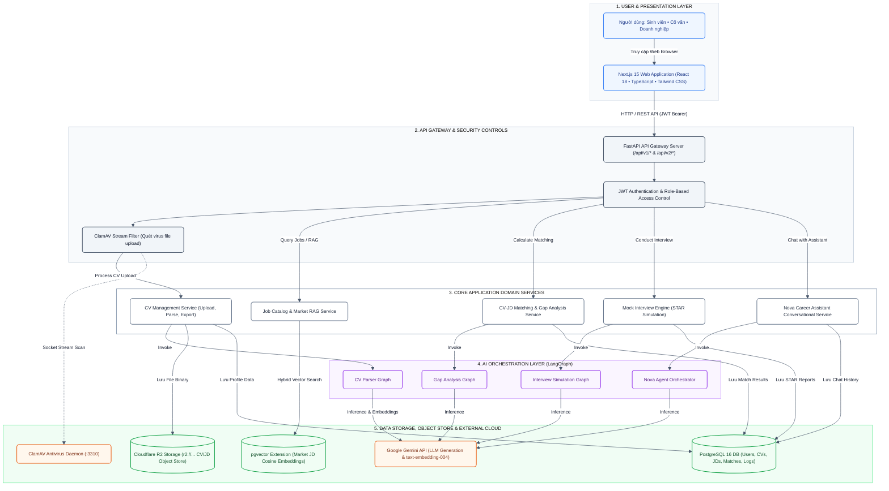
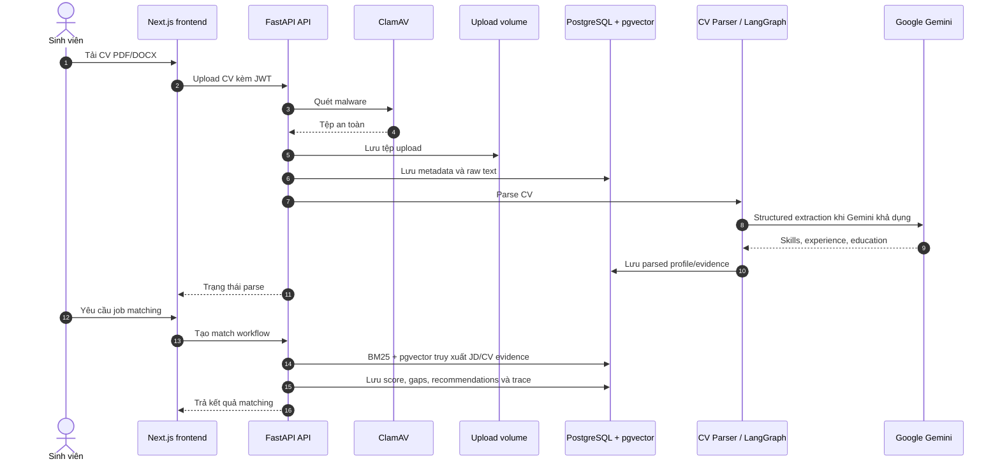
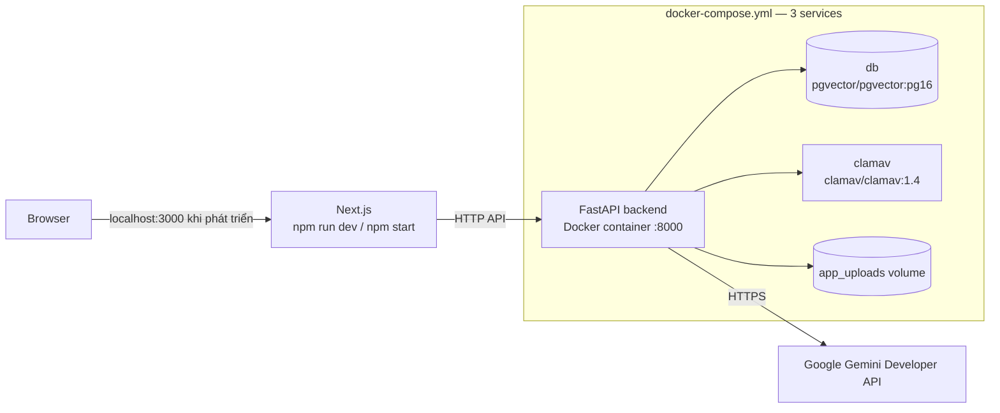

# Architecture Document — Career Assistant X (P-041)

## Phạm vi hiện tại

Career Assistant X là ứng dụng web hỗ trợ định hướng nghề nghiệp. Ba vai trò người dùng trên giao diện là **Sinh viên**, **Cố vấn** và **Doanh nghiệp**. Hệ thống cung cấp quản lý CV/JD, phân tích CV–JD, gợi ý việc làm, phỏng vấn thử và trợ lý nghề nghiệp Nova.

> Các route `/admin/*` tồn tại cho tác vụ vận hành/quản trị dữ liệu; chúng không đại diện cho role người dùng thứ tư trong MVP.

## System overview

## Components

| Tầng | Công nghệ thực tế | Trách nhiệm |
|---|---|---|
| Frontend | Next.js `15.5.x`, React `18.3`, TypeScript, Tailwind CSS | UI theo ba role, dashboard, upload CV/JD, matching, interview và Nova chat. |
| API | FastAPI, Uvicorn, Pydantic, SQLAlchemy async | REST API dưới `/api/v1/*`; các workflow mới tại `/api/v2/*`. |
| Xác thực | PyJWT, bcrypt, Google Auth | Đăng ký/đăng nhập, token version/revoke, Google OAuth, phân quyền route. |
| Object Storage | Cloudflare R2 (`boto3` S3 API), local disk volume fallback | Lưu trữ toàn bộ CV và JD (`r2://<bucket>/...`) bảo mật, hỗ trợ fallback local `/app/data/uploads`. |
| AI orchestration | LangGraph, LangChain Google GenAI | Bốn graph độc lập: CV Parser, Gap Analysis, Interview và Nova. |
| LLM / embeddings | Google Gemini, model cấu hình bằng `MODEL_NAME` (mặc định `gemini-3.5-flash`) | Sinh nội dung AI và embedding; các luồng có fallback khi key/model không khả dụng. |
| Retrieval | BM25 + PostgreSQL `pgvector`, RRF | Index JD thị trường và truy xuất semantic; fallback catalog/keyword hoặc hashing embedding. |
| Dữ liệu | PostgreSQL 16 + pgvector, Alembic | Users, CVs, JDs, matches, interviews, chats, notifications, logs và vectors. |
| Bảo mật file | ClamAV, stream malware scan | Quét malware trước khi lưu CV/JD upload vào Cloudflare R2/storage. |

## AI graphs

| Graph | Luồng chính | Kết quả |
|---|---|---|
| CV Parser | `validate_input → extract_local_evidence → llm_structured_parse → evidence_guardrail → ats_quality_gate` | Hồ sơ CV có cấu trúc và evidence. |
| Gap Analysis | `validate_input → extract_evidence → draft_analysis → integrity_guardrail` | Skill gaps và khuyến nghị có kiểm chứng. |
| Interview | `validate_input → generate_questions → guard_questions → evaluate_answer → generate_report` | Câu hỏi, follow-up và báo cáo STAR. |
| Nova | `plan → weather / datetime / respond / orchestrate` | Trợ lý hội thoại và điều hướng workflow. |

## Data flow — CV upload và job matching

## RAG và matching

- Không có Qdrant trong source, dependencies hoặc `docker-compose.yml`.
- JD market catalog được đồng bộ vào PostgreSQL/pgvector bởi `backend/src/services/job_rag.py`.
- Embedding dùng Gemini khi cấu hình cho phép; nếu không có thể dùng hashing nội bộ. Khi pgvector không sẵn sàng, hệ thống dùng catalog/keyword fallback.
- Pipeline matching kết hợp BM25 và vector search, gộp với Reciprocal Rank Fusion (RRF), sau đó lưu evidence và rubric evaluation.

## Runtime / deployment hiện tại

`docker-compose.yml` chỉ định nghĩa `db`, `clamav` và `backend`. Next.js frontend, Nginx gateway và Qdrant **không** được khai báo trong file Compose hiện tại. Các persistent volumes là `postgres_data`, `clamav_data` và `app_uploads`.

## Security controls

- Secrets lấy từ `.env`; không hard-code API key hoặc password.
- JWT + bcrypt và dependency/middleware kiểm tra quyền trước khi vào route.
- Pydantic validate payload API.
- Tệp upload được ClamAV quét theo `MALWARE_SCAN_MODE`; Docker đặt chế độ `required`.
- Agent có evidence/integrity/question guardrail để không tự tạo kỹ năng hoặc kinh nghiệm không có trong dữ liệu đầu vào.
