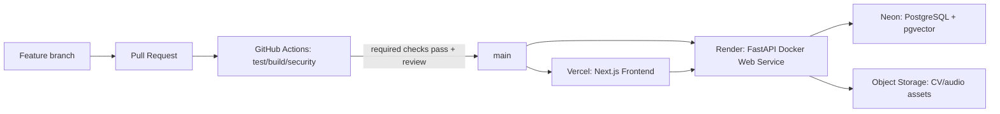

# CI/CD và deploy miễn phí cho Career Assistant X

**Mục tiêu:** Mọi thay đổi backend, frontend hoặc hạ tầng phải được kiểm tra tự động trước khi merge; khi merge vào nhánh production, frontend/backend tự deploy từ commit đã được duyệt.
**Phạm vi:** môi trường demo/portfolio, không cam kết SLA production. Các free tier có giới hạn và có thể thay đổi.

---

## 1. Kiến trúc triển khai được khuyến nghị



| Thành phần | Nền tảng khuyến nghị | Lý do | Giới hạn phải chấp nhận |
|---|---|---|---|
| Frontend Next.js | Vercel Hobby | Tích hợp Git/preview tốt nhất cho Next.js | Hobby phù hợp cá nhân/demo; có giới hạn cộng tác với private organization repo |
| Backend FastAPI/Docker | Render Free Web Service | Deploy Docker trực tiếp từ GitHub, có health check và HTTPS | Sleep sau 15 phút idle; cold start khoảng 1 phút; filesystem ephemeral |
| PostgreSQL + pgvector | Neon Free | Postgres serverless, có pgvector, scale-to-zero | 0.5 GB/project, 100 CU-hours/tháng; không phù hợp tải production liên tục |
| File CV/PDF/audio | Cloudflare R2 (S3-compatible) | Private bucket, 10 GB free/tháng, không tính egress | Cần bucket, access key và retention policy |

Vercel tự tạo preview cho PR và production deployment khi merge branch production. Render Git-backed web service tự build/deploy mỗi push lên branch đã liên kết. [Vercel Git deployments](https://vercel.com/docs/git), [Render web services](https://render.com/docs/web-services)

> Không deploy database PostgreSQL trong Docker Compose lên Render Free. Database phải là Neon/managed Postgres. Neon hỗ trợ `pgvector` qua `CREATE EXTENSION vector;`. [Neon pgvector](https://neon.com/docs/ai/ai-concepts)

---

## 2. Chọn và đăng ký domain: ưu đãi sinh viên hoặc rẻ nhất

Không có “domain miễn phí vĩnh viễn” đáng tin cậy. Domain miễn phí thường miễn năm đầu, sau đó phải gia hạn; hãy xem **giá gia hạn** trước khi chốt. Domain là tài sản của nhóm: chỉ định một người giữ tài khoản registrar, bật 2FA và ghi owner/renewal date vào tài liệu nội bộ.

### 2.1 Lựa chọn ưu tiên

| Ưu tiên | Nơi đăng ký | Phù hợp khi | Ưu đãi/chi phí | Hành động |
|---:|---|---|---|---|
| 1 | [VNNIC / nhà đăng ký `.vn`](https://vnnic.vn/vi/ten-mien-vn/danh-sach-nha-dang-ky-ten-mien) | Thành viên là công dân Việt Nam 18–23 tuổi; muốn domain cá nhân/demo Việt Nam | VNNIC hiện công bố miễn 100% phí đăng ký/sử dụng `.id.vn` cho người trẻ 18–23 tuổi | Chọn một nhà đăng ký VNNIC, tìm `<ten-du-an>.id.vn`, xác thực danh tính và đăng ký |
| 2 | [GitHub Student Developer Pack](https://education.github.com/pack/) | Có GitHub Education đã verified | Pack hiện liệt kê 1 năm `.me` qua Namecheap, domain chọn lọc qua Name.com và `.tech` 1 năm; offer phụ thuộc điều kiện/redeem tại thời điểm đăng ký | Verify student GitHub → mở offer chính thức → redeem trên đối tác |
| 3 | [Cloudflare Registrar](https://domains.cloudflare.com/) | Cần `.com`/`.dev`/`.app` hoặc đội không đủ điều kiện student | Trả giá registry/ICANN, không markup; Cloudflare nêu giá khởi điểm từ $7.85 nhưng giá thực phụ thuộc TLD | Tìm domain → xem cả registration + renewal price → mua và quản lý DNS tại Cloudflare |

**Khuyến nghị cho P-041:**

- Nếu có thành viên đủ điều kiện 18–23: thử `careerassistant.id.vn` hoặc `p041.id.vn` trước. Đây là lựa chọn demo rẻ/miễn phí phù hợp Việt Nam.
- Nếu không: mua `.com` tại Cloudflare Registrar, ưu tiên tên ngắn, không dấu, ví dụ `careerassistantx.com` hoặc một biến thể còn trống. Chỉ mua sau khi xem giá gia hạn.
- Không dùng domain free lạ, domain bị quảng cáo/redirect, hoặc tài khoản registrar dùng chung mật khẩu.

VNNIC công bố chính sách miễn phí `.id.vn` cho người trẻ 18–23 tuổi; hãy xác minh eligibility và điều khoản tại nhà đăng ký trước checkout. [Hướng dẫn VNNIC](https://www.vnnic.vn/vi/ten-mien-vn/danh-cho-chu-the/dang-ky-ten-mien/huong-dan-dang-ky-ten-mien). GitHub Education yêu cầu student verification; các ưu đãi đối tác có thể thay đổi theo thời điểm/quốc gia. [GitHub Student Pack](https://github.com/education/students), [offer hiện có](https://education.github.com/pack/). Cloudflare Registrar công bố đăng ký/gia hạn at-cost, không markup và có WHOIS redaction/DNSSEC. [Cloudflare Registrar](https://developers.cloudflare.com/registrar/)

### 2.2 Các bước mua/đăng ký ngay

#### Phương án A — `.id.vn` miễn phí (nếu đủ điều kiện)

1. Mở [danh sách nhà đăng ký `.vn` chính thức của VNNIC](https://vnnic.vn/vi/ten-mien-vn/danh-sach-nha-dang-ky-ten-mien), chọn một nhà đăng ký trong nước.
2. Tạo **một** tài khoản sở hữu bởi thành viên được nhóm thống nhất làm domain owner; dùng email khôi phục bền vững, bật 2FA.
3. Tìm `<ten>.id.vn`. Kiểm tra chính tả/trademark trước khi đăng ký.
4. Chọn chính sách ưu đãi người trẻ 18–23 nếu portal hiển thị; hoàn tất xác thực danh tính theo yêu cầu nhà đăng ký.
5. Ghi vào password manager/team doc: registrar, account owner, domain, ngày hết hạn, email khôi phục, người chịu trách nhiệm gia hạn. Không ghi mật khẩu/token DNS vào Git.
6. Sau khi active, chuyển đến mục 2.3 để cấu hình DNS.

#### Phương án B — GitHub Student Pack

1. Mở [GitHub Education](https://github.com/education/students), đăng nhập GitHub và nộp school email/giấy xác nhận nếu chưa verified.
2. Khi trạng thái Student Developer Pack được duyệt, mở [Pack offers](https://education.github.com/pack/) và chọn domain offer phù hợp (`.me`, Name.com hoặc `.tech` nếu còn hiện trong tài khoản).
3. Redeem **trực tiếp từ link của GitHub Pack**, không dùng coupon/share account từ bên thứ ba.
4. Tại checkout, kiểm tra giá năm đầu, renewal, WHOIS privacy và auto-renew; domain free năm đầu vẫn có thể cần thẻ/thông tin thanh toán tùy đối tác.
5. Sau khi đăng ký, chuyển nameserver sang Cloudflare nếu muốn quản lý DNS tập trung, hoặc giữ DNS tại registrar.

#### Phương án C — Cloudflare Registrar (mua trả phí, giá minh bạch)

1. Mở [Cloudflare Domains](https://domains.cloudflare.com/), tạo/đăng nhập Cloudflare account của domain owner và bật 2FA.
2. Search domain. Chọn TLD chuẩn (`.com` ưu tiên cho sản phẩm chung; `.dev`/`.app` phù hợp tech nhưng thường phải HTTPS).
3. Ở màn hình checkout, kiểm tra **registration cost** và **renewal cost**; từ chối add-on không cần thiết.
4. Hoàn tất thanh toán. Không gửi thông tin thẻ cho bất kỳ thành viên/tool/chat nào.
5. Giữ auto-renew bật; Cloudflare Registrar mặc định auto-renew và không markup renewal, nhưng owner vẫn phải đảm bảo phương thức thanh toán còn hiệu lực.

### 2.3 DNS records cho Vercel + Render

Ví dụ domain chính là `career.example.com`, API dùng subdomain `api.career.example.com`.

```text
Vercel Dashboard → Project → Settings → Domains
  add: career.example.com
  → Vercel hiển thị chính xác CNAME/A record cần tạo

Render Dashboard → Service → Settings → Custom Domains
  add: api.career.example.com
  → Render hiển thị chính xác CNAME record cần tạo
```

Tạo record theo **giá trị Vercel/Render dashboard hiển thị tại thời điểm đó**, không hard-code record từ blog cũ. Chờ DNS/TLS active rồi cập nhật:

```env
# Render backend
CORS_ORIGINS=https://career.example.com

# Vercel frontend
API_PROXY_TARGET=https://api.career.example.com

# Google OAuth Authorized JavaScript origins
https://career.example.com
```

Không tạo record cho `localhost`; localhost chỉ dùng development. Không công khai `DATABASE_URL`, API keys hoặc Cloudflare API token trong DNS/GitHub/README.

---

## 3. Điều kiện bắt buộc trước khi deploy

### 3.1 Các việc code phải hoàn tất trước

1. **Tách file storage khỏi local disk.** Hiện backend lưu upload ở `data/uploads`. Render Free có ephemeral filesystem: file sẽ mất khi redeploy/restart/sleep. Tạo `StorageService` với `local` cho development và `Cloudflare R2` (S3-compatible) cho deploy; DB chỉ lưu object key/metadata, không lưu path local hay public URL vĩnh viễn.
2. **Migrations rõ ràng.** Dùng Alembic (hoặc migration runner versioned) thay vì chỉ tạo bảng ngầm. Migration phải chạy trước khi API nhận traffic.
3. **Health endpoint:** `GET /health` trả 200 không cần auth, đồng thời kiểm tra DB ở mức tối thiểu. Không gọi Gemini/embedding trong health check.
4. **Không mang `.env` lên Git.** Tất cả secret để ở Render/Neon/Vercel Environment Variables.
5. **Malware scan:** Docker Compose local có ClamAV nhưng Render chỉ deploy một Web Service. Không được giả vờ ClamAV đang chạy. Với demo, đặt `MALWARE_SCAN_MODE=disabled` và hiển thị rõ limitation; production cần external/managed scanner hoặc một service scan riêng.
6. **Background jobs:** không dùng `BackgroundTasks`/filesystem để làm công việc phải sống lâu. Với free tier, task nặng phải có retry/idempotency; demo nên giới hạn thời gian/tệp.

### 3.2 Cloudflare R2 — file CV/PDF/audio private

Cloudflare R2 là storage chính thức của dự án khi deploy. R2 Free hiện có 10 GB storage/tháng, 1 triệu Class A operations, 10 triệu Class B operations và egress miễn phí. [R2 pricing](https://developers.cloudflare.com/r2/pricing/)

1. Cloudflare Dashboard → **R2 Object Storage** → Create bucket: `career-assistant-private`.
2. Không bật public bucket/`r2.dev` public access cho CV, PDF optimized hoặc audio.
3. R2 → Manage R2 API Tokens → tạo token cho backend với quyền tối thiểu `Object Read & Write` trên đúng bucket. Lưu Access Key ID/Secret Access Key vào Render, không vào Git/frontend.
4. Object key chuẩn:

```text
cvs/{user_id}/{upload_id}.pdf
cv-variants/{user_id}/{variant_id}-r{revision}.pdf
users/{user_id}/interviews/{session_id}/audio/{turn_id}.webm
```

5. Backend phải kiểm tra ownership trước khi upload/download/delete và chỉ cấp presigned URL ngắn hạn (ví dụ 5 phút).
6. Lifecycle policy: CV gốc/variant giữ đến khi user xóa; audio phỏng vấn tự xóa sau 30 ngày (hoặc policy được user consent). Khi xóa account/CV/session, enqueue xóa object R2 idempotent.
7. DB lưu `bucket`, `object_key`, `content_type`, `size_bytes`, `checksum`, `owner_id`, `retention_expires_at`; không lưu binary blob trong PostgreSQL.

**Environment variables Render:**

```env
STORAGE_PROVIDER=r2
S3_ENDPOINT_URL=https://<CLOUDFLARE_ACCOUNT_ID>.r2.cloudflarestorage.com
S3_BUCKET=career-assistant-private
S3_REGION=auto
S3_ACCESS_KEY_ID=<R2_ACCESS_KEY_ID>
S3_SECRET_ACCESS_KEY=<R2_SECRET_ACCESS_KEY>
FILE_URL_TTL_SECONDS=300
AUDIO_RETENTION_DAYS=30
```

Không đặt các biến trên Vercel/`NEXT_PUBLIC_*`. R2 cung cấp S3-compatible API nên backend Python có thể dùng `boto3`/`aioboto3` qua endpoint R2. [R2 S3 API](https://developers.cloudflare.com/r2/get-started/s3/)

### 3.3 Không đưa vào GitHub Actions secrets/logs

Không echo/commit các giá trị: `DATABASE_URL`, `SECRET_KEY`, `POSTGRES_PASSWORD`, Gemini key, SMTP password, Google OAuth secret, object-storage key, AI log key. Client ID Google OAuth (`NEXT_PUBLIC_GOOGLE_OAUTH_CLIENT_ID`) là public nhưng vẫn chỉ nên cấu hình bằng environment variable để tránh lẫn giữa môi trường.

---

## 4. Chiến lược nhánh và đồng bộ tự động

```text
feature/* → Pull Request vào develop → preview + CI
develop   → môi trường staging (tùy chọn)
main      → production deploy tự động
hotfix/*  → Pull Request vào main → CI → production deploy
```

Nếu nhóm chưa cần staging, có thể bỏ `develop`: `feature/* → PR → main`. Không push trực tiếp vào `main`.

### 4.1 Branch protection cho `main`

GitHub → Settings → Rules → Rulesets (hoặc Branches) → tạo rule cho `main`:

- Require a pull request before merging.
- Require ít nhất 1 approving review.
- Require status checks: `backend-test`, `frontend-test`, `infra-validate`, `e2e-smoke`.
- Require branches to be up to date trước merge.
- Block force push và deletion.

GitHub hỗ trợ rules bắt buộc review/status checks trước khi merge. [GitHub branch protection](https://docs.github.com/en/repositories/configuring-branches-and-merges-in-your-repository/managing-protected-branches/managing-a-branch-protection-rule)

### 4.2 Luồng đồng bộ thực tế

```text
1. Developer tạo feature branch, commit, push.
2. GitHub Actions chạy test/build theo commit đó.
3. Vercel tạo Preview URL cho PR; Render preview là tùy chọn.
4. Reviewer kiểm tra PR + Preview URL + Actions.
5. Merge PR khi mọi required check xanh.
6. Push mới vào main kích hoạt:
   - Vercel production deploy frontend;
   - Render production deploy backend Docker;
   - migration chạy một lần, rồi health check;
   - smoke test production.
7. Nếu smoke test fail: rollback deployment/revert commit, không tiếp tục deploy commit khác.
```

**Điểm quan trọng:** Vercel/Render không nên là nơi “test hộ” sau khi đã deploy. Test phải là required check trước merge. Auto-deploy chỉ nhận commit đã qua CI.

---

## 5. GitHub Actions: các workflow cần tạo

Tạo thư mục `.github/workflows/` với ba workflow. Không dùng `paths` cho workflow có required check, vì GitHub có thể để check ở trạng thái Pending nếu workflow bị skip do path filter và block merge. [GitHub Actions trigger/filter behavior](https://docs.github.com/en/actions/how-tos/write-workflows/choose-when-workflows-run/trigger-a-workflow)

### 5.1 `ci.yml` — bắt buộc với mọi PR/main push

```yaml
name: CI

on:
  pull_request:
    branches: [main, develop]
  push:
    branches: [main, develop]

permissions:
  contents: read

jobs:
  backend-test:
    runs-on: ubuntu-latest
    defaults:
      run:
        working-directory: backend
    steps:
      - uses: actions/checkout@v4
      - uses: actions/setup-python@v5
        with:
          python-version: "3.12"
          cache: pip
          cache-dependency-path: backend/requirements.txt
      - run: pip install -r requirements.txt
      - run: ruff check src tests
      - run: pytest -q

  frontend-test:
    runs-on: ubuntu-latest
    defaults:
      run:
        working-directory: frontend
    steps:
      - uses: actions/checkout@v4
      - uses: actions/setup-node@v4
        with:
          node-version: "20"
          cache: npm
          cache-dependency-path: frontend/package-lock.json
      - run: npm ci
      - run: npm run typecheck
      - run: npm run build

  infra-validate:
    runs-on: ubuntu-latest
    steps:
      - uses: actions/checkout@v4
      - name: Validate Docker Compose syntax
        run: docker compose config --quiet
      - name: Build backend Docker image
        run: docker build -f backend/Dockerfile -t career-assistant-backend:ci .
      - name: Build frontend Docker image
        run: docker build -f frontend/Dockerfile -t career-assistant-frontend:ci frontend
```

**Lưu ý:** test backend phải dùng test DB/SQLite và mock Gemini/STT/TTS; CI không dùng database production hay API key production.

### 5.2 `e2e.yml` — smoke test giao diện

Chạy khi PR vào `main` và sau deploy `main`. Có thể dùng Playwright với backend test container/mocked API:

```yaml
name: E2E smoke
on:
  pull_request:
    branches: [main]

jobs:
  e2e-smoke:
    runs-on: ubuntu-latest
    steps:
      - uses: actions/checkout@v4
      - uses: actions/setup-node@v4
        with: { node-version: "20" }
      - run: cd frontend && npm ci
      - run: cd frontend && npx playwright install --with-deps chromium
      - run: ./scripts/ci-start-test-stack.sh
      - run: cd frontend && npx playwright test --project=chromium
```

Kịch bản tối thiểu:

- Đăng ký/login email mock, chọn CV/JD và chạy Match.
- Mở Match Evaluation Modal, evidence drawer và CTA.
- Tạo CV manual/template rồi validation error/success.
- Top Jobs loading/error/success bằng fixture.
- Interview text fallback; voice/STT dùng mock WebSocket, không cần microphone thật trong CI.

### 5.3 `production-smoke.yml` — sau deploy

Không chứa secret. Dùng URL public trong GitHub Variables (`PROD_FRONTEND_URL`, `PROD_BACKEND_URL`):

```yaml
name: Production smoke
on:
  workflow_dispatch:
  push:
    branches: [main]

jobs:
  health:
    runs-on: ubuntu-latest
    steps:
      - name: Wait briefly for providers to deploy
        run: sleep 60
      - name: Backend health
        run: curl --fail --retry 5 --retry-delay 15 "${{ vars.PROD_BACKEND_URL }}/health"
      - name: Frontend availability
        run: curl --fail --retry 5 --retry-delay 15 "${{ vars.PROD_FRONTEND_URL }}/"
```

Nếu Render Free đang cold-start, tăng retry/time limit thay vì kết luận lỗi ngay. Có thể chạy workflow thủ công để kiểm tra sau rollback.

---

## 6. Deploy backend miễn phí lên Render

### 6.1 Chuẩn bị Neon database

1. Đăng ký Neon và tạo project/database production-demo.
2. Lấy pooled connection string (SSL) từ Neon dashboard.
3. Trong Neon SQL Editor chạy:

```sql
CREATE EXTENSION IF NOT EXISTS vector;
```

4. Lưu connection string vào Render dưới tên `DATABASE_URL`, **không** commit vào `.env`.

Neon Free hiện cấp 0.5 GB storage/project và 100 CU-hours/tháng; phù hợp demo/tải ngắt quãng, không phải production workload liên tục. [Neon pricing](https://neon.com/pricing)

### 6.2 Tạo Render Web Service

1. Vào Render Dashboard → **New** → **Web Service**.
2. Connect GitHub, chọn repository `P-041` và branch `main`.
3. Điền:

| Trường Render | Giá trị |
|---|---|
| Name | `career-assistant-api` |
| Region | gần người dùng/database nhất |
| Runtime | `Docker` |
| Dockerfile Path | `backend/Dockerfile` |
| Docker Build Context | repository root `.` nếu Dockerfile copy từ root; nếu Dockerfile self-contained trong backend, dùng `backend` |
| Health Check Path | `/health` |
| Auto-Deploy | `Yes` |
| Instance Type | `Free` cho demo |

4. Chỉ chọn `main` làm production branch. Feature branch chỉ được deploy preview sau CI/review, không làm production.
5. Render yêu cầu app bind `0.0.0.0` và dùng port môi trường cung cấp (mặc định Render là `10000`). Cập nhật entrypoint/Dockerfile để dùng `${PORT:-8000}` nếu code hiện chỉ bind cứng 8000.

Render có thể build Docker image từ repository ở mỗi deploy, auto-deploy từ linked Git branch và tạo URL `onrender.com`. [Render Docker](https://render.com/docs/docker), [Render GitHub connection](https://render.com/docs/github)

### 6.3 Environment Variables trên Render

Tạo trong Render Dashboard → Environment, không paste file `.env` nguyên khối:

```env
APP_ENV=production
APP_HOST=0.0.0.0
APP_PORT=10000
DATABASE_URL=<Neon pooled PostgreSQL URL>
SECRET_KEY=<random value >= 32 characters>
INITIAL_ADMIN_PASSWORD=<strong unique password>
GOOGLE_OAUTH_CLIENT_ID=<same Web client ID as frontend>
CORS_ORIGINS=https://<frontend-domain>
GEMINI_API_KEY=<server-only key>
MODEL_NAME=<approved model name>
MALWARE_SCAN_MODE=disabled
VECTOR_SEARCH_ENABLED=true
VECTOR_EMBEDDING_PROVIDER=auto
```

Thêm SMTP, AI logging, object storage variables chỉ khi feature đó được bật. Không dùng `POSTGRES_*` local Docker values trên Render khi đã dùng `DATABASE_URL` Neon.

### 6.4 Migration release step

Không chạy migration trong nhiều instance song song. Với demo một backend instance, chọn một trong hai cách:

- **Khuyến nghị:** Render pre-deploy command/release command chạy `alembic upgrade head`, sau đó start FastAPI.
- **Tạm thời:** entrypoint tuần tự `alembic upgrade head && uvicorn ...`; nếu migration fail thì deploy fail và service cũ vẫn phải còn hoạt động.

Migration phải có backup/rollback plan. Không chạy `drop_all`, không tự seed dữ liệu production mỗi startup.

### 6.5 Limitation Render Free

- Sleep sau 15 phút không có HTTP/WebSocket, cold-start mất khoảng một phút.
- Local filesystem bị mất sau restart/redeploy/sleep.
- Có 750 free instance-hours/workspace/tháng; hết quota service bị suspend.
- Không dùng cho voice realtime hay production SLA; page UI cần state “Đang khởi động máy chủ, thử lại sau”.

Các giới hạn này là lý do phải có object storage và retry UX. [Render Free limitations](https://render.com/docs/free)

---

## 7. Deploy frontend miễn phí lên Vercel

### 7.1 Tạo project

1. Vào Vercel → **Add New Project** → Import GitHub repository.
2. Thiết lập:

| Trường Vercel | Giá trị |
|---|---|
| Framework | Next.js (auto detect) |
| Root Directory | `frontend` |
| Build Command | `npm run build` |
| Install Command | `npm ci` |
| Production Branch | `main` |

3. Bật Preview Deployment cho PR.
4. Bấm Deploy; sau đó có URL như `https://p-041-xxx.vercel.app`.

### 7.2 Environment Variables Vercel

Vì frontend hiện proxy `/api/v1/*` qua Next rewrite, phải đặt backend Render URL:

```env
API_PROXY_TARGET=https://career-assistant-api.onrender.com
NEXT_PUBLIC_GOOGLE_OAUTH_CLIENT_ID=<same Web client ID as backend>
```

Đặt cho cả `Preview` và `Production` (có thể dùng backend staging khác cho Preview). `NEXT_PUBLIC_*` được nhúng vào bundle lúc build, nên sửa biến phải redeploy/rebuild frontend.

Không đặt `GEMINI_API_KEY`, `DATABASE_URL`, `SECRET_KEY` hay SMTP secret tại Vercel, vì frontend không được quyền biết chúng.

### 7.3 Vercel Hobby và nhóm GitHub

Vercel Hobby thích hợp cá nhân/demo. Với repository private thuộc GitHub organization, policy Hobby có giới hạn: deploy commit có thể yêu cầu commit author là owner của Hobby team; nếu nhiều người cùng push có thể bị chặn. Giải pháp demo là dùng public repo (không có secret) hoặc để một owner Vercel merge/deploy; dự án nhóm lâu dài cần Vercel Pro/host khác. [Vercel Git deployment restrictions](https://vercel.com/docs/git)

---

## 8. Domain, CORS và Google Login sau deploy

Ví dụ:

```text
Frontend: https://career.example.com
Backend:  https://career-assistant-api.onrender.com
```

1. Vercel → Domains: thêm `career.example.com`; cập nhật DNS theo hướng dẫn Vercel.
2. Render không nhất thiết cần custom API domain cho demo; nếu có dùng `https://api.career.example.com`.
3. Render `CORS_ORIGINS`:

```env
CORS_ORIGINS=https://career.example.com
```

4. Google Cloud → Google Auth Platform → Clients → OAuth Web Client → Authorized JavaScript origins:

```text
https://career.example.com
https://<preview-domain>.vercel.app   # chỉ khi cần Google login trên Preview
```

Không thêm path (`/login`, `/api/v1/...`) và không dùng wildcard. Client ID frontend/backend phải giống nhau. Google yêu cầu origin khớp scheme + hostname + port. [Google Identity Services setup](https://developers.google.com/identity/gsi/web/guides/get-google-api-clientid?hl=en)

---

## 9. Cấu hình environment mẫu

### 9.1 Backend production (Render Dashboard, không commit)

```env
APP_ENV=production
APP_HOST=0.0.0.0
APP_PORT=10000
DATABASE_URL=postgresql+asyncpg://<user>:<password>@<neon-host>/<database>?sslmode=require
SECRET_KEY=<generate-strong-secret>
INITIAL_ADMIN_PASSWORD=<generate-strong-password>
GOOGLE_OAUTH_CLIENT_ID=<client-id>.apps.googleusercontent.com
CORS_ORIGINS=https://career.example.com
GEMINI_API_KEY=<server-only>
MALWARE_SCAN_MODE=disabled
STORAGE_PROVIDER=r2
S3_ENDPOINT_URL=https://<cloudflare-account-id>.r2.cloudflarestorage.com
S3_BUCKET=career-assistant-private
S3_REGION=auto
S3_ACCESS_KEY_ID=<R2-access-key-id>
S3_SECRET_ACCESS_KEY=<R2-secret-access-key>
FILE_URL_TTL_SECONDS=300
AUDIO_RETENTION_DAYS=30
```

### 9.2 Frontend production (Vercel Environment Variables)

```env
API_PROXY_TARGET=https://career-assistant-api.onrender.com
NEXT_PUBLIC_GOOGLE_OAUTH_CLIENT_ID=<client-id>.apps.googleusercontent.com
```

### 9.3 Local environment (không thay bằng production values)

```env
# root .env
APP_ENV=development
CORS_ORIGINS=http://localhost:3000
GOOGLE_OAUTH_CLIENT_ID=<same-client-id>

# frontend/.env.local
API_PROXY_TARGET=http://127.0.0.1:8000
NEXT_PUBLIC_GOOGLE_OAUTH_CLIENT_ID=<same-client-id>
```

---

## 10. Checklist triển khai theo thứ tự

### Phase A — chuẩn bị repository

- [ ] Kiểm tra `main` build/test xanh local.
- [x] Thêm storage abstraction; `local` cho dev, Cloudflare R2 private bucket cho deploy.
- [ ] Tạo R2 bucket/API token, set lifecycle audio 30 ngày và kiểm thử với credentials production.
- [ ] Thêm migration runner versioned và `/health` DB-safe.
- [ ] Thêm `.github/workflows/ci.yml`, `e2e.yml`, `production-smoke.yml`.
- [ ] Bật branch protection required checks.
- [ ] Commit `.env.example`/`frontend/.env.local.example`, không commit `.env`.

### Phase B — data/backend

- [ ] Tạo Neon project/database và bật `vector` extension.
- [ ] Tạo Render Docker Web Service từ `main`.
- [ ] Điền secrets/environment trên Render.
- [ ] Chạy migration một lần và gọi `https://<render-url>/health`.
- [ ] Test API login, upload/object storage, Match trên Render.

### Phase C — frontend/auth

- [ ] Tạo Vercel project với Root Directory `frontend`.
- [ ] Điền `API_PROXY_TARGET` và public Google Client ID.
- [ ] Deploy, xác nhận `/api/v1/*` proxy sang Render.
- [ ] Thêm Vercel domain vào Google OAuth Authorized JavaScript origins.
- [ ] Test Google login với tài khoản test user nếu OAuth consent screen đang Testing.

### Phase D — kiểm tra CD

- [ ] Tạo nhánh `chore/verify-cicd`, đổi nội dung vô hại, mở PR.
- [ ] Xác nhận CI, Vercel Preview và review chạy trước merge.
- [ ] Merge vào `main`; xác nhận Render + Vercel production deploy đúng commit SHA.
- [ ] Xác nhận production smoke workflow xanh.
- [ ] Revert commit thử nghiệm và xác nhận rollback/deploy phiên bản trước hoạt động.

---

## 11. Rollback và vận hành

| Sự cố | Cách xử lý |
|---|---|
| Frontend lỗi sau deploy | Vercel Dashboard → Deployments → Promote/Redeploy deployment trước, hoặc `git revert` commit main |
| Backend lỗi sau deploy | Render → Deploys → rollback một trong các deployment gần nhất; kiểm tra health/log |
| Migration lỗi | Dừng rollout, không chạy migration lại mù quáng; dùng rollback script đã review hoặc restore database backup |
| Render cold start | UI retry exponential, thông báo server đang khởi động; không coi là login failure |
| Upload mất file | Kiểm tra storage abstraction/object bucket; local disk Render không bền |
| Google login lỗi production | So khớp Vercel domain trong Authorized JS origins, Client ID frontend/backend và `CORS_ORIGINS` |

### Definition of Done cho CI/CD

- Không thể merge `main` nếu backend/frontend/infra/e2e checks không pass.
- Commit main deploy tự động đúng SHA tới Vercel + Render.
- Có production health/smoke check và cách rollback đã thử.
- Không có secret trong repo/logs/browser bundle.
- Upload, database và audit data tồn tại sau Render restart/redeploy.
- README có URL demo, trạng thái free-tier limitations và quy trình vận hành.
