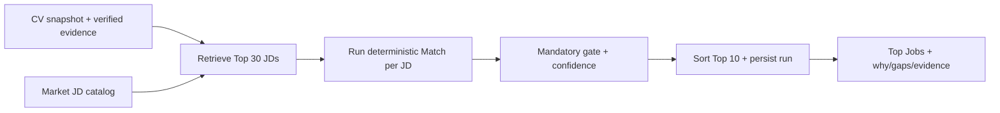

# Kế hoạch triển khai 4 thành viên — Career Assistant X

**Phiên bản:** 1.0  
**Mục tiêu:** Hoàn thiện bốn luồng có thể demo và kiểm toán được: Top Jobs theo CV, Match CV–JD, tối ưu/tạo CV theo JD, và mock interview voice-to-voice.  
**Nguyên tắc bắt buộc:** Không evidence thì không claim; LLM không tính điểm cuối; bản CV gốc không bị ghi đè; mọi output AI có thể truy ngược về input, prompt/model/version và kết quả validator.

---

## 1. Phạm vi và hiện trạng cần giữ lại

Repository đã có các nền tảng không cần làm lại:

- CV upload/manual creation, parse có evidence guardrail.
- JD catalog, CV–JD matching: CV chunks + JD atomic requirements → BM25 + semantic retrieval → RRF → evidence → deterministic rubric score.
- Các bảng `matches`, `cv_chunks`, `jd_requirements`, `evidences`, `criterion_evaluations`, `match_results`.
- Gap analysis và quyết định accept/reject suggestion.
- Interview text theo STAR, lịch sử, report và CSAT.

Các phần còn thiếu hoặc mới chỉ là UI/fallback:

1. Job discovery có ranking theo CV nhưng chưa phải **Top Jobs có Fit Score chính thức, breakdown, history và explanation**.
2. Match hiện có dữ liệu audit nhưng FE chưa hiển thị đầy đủ bảng requirement/evidence.
3. CV tối ưu chưa là một `CV Variant` độc lập, versioned, có claim validation và pre/post match.
4. “Voice interview” hiện mới dùng browser SpeechRecognition và API text; chưa có WebSocket, STT/TTS, transcript persistence chi tiết, Question Bank hay evidence-grounded criterion scoring.
5. FE dùng TSX để render và `frontend/app.js` xử lý DOM/logic tập trung. Không rewrite toàn bộ; feature mới phải có typed API client và React state cục bộ, không thêm logic mới vào `app.js` nếu tránh được.

---

## 2. Contract dùng chung giữa 4 người

### 2.1 Source of truth và versioning

Mọi pipeline mới nhận `cv_snapshot_id` và `jd_snapshot_id`, không dùng CV/JD mutable trực tiếp. Một input hợp lệ phải có:

```text
cv_snapshot_id, jd_snapshot_id, user_id,
pipeline_version, normalization_version,
embedding_model/version, rubric_version,
prompt_version (nếu có LLM), created_at, trace_id
```

| Dữ liệu | Source of truth | Không được dùng làm source of truth |
|---|---|---|
| Candidate facts | CV snapshot + evidence đã xác nhận | Wording do LLM tạo, JD, transcript cũ |
| JD requirements | JD snapshot + atomic requirements | LLM suy luận từ title |
| Match score | Backend arithmetic từ criterion persisted | Điểm semantic, UI, LLM |
| CV optimized | CV variant đã qua validator + user publish | Suggestion draft |
| Interview score | Criterion evaluation từ final transcript persisted | Report do LLM viết |
| Realtime state | Redis/WebSocket memory | PostgreSQL business records |

### 2.2 Quy ước API

- Giữ `/api/v1/*` cho luồng đang chạy; thêm `/api/v2/*` cho data model mới, không phá frontend cũ.
- Response lỗi chuẩn: `{ code, message, trace_id, retryable }`.
- Response AI luôn có `ai_metadata`: provider, model, prompt_version, fallback_used, latency_ms; tuyệt đối không trả API key/prompt hệ thống.
- Endpoint tạo run/session phải idempotent bằng `Idempotency-Key`.
- FE chỉ render score do API trả; không tự tính trọng số, final score hoặc score delta.

### 2.3 Definition of Done chung

Một task chỉ hoàn tất khi có đủ:

- Migration/schema + Pydantic request/response.
- Authorization ownership (`user_id`, role, tenant isolation) và audit log.
- Unit test thuật toán; API test happy/error/ownership; E2E luồng UI quan trọng.
- Loading, empty, error, retry, accessibility keyboard trên FE.
- Metric latency/error/fallback và tài liệu cập nhật.

---

## 3. Luồng 1 — Top công việc phù hợp với CV

### 3.1 Ý nghĩa của phần trăm

Nhãn hiển thị là **“Độ phù hợp hồ sơ với JD”**, không phải “xác suất được tuyển”. Con số không được sử dụng địa chỉ, giới tính, tuổi, ảnh hoặc bất kỳ PII nhạy cảm nào.

### 3.2 Input → thuật toán → output



**Input:** `cv_snapshot_id`, search/filter (role, location, remote, seniority), optional candidate preferences.  
**Candidate set:** metadata filter trước, sau đó BM25 Top 30 + dense Top 30, Weighted RRF để chọn tối đa 30 JD. Retrieval chỉ nhằm giảm chi phí; nó không phải Fit Score.  
**Scoring:** chạy lại engine Match hiện có cho từng JD candidate, dùng evidence verified.

```text
FitScore =
  0.35 × RequiredSkillsCoverage
+ 0.30 × RelevantExperienceCoverage
+ 0.10 × EducationCoverage
+ 0.10 × PreferredSkillsCoverage
+ 0.15 × DomainAndResponsibilitiesCoverage
```

`Coverage` là điểm 0–100 của requirement/criterion do pipeline Match xác định từ evidence. Criterion không có requirement thì disable; tổng trọng số active được chuẩn hóa về 100. Không đưa cosine similarity trực tiếp vào score.

**Mandatory gate:**

- `mandatory_requirement_failed=true`: Job vẫn có thể hiện nhưng có warning rõ và không được gọi là “phù hợp hoàn toàn”.
- `must_have_coverage < 50%`: `display_score = min(raw_fit_score, 49)`; lưu cả raw/display và lý do cap.
- Evidence confidence thấp: không “bù” bằng LLM; hiển thị confidence thấp và yêu cầu user review CV.
- Tie-break: required-skill coverage giảm dần → number of directly supported requirements giảm dần → RRF rank tăng dần → JD ID ổn định.

**Output mỗi job:**

```json
{
  "job_id": "JD-001",
  "title": "Backend Engineer",
  "fit_score": 74.5,
  "raw_fit_score": 74.5,
  "evidence_confidence": "high",
  "mandatory_requirement_failed": false,
  "score_breakdown": [],
  "top_evidence": [],
  "top_gaps": [],
  "why_recommended": [],
  "match_id": "...",
  "versions": {}
}
```

### 3.3 Data/API/UI cần có

Thêm `job_recommendation_runs` và `job_recommendations`:

```text
run: id, user_id, cv_snapshot_id, filter_json, retrieval_config_json,
     status, pipeline_version, trace_id, created_at, completed_at
item: id, run_id, job_id/jd_snapshot_id, rank, raw_fit_score,
      display_fit_score, confidence, mandatory_gate_json,
      match_id, explanation_json, created_at
```

```http
POST /api/v2/job-recommendations
GET  /api/v2/job-recommendations/{run_id}
GET  /api/v2/job-recommendations/history
```

FE `FindJobsView` cần: chọn CV, filter, skeleton; 10 job cards; `% fit`, confidence, 3 evidence, 3 gap, mandatory warning, “Xem Match đầy đủ”, “Tối ưu CV theo JD”, “Luyện phỏng vấn”. Không render score nếu run chưa completed.

### 3.4 Benchmark/guardrail

- Golden set: ít nhất 50 cặp CV–JD, có expert label cho Top-3 relevance và mandatory gaps.
- Metrics: Recall@30 retrieval, nDCG@10, MRR, Precision@3, mandatory-gap false-negative rate.
- Regression: đổi embedding/model/RRF/rubric chỉ promote khi không giảm metric vượt ngưỡng đã chốt (ví dụ nDCG@10 giảm quá 3%).
- Test anti-bias: thay PII nhưng không thay skills/evidence phải ra cùng ranking/score.

---

## 4. Luồng 2 — Match CV với JD và bảng đánh giá sâu

### 4.1 Thuật toán pipeline bắt buộc

```text
CV snapshot → normalize/chunk theo section
JD snapshot → parse atomic requirements
For each requirement:
  metadata matching matrix
  → BM25 Top K + dense Top K
  → RRF(k=60) Top K
  → evidence classification
  → requirement status/score
→ aggregate deterministic rubric
→ persist full trace
```

RRF:

```text
RRF(document) = Σ weight_i / (k + rank_i), k = 60
```

Chỉ `evidence` được retrieval từ CV là proof. `BM25`, `semantic_score`, `fusion_score` phục vụ xếp hạng evidence, không là final score.

### 4.2 Modal đánh giá FE bắt buộc

Không dùng bảng rộng làm trải nghiệm chính. Tại kết quả Match, hiển thị score ring, một câu tóm tắt và nút **“Xem đánh giá chi tiết”**. Nút mở modal responsive; trên mobile là bottom sheet/full-screen sheet.

```text
Match summary
  └─ [Xem đánh giá chi tiết]
       └─ Evaluation modal
           ├─ Header: Fit Score, confidence, trạng thái mandatory gate
           ├─ Tab “Tổng quan”
           ├─ Tab “Đã phù hợp”
           ├─ Tab “Cần cải thiện”
           └─ Tab “Tất cả tiêu chí” + evidence drawer
```

**Header modal** hiển thị `% Độ phù hợp hồ sơ`, nhãn confidence, số tiêu chí đạt/trên tổng số và warning màu vàng/đỏ nếu thiếu mandatory requirement. Không gọi score là “khả năng được tuyển”.

**Tab Tổng quan** gồm 5 criterion card, không phải table:

| Card | Weight | Nội dung rút gọn |
|---|---:|---|
| Kỹ năng bắt buộc | 35% | `x/y` requirement được support, điểm `x/35`, 1 evidence/gap quan trọng nhất |
| Kinh nghiệm liên quan | 30% | số năm/yêu cầu, điểm `x/30`, lý do |
| Học vấn | 10% | trạng thái và điểm `x/10` |
| Kỹ năng ưu tiên | 10% | `x/y` skill, điểm `x/10` |
| Domain/Trách nhiệm | 15% | trạng thái và điểm `x/15` |

Mỗi card có một trong các trạng thái rõ ràng:

- `Đã đáp ứng` (xanh): có evidence trực tiếp.
- `Đáp ứng một phần` (vàng): có evidence nhưng thiếu phạm vi/mức độ/thời gian.
- `Cần bổ sung` (đỏ/cam): chưa tìm thấy evidence cho yêu cầu JD.
- `Cần kiểm tra` (xám): extraction/evidence `UNCERTAIN`; không kết luận người dùng không có kỹ năng.

**Tab Đã phù hợp** chỉ liệt kê requirement `SUPPORTED`/`PARTIALLY_SUPPORTED`: tên requirement, quote evidence, section/page và lý do ngắn.  
**Tab Cần cải thiện** ưu tiên mandatory/high priority trước: requirement thiếu, tác động điểm, trạng thái, action an toàn (ví dụ “bổ sung evidence dự án nếu bạn thực sự đã làm”, “học/làm mini project”; không gợi ý thêm skill chưa có vào CV).  
**Tab Tất cả tiêu chí** là danh sách accordion, không phải bảng: mỗi requirement có status, score đóng góp, evidence IDs và nút **“Xem bằng chứng trong CV”**. Nút này mở evidence drawer bên trong modal, highlight đúng quote/page/section; không để FE tự tạo mô tả evidence.

Modal có CTA theo ngữ cảnh:

```text
Có gap → “Tối ưu CV theo JD” / “Lập kế hoạch cải thiện”
Đã đủ context → “Luyện phỏng vấn vị trí này”
Mọi trạng thái → “Xem lại CV” / “Đóng”
```

Accessibility: focus trap, `Esc`/nút đóng, tab keyboard, `aria-labelledby`, badge không chỉ phân biệt bằng màu, không mở nested modal. Khi Match đang chạy/lỗi/chưa có CV-JD, nút modal disabled và giải thích lý do.

### 4.3 Guardrail

- Evidence text phải là substring của raw CV sau Unicode normalization; lưu `start/end`, page, section, chunk ID.
- Không evidence: `NOT_FOUND`, không được chuyển thành claim “candidate không biết X”.
- Requirement missing không là quyết định loại ứng viên tự động.
- Arithmetic property test: score [0,100], total active weight = 100, output lặp lại với cùng input/config.
- Match report lưu version model/index/rubric để rerun và so sánh.

---

## 5. Luồng 3 — Tạo/tối ưu CV theo JD

### 5.1 Hai mode nghiệp vụ

```text
Mode A: HAS_CV + HAS_JD
CV snapshot + Match artifacts → suggestions → user review → validator
→ CV Variant → render → optional post-presentation match

Mode B: NO_CV + HAS_JD
template → guided form/autosave → candidate evidence draft → user confirm
→ CV snapshot → Match → cùng workflow Mode A
```

Không có JD: chỉ lưu CV gốc/draft, không gọi là JD-guided optimization.

### 5.2 LLM được phép và không được phép

LLM được viết lại wording, chọn thứ tự, rút gọn, nhấn mạnh evidence phù hợp JD. LLM không được thêm skill, công ty, vai trò, metric, chứng chỉ, thời gian hay project chưa có Candidate Evidence.

`Generation Contract` gửi vào LLM chỉ gồm:

```text
verified candidate evidence IDs + allowed source spans
JD requirements + priorities
layout/template constraints
language/tone
```

Không gửi raw CV/JD không cần thiết, previous score, hoặc text generated trước đó làm fact.

### 5.3 Validator trước publish

1. Schema validator: section/bullet/length hợp lệ.
2. Atomic claim validator: mọi claim map ≥1 evidence ID.
3. Entailment validator: text claim không mâu thuẫn source span.
4. Numeric validator: số/date/percentage chỉ được giữ nếu có trong evidence hoặc user xác nhận write-back.
5. JD leakage validator: từ JD không có evidence không được xuất hiện như candidate fact.
6. Protected-content validator: không được bỏ evidence critical chỉ để ép 1 trang.
7. Render validator: PDF không overflow, không empty page, readable font, 1 trang ưu tiên; 2 trang nếu retention/readability không đạt.

Fail bất kỳ hard gate nào: variant giữ `DRAFT_BLOCKED`, không có publish/download; trả danh sách claim lỗi cho UI sửa/review.

### 5.4 Data/API/UI

```text
cv_variants: id, user_id, source_cv_snapshot_id, target_jd_snapshot_id,
  match_id, template_id, content_json, status, prompt_version,
  validator_result_json, rendered_uri, created_at
cv_variant_claims: variant_id, claim_text, source_evidence_ids,
  validation_status, validator_reason
cv_variant_revisions: variant_id, revision_no, content_json,
  editor_type(user/ai), created_at
cv_templates: id, version, name, schema_json, renderer_config, status
```

```http
POST /api/v2/cv-variants
GET  /api/v2/cv-variants/{id}
PUT  /api/v2/cv-variants/{id}/suggestions/{suggestion_id}
POST /api/v2/cv-variants/{id}/validate
POST /api/v2/cv-variants/{id}/publish
GET  /api/v2/cv-variants/{id}/export
GET  /api/v2/cv-variants?cv_id=&jd_id=
```

FE wizard cần: template gallery → form section-by-section → evidence review → match/gaps → list suggestions có original/evidence/rewrite/accept/reject/edit → preview PDF → validation status → publish/version history. Autosave draft, không autosave AI text thành candidate fact.

### 5.5 Benchmark/guardrail

- 100 claims: 50 supported, 25 unsupported, 15 conflicting, 10 numeric/date edge cases.
- Metrics: unsupported-claim publish rate = 0; evidence coverage = 100% với published claim; render success rate ≥ 95% trên template/corpus.
- Human review sample mỗi release: factuality, readability, ATS layout; audit cả false reject để không quá bảo thủ.

---

## 6. Luồng 4 — Interview voice-to-voice

### 6.1 Chuẩn bị Question Bank

Không sinh toàn bộ câu hỏi tự do lúc runtime. Câu hỏi curated/approved là ưu tiên; LLM chỉ fallback trong điều kiện chặt.

Mỗi câu hỏi là một retrieval document, không chunk tại runtime:

```text
id, version, language, role_family, seniority, topic, skills,
question_type, difficulty, question_text, expected_duration_seconds,
rubric_id, source_type, status(draft/approved/retired), content_hash,
created_by, reviewed_by, reviewed_at
```

`question_type`: technical knowledge, project deep-dive, candidate experience, system design, hypothetical, behavioral STAR, communication, motivation, domain knowledge.

Tách **Technical Knowledge Base** khỏi Question Bank:

```text
knowledge_documents: source title/version/license/status
knowledge_chunks: document_id, content, embedding, source locator, hash
rubric_expected_points: rubric_id, criterion, expected_point,
  knowledge_evidence_id
```

Mọi expected point factual phải có `knowledge_evidence_id`. JD xác định topic cần hỏi; Candidate Evidence chỉ cho phép câu hỏi nhắc trải nghiệm cá nhân.

### 6.2 Đưa dữ liệu vào đâu và quy trình duyệt

- PostgreSQL + pgvector: metadata, question text embedding, rubric, transcript, score/audit.
- MinIO/S3: audio upload/TTS output, encryption, retention TTL và delete workflow.
- Redis: WebSocket presence, partial transcript, timeout; không lưu final score.

Quy trình question bank:

```text
SME/curator tạo DRAFT → schema/content hash validation
→ attach rubric + knowledge evidence → peer review
→ status APPROVED → embed một lần + index
→ benchmark retrieval → dùng trong session
→ sửa nội dung = version mới; bản cũ RETIRED
```

### 6.3 Interview plan, retrieval và generated fallback

```text
Match artifacts + JD requirements + candidate evidence
→ determine mode/difficulty/topics
→ allocate question slots by topic priority
→ metadata filter Question Bank
→ BM25 Top20 + dense Top20 → weighted RRF Top10 → rerank Top5
→ duplicate/assumption/rubric gates
→ approved interview plan
```

```text
TopicPriority = 0.50 × JDImportance
              + 0.20 × RoleCriticality
              + 0.15 × CoverageValidationNeed
              + 0.15 × CandidateEvidenceRelevance
```

Generated fallback chỉ khi không có approved question phù hợp hoặc cần follow-up cá nhân. Với technical generated question:

```text
approved technical knowledge retrieval
→ LLM generate question + rubric draft
→ every expected point linked to knowledge evidence
→ rubric validator + assumption guardrail
→ only then APPROVED_FOR_SESSION
```

Nếu thiếu knowledge evidence: không generate factual expected point; dùng câu approved khác hoặc hỏi clarification an toàn.

### 6.4 Voice transport và state machine

```text
POST /api/v2/interviews
WS   /api/v2/interviews/{session_id}/stream
POST /api/v2/interviews/{session_id}/complete
GET  /api/v2/interviews/{session_id}/result
```

WebSocket events:

```text
client → audio_frame, end_turn, skip, end_session
server → state, stt_partial, stt_final, question_text, question_audio,
         clarification, score_committed, error
```

State:

```text
PENDING → RESOLVING_ARTIFACTS → PLANNING → READY → IN_PROGRESS
→ PROCESSING_AUDIO → PROCESSING_TRANSCRIPT → DETECTING_INTENT
→ EVALUATING → PERSISTING_SCORE → next question/follow-up
→ COMPLETED | INCOMPLETE | FAILED | CANCELLED
```

STT partial chỉ hiển thị. Chỉ `FINAL transcript` được intent detection/scoring. Technical entities (C++, C#, .NET, PostgreSQL, Redis, Kubernetes, Docker...) phải có validator riêng; STT confidence cao không đủ để tự suy diễn entity.

### 6.5 Chấm và báo cáo sau phỏng vấn

Evaluator chỉ nhận current question, current rubric, current final transcript và optional follow-up. Không nhận full CV/JD, previous score hoặc final score để tránh anchoring.

LLM trả coverage label + exact evidence span, không trả final score:

```text
FULL=1.00; PARTIAL_STRONG=.75; PARTIAL=.50;
PARTIAL_WEAK=.25; NOT_DEMONSTRATED=0; CONTRADICTED=0;
UNCERTAIN=not scored, needs validation

CriterionScore = CriterionMax × CoverageFactor
QuestionScore = Σ CriterionScore
TopicScore = weighted average QuestionNormalizedScore
FinalScore = weighted average TopicScore
```

Mỗi evidence span phải đúng substring của final transcript sau normalization. Không evidence thì `NOT_DEMONSTRATED`. Lỗi platform/STT/rubric là `NOT_EVALUATED_SYSTEM`, không chấm 0. User skip là `SKIPPED_BY_CANDIDATE` theo policy rõ ràng.

Chỉ sau `Evaluate → validate evidence → deterministic calculation → commit PostgreSQL` mới hỏi câu kế. Final report chỉ được viết từ persisted criterion/topic score + evidence-backed strengths/gaps; LLM không được đổi điểm.

### 6.6 Data/UI cần có

Thêm: `interview_plans`, `interview_plan_questions`, `interview_turns`, `transcripts`, `technical_entity_validations`, `interview_criterion_evaluations`, `interview_evidence_spans`, `interview_scores`, `audio_assets`, `interview_audit_logs`.

FE gồm:

- Permission/microphone/device test và consent ghi âm.
- Live screen: trạng thái kết nối, question, TTS playback, mic/VAD, partial transcript, transcript final editable trước submit, retry/reconnect/skip/end.
- Report: score theo topic/criterion, transcript highlight evidence, strengths/gaps, exercise plan, compare sessions, CSAT, download/delete request.

### 6.7 Benchmark/guardrail

- Question retrieval: Recall@K, MRR, nDCG, duplicate rate trên bộ question labeled.
- STT: WER/CER cho Việt/Anh/code-switch; Technical Entity Error Rate (TEER) riêng.
- Scoring: MAE và agreement với ít nhất 2 human raters; evidence-span exact-match precision/recall.
- Safety corpus: transcript prompt injection, request tiết lộ rubric, profanity, silence, code-switch, audio lỗi. Không prompt injection nào thay được policy/scoring.
- Promotion gate: không phát hành nếu unsupported personal assumption, ungrounded technical rubric, fabricated evidence span, hoặc sai arithmetic tăng so với baseline.

---

## 7. Phân công theo vertical slice: mỗi người làm trọn một tính năng

Không phân chia theo lớp BE/FE/QA. Mỗi người chịu trách nhiệm một lát cắt hoàn chỉnh: database/migration → service/API/AI guardrail → UI → unit/API/E2E/benchmark → tài liệu. Người khác chỉ review chéo, không nhận phần FE hay QA thay owner.

### Thành viên 1 — Top Jobs theo CV (end-to-end)

**Branch:** `feat/top-job-recommendations`  
**PR chính:** `feat: add evidence-based top job recommendations`

**Backend/data**

1. Tạo migration `job_recommendation_runs` và `job_recommendations`, ownership/indexes/retention.
2. Tái sử dụng `cv_jd_pipeline.py`, `cv_jd_matching.py`, `match_persistence.py`: metadata filter → BM25/dense retrieval → RRF Top 30 → deterministic Match → mandatory gate → Top 10 persist. Không tạo score engine riêng.
3. Tạo `POST/GET /api/v2/job-recommendations`, history và Pydantic/OpenAPI examples; thêm idempotency, trace ID và authorization.
4. Trả raw/display score, breakdown, confidence, evidence, gaps, gate/reason và versions.

**Frontend**

5. Tự triển khai `FindJobsView`/feature module: chọn CV, role/location filters, loading skeleton, Top 10 cards, `% độ phù hợp hồ sơ`, mandatory warning, evidence/gap preview và CTA sang Match/Optimize/Interview.
6. Dùng typed API hook mới; không viết score calculation trong client và không nhân bản logic sang `app.js`.

**Test/evaluation**

7. Unit test retrieval/RRF/tie-break/gate/score range; API test ownership, idempotency, empty CV/catalog và fallback embedding.
8. Tạo golden set tối thiểu 50 CV–JD và benchmark Recall@30, nDCG@10, MRR, Precision@3, mandatory-gap false-negative, PII invariance.
9. Viết E2E: chọn CV → xem Top Jobs → mở Match của một job; test loading/error/retry và keyboard navigation.

**Acceptance:** kết quả Top 10 stable và explainable; cùng input/version cho cùng thứ hạng; không có PII trong score; FE/BE/E2E/benchmark đều pass.

### Thành viên 2 — CV Variant & AI Optimization theo JD (end-to-end)

**Branch:** `feat/cv-variants-optimization`  
**PR chính:** `feat: add evidence-preserving CV variants and optimization`

**Backend/data/AI**

1. Chốt và triển khai snapshot/version contract cần cho feature: `cv_variants`, `cv_variant_claims`, `cv_variant_revisions`, `cv_templates`; không ghi đè CV gốc.
2. Triển khai Mode A (có CV + JD) và Mode B (chưa có CV + JD), autosave draft và controlled user write-back.
3. Tạo Generation Contract, LLM structured-output adapter/fallback và 7 hard validators: schema, atomic claim, entailment, numeric/date, JD leakage, protected content, render/layout.
4. Tạo APIs create/get/edit/validate/publish/export/list; PDF render, checksum, asset/retention policy và authorization.

**Frontend**

5. Tự triển khai CV wizard: template gallery, form theo section, autosave, evidence confirmation, suggestions diff, accept/reject/edit, preview/validation errors, publish/version history/download.
6. Mọi AI wording phải hiện evidence source và trạng thái validator; không tự publish, không biến text AI thành candidate fact.

**Test/evaluation**

7. Unit/API test snapshot immutability, ownership, revision, publish block, delete/export; visual regression/render test PDF.
8. Tạo corpus 100 claims (supported/unsupported/conflicting/numeric edge case); đo unsupported-claim publish rate = 0, evidence coverage published = 100%, render success ≥ 95%.
9. Viết E2E cho cả Mode A và Mode B: form/template → validate → publish → download; test validator error và recovery.

**Acceptance:** CV gốc bất biến; variant published truy được CV/JD/evidence nguồn; output sai fact không vượt publish gate; UI hỗ trợ đầy đủ luồng tạo/tối ưu/phiên bản.

### Thành viên 3 — Voice Interview, Question Bank & Evidence Scoring (end-to-end)

**Branch:** `feat/voice-interview-question-bank`  
**PR chính:** `feat: add grounded voice interview with persistent scoring`

**Backend/data/AI**

1. Tạo migration/model cho Question Bank, Technical Knowledge Base, interview plan, turns, transcripts, technical entities, criterion evaluations, evidence spans, scores, audio assets, audit.
2. Viết import/curation CLI: DRAFT → review → APPROVED → embed/index → RETIRED; seed ít nhất 100 approved questions, mỗi rubric factual có knowledge evidence.
3. Implement metadata/BM25/dense/RRF/rerank, duplicate/assumption/rubric gates, interview plan và generated fallback grounded.
4. Implement provider-agnostic STT/TTS adapters, REST v2/WebSocket, final transcript/entity/evidence validators, deterministic score commit và report. LLM chỉ trả coverage/evidence, không trả final score.

**Frontend**

5. Tự triển khai interview room: microphone/device/consent, WebSocket lifecycle, TTS playback, waveform, partial/final transcript, reconnect, skip/end, text fallback.
6. Tự triển khai report: topic/criterion scores, evidence-highlighting transcript, strengths/gaps, practice plan, historical comparison, CSAT và delete/retention controls.

**Test/evaluation**

7. Unit/API/WS test state machine, reconnect/timeout, ownership, audio limit, score arithmetic, evidence substring, system-error-not-zero.
8. Tạo benchmark question retrieval (Recall@K/MRR/nDCG/duplicate), STT (WER/CER/TEER), evidence exact-match precision/recall và score MAE/agreement với human labels.
9. E2E với mock STT/TTS/WebSocket: permission → answer → follow-up → report; safety tests cho injection, silence, code-switch, transcript lỗi.

**Acceptance:** session có plan approved, trace realtime, transcript final, exact evidence span và score persisted từng câu; report không thể thay đổi điểm; voice UI có fallback text khi thiết bị/provider lỗi.

### Thành viên 4 — Match Evaluation Modal & Gap-to-Action (end-to-end)

**Branch:** `feat/match-evaluation-modal`  
**PR chính:** `feat: add evidence-driven Match evaluation modal`

**Backend/data/AI**

1. Mở rộng/chuẩn hóa Match report và evidence endpoints cho modal: criterion, atomic requirements, status, score contribution, evidence span/page/section, confidence, mandatory gate và next actions.
2. Đảm bảo APIs luôn đọc snapshot/match persisted; thêm pagination/filter theo criterion/requirement, ownership, trace/version metadata.
3. Implement deterministic gap-priority service: mandatory/high priority trước, sau đó expected score impact; action templates chỉ dùng status/evidence, không tạo candidate fact. Nếu gọi LLM để diễn giải, output phải qua evidence/anti-JD-leakage validator và có fallback template.

**Frontend**

4. Tự triển khai score summary + **evaluation modal**: header score/confidence/gate; tabs Tổng quan, Đã phù hợp, Cần cải thiện, Tất cả tiêu chí; accordion + evidence drawer, CTA Optimize/Interview.
5. Mobile bottom sheet/full-screen sheet, focus trap/Esc/keyboard/ARIA, badge không chỉ dựa màu; loading/empty/error/retry state.
6. Liên kết modal với History/Gap/Top Jobs hiện có mà không tự tính điểm ở client.

**Test/evaluation**

7. Unit/API test arithmetic/weight normalization, evidence integrity, `UNCERTAIN` vs `NOT_FOUND`, mandatory warning và access control.
8. E2E desktop/mobile: Match → open modal → filter tabs → open evidence → CTA; accessibility test keyboard/screen-reader labels; visual regression modal.
9. Benchmark Match: corpus ≥50 CV–JD, criterion status precision/recall, evidence traceability completeness, final-score deterministic regression. Kiểm thử prompt injection/JD leakage nếu dùng LLM summary.

**Acceptance:** người dùng đọc được phần đã ổn/cần cải thiện trong modal, mở được proof đúng CV, không có statement thiếu evidence; responsive/accessibility/E2E/benchmark pass.

---

## 8. Branch, merge order và review chéo

| Thứ tự | Branch | Owner | Phụ thuộc bắt buộc | Reviewer chéo |
|---:|---|---|---|---|
| 0 | `chore/freeze-v2-contracts` | Cả nhóm, 1 người tạo PR | Không | 3 người còn lại approve |
| 1 | `feat/cv-variants-optimization` | Thành viên 2 | Contract freeze | Thành viên 4 UI/UX + Thành viên 1 data |
| 2 | `feat/top-job-recommendations` | Thành viên 1 | Contract freeze, snapshot contract | Thành viên 2 guardrail + Thành viên 4 UX |
| 3 | `feat/match-evaluation-modal` | Thành viên 4 | Contract freeze; có thể mock API trước | Thành viên 1 algorithm + Thành viên 2 evidence guardrail |
| 4 | `feat/voice-interview-question-bank` | Thành viên 3 | Contract freeze, Match snapshot/artifacts | Thành viên 4 UX + Thành viên 2 audit/retention |
| 5 | `chore/release-quality-gates` | Cả nhóm, luân phiên owner | 4 feature PR merge | Mỗi người sign-off phần mình |

`chore/freeze-v2-contracts` chỉ chứa ADR, schemas, OpenAPI mock và migration plan; không chứa business implementation. Các feature branch rebase từ nhánh tích hợp sau khi contract merge. Không merge API/schema breaking change nếu chưa có review owner liên quan.

Mỗi feature PR phải có checklist:

- [ ] Migration có upgrade/downgrade hoặc rollback note; không làm mất dữ liệu.
- [ ] API contract + authorization + error/empty states.
- [ ] Guardrail và fallback của AI, cùng log version/trace.
- [ ] Unit + API + E2E + benchmark của chính feature đó.
- [ ] Screenshot/video UI desktop-mobile; accessibility check.
- [ ] Tài liệu cập nhật: input → algorithm → output, metric baseline và known limitation.

---

## 9. Release gates an toàn AI

Không đưa production/demo chính thức khi một trong các điều kiện sau đúng:

1. Published CV chứa claim không map được evidence.
2. Interview factual rubric không có knowledge evidence.
3. Evidence span không khớp transcript/CV source.
4. LLM có thể sửa final score hoặc bypass mandatory validation.
5. Benchmark regression vượt ngưỡng đã chốt hoặc benchmark chưa chạy.
6. Không có audit trace cho prompt/model/version/config của AI run.
7. PII/audio không có consent, access control, retention/delete policy.

Checklist demo cuối:

- Một CV → Top Job → Match evidence → Optimize/PDF variant → Interview voice → Report/CSAT chạy end-to-end.
- Tắt LLM/provider vẫn trả fallback rõ ràng hoặc fail an toàn, không bịa kết quả.
- User khác/counselor không consent không truy cập CV, transcript, audio, report.
- Có thể giải thích mọi % và mọi câu nhận xét bằng requirement/evidence/criterion hoặc ghi rõ “không đủ evidence”.
