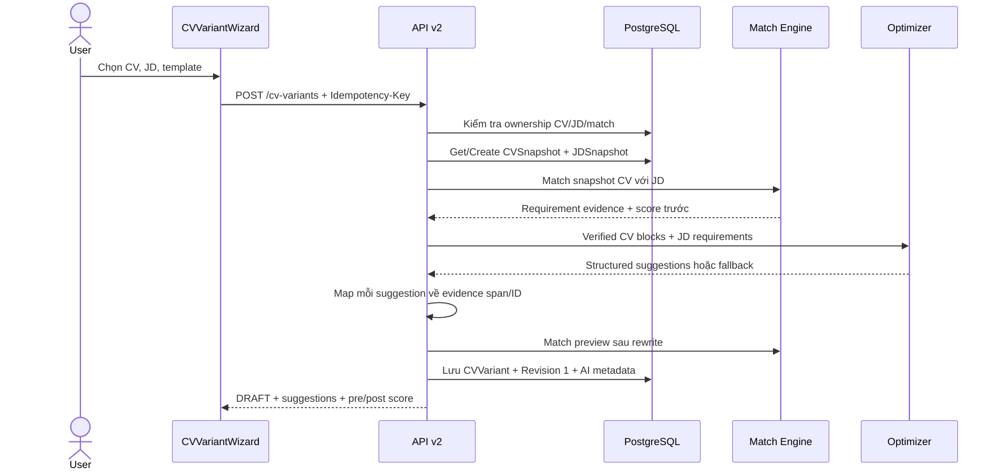
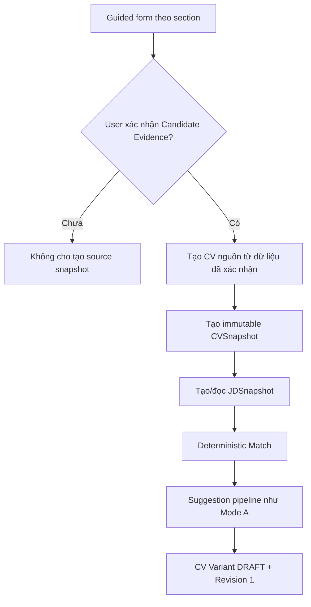
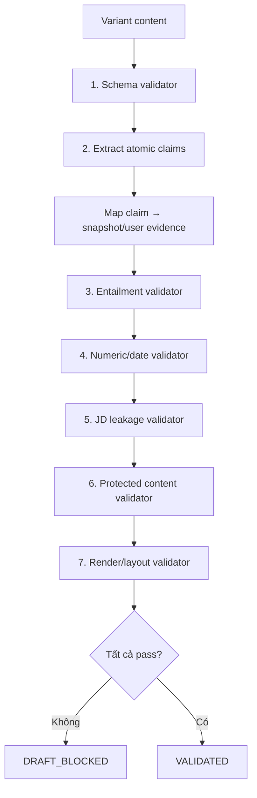

# Báo cáo Task 2 — CV Variant & AI Optimization theo JD

**Branch:** `feat/cv-variants-optimization`  
**Ngày hoàn thành:** 2026-08-15  
**Owner:** Thành viên 2  
**Trạng thái:** Hoàn tất implementation và automated acceptance gates.

## 1. Kết quả triển khai

Đã xây dựng một vertical slice độc lập cho CV Variant theo `/api/v2`, không ghi
đè CV gốc và không dùng suggestion draft làm source of truth. Mỗi variant truy
ngược được về `cv_snapshot`, `jd_snapshot`, evidence spans, revision, AI metadata,
validator result, PDF checksum và trace ID.

Hai mode đã hỗ trợ:

- `HAS_CV`: CV hiện có + JD → snapshot → Match deterministic → suggestion có evidence → user review → validate → publish/download.
- `NO_CV`: form có autosave + JD → user xác nhận Candidate Evidence → snapshot → cùng pipeline review/validate/publish.

## 2. Luồng nghiệp vụ và pipeline chức năng

### 2.1 Pipeline tổng thể

```mermaid
flowchart LR
    U[Người dùng chọn mode] --> I[CV/JD input]
    I --> O[Ownership + idempotency]
    O --> S[CV/JD immutable snapshots]
    S --> M[Deterministic CV-JD Match]
    M --> G[Generation Contract]
    G --> A[Gemini structured output hoặc fallback]
    A --> E[Evidence mapping + suggestion draft]
    E --> R[User accept/reject/edit]
    R --> V[7 hard validators]
    V -->|Fail| B[DRAFT_BLOCKED]
    V -->|Pass| D[VALIDATED]
    D --> P[Publish + PDF + SHA-256]
    P --> H[PUBLISHED + history/audit]
```



Các invariant được giữ xuyên suốt pipeline:

- CV gốc không bị cập nhật bởi tối ưu hoặc export.
- CV/JD mutable chỉ dùng để tạo snapshot; pipeline sau đó đọc snapshot.
- Suggestion của AI không tự trở thành candidate fact.
- LLM không tính Match Score, không đổi validator result và không publish.
- Mọi lần user/AI thay đổi nội dung đều tạo revision mới.
- Mọi claim được publish phải có evidence ID hoặc user-confirmed evidence.

### 2.2 Luồng Mode A — Có CV và có JD



Chi tiết xử lý:

1. API xác minh CV thuộc `current_user`; JD phải là JD hệ thống hoặc do user tạo.
2. Nếu gửi `match_id`, match phải thuộc user và đúng CV/JD.
3. `get_or_create_cv_snapshot` và `get_or_create_jd_snapshot` tạo source of truth bất biến.
4. Match engine tạo requirement/evidence và score ban đầu.
5. Optimizer chỉ nhận CV blocks có nguồn và JD requirements liên quan.
6. Suggestion chỉ được trả về khi `original` map được đúng block/evidence.
7. Variant và revision đầu tiên được lưu riêng; bản ghi `CV` gốc không thay đổi.

### 2.3 Luồng Mode B — Chưa có CV nhưng có JD



Frontend thu thập `personal_info`, `summary`, `skills`, `experience`, `projects`,
`education` và template. Checkbox xác nhận là hard requirement của UI. Backend chỉ
tạo Candidate Evidence snapshot khi `candidate_evidence_confirmed=true`. Sau khi
có snapshot, Mode B dùng chung hoàn toàn pipeline Match, suggestion, validation,
publish và export với Mode A.

### 2.4 Pipeline Match và tạo suggestion AI

```text
CVSnapshot.profile_json + CVSnapshot.raw_text
  → deterministic CV-JD Match
  → matched/partial/missing requirements + evidence
  → Generation Contract
  → Pydantic structured-output optimizer
  → Gemini nếu khả dụng, deterministic fallback nếu lỗi/thiếu key
  → block_id/section/original integrity checks
  → technology/numeric/scope/JD-leakage guardrails
  → source evidence ID + start/end span
  → suggestion status PENDING_USER_REVIEW
  → deterministic Match lại trên preview content
```

Mỗi suggestion gồm:

```json
{
  "id": "suggestion-1",
  "block_id": "experience-001-description",
  "section": "experience",
  "original": "Built REST API using Python",
  "proposed": "Developed REST API using Python",
  "reason": "Align verified Python evidence",
  "source_evidence_ids": ["cv:<snapshot>:<start>:<end>"],
  "source_spans": [],
  "decision": "pending",
  "validator_status": "PENDING_USER_REVIEW"
}
```

AI metadata được persist cùng variant:

```text
provider, model, prompt_version, fallback_used, latency_ms
```

### 2.5 Luồng review suggestion

| Quyết định | Backend xử lý | Kết quả |
|---|---|---|
| Accept | Dùng `proposed`, chạy fact-check, apply đúng `block_id` | Revision mới, suggestion `accept` |
| Edit | Kiểm tra `final_text` với evidence gốc rồi apply patch | Revision mới nếu an toàn |
| Reject | Không sửa content | Revision mới, suggestion `reject` |

Pipeline Accept/Edit:

```text
final_text
  → evidence contract
  → numeric/date check
  → scope/seniority check
  → JD-only technology check
  → block_id + section + original consistency
  → apply patch vào bản sao content
  → persist CVVariantRevision
  → reset previous validation
  → status DRAFT
```

Nếu suggestion không còn khớp revision hiện tại, API trả
`CV_SUGGESTION_PATCH_FAILED` và không lưu nội dung.

### 2.6 Luồng autosave, revision và controlled write-back

Frontend đánh dấu `dirty` khi user sửa section và debounce `900ms` trước khi gọi:

```http
PATCH /api/v2/cv-variants/{id}
```

Mỗi autosave:

1. Giữ lại private metadata `_suggestions`, `_match_scores`, `_source_confirmed`.
2. Ghi nội dung mới vào variant.
3. Tăng `revision_no`.
4. Tạo `cv_variant_revisions` với `editor_type=user`.
5. Xóa validation result cũ vì content hash đã thay đổi.
6. Đưa trạng thái về `DRAFT`.

Với fact mới do user tự nhập, user phải dán đúng claim và xác nhận rõ ràng. Backend
lưu evidence ID dạng `user-confirmed:<hash>`. AI suggestion không thể tự đi qua
luồng này và không thể tự xác nhận thay user.

### 2.7 Pipeline validation và publish gate



Validation persist:

- Một `cv_variant_claims` record cho mỗi atomic claim.
- Evidence IDs, source spans, status và validator reason.
- `content_hash`, tổng claim, claim supported/blocked và PDF render metadata.
- Audit event `cv_variant_validated` kèm `trace_id` và kết quả pass/fail.

Validation không dừng ở lỗi đầu tiên; API tổng hợp lỗi của cả bảy gate để frontend
hiển thị và user sửa trong một vòng review.

### 2.8 Luồng publish, preview và export PDF

```text
POST /{id}/publish
  → kiểm tra ownership
  → chạy lại toàn bộ validation trên revision hiện tại
  → fail: DRAFT_BLOCKED + CV_VARIANT_PUBLISH_BLOCKED
  → pass: render PDF 1–2 trang
  → ghi asset theo user/variant/revision
  → tính SHA-256 checksum
  → lưu rendered_uri, checksum, published_at, retention_until
  → status PUBLISHED
  → audit cv_variant_published
```

- Preview dùng `GET /export?preview=true` và chỉ hoạt động khi validation pass.
- Download không có `preview=true` chỉ cho variant `PUBLISHED`.
- API trả `X-Content-SHA256` để client/QA kiểm tra file.
- Variant đã publish là immutable; muốn sửa phải tạo variant mới.

### 2.9 Luồng history, filter, delete và retention

```text
GET /cv-variants?cv_id=&jd_id=&status=
  → ownership filter
  → join source/target snapshots khi có filter
  → trả variant metadata + status + revision

GET /cv-variants/{id}
  → variant + claims + revision history + validator result

DELETE /cv-variants/{id}
  → ownership check
  → xóa PDF trong đúng asset root
  → cascade claims/revisions
  → giữ audit event cv_variant_deleted
```

`retention_until` mặc định là 365 ngày. Test dùng thư mục Temp; development dùng
`data/generated/cv_variants`; production có thể cấu hình `CV_VARIANT_ASSET_ROOT`
hoặc thay adapter bằng S3/MinIO.

### 2.10 State machine

```text
CREATE
  → DRAFT
  → autosave/review/edit → DRAFT + revision mới
  → validate fail        → DRAFT_BLOCKED
  → sửa lỗi/autosave     → DRAFT
  → validate pass        → VALIDATED
  → publish              → PUBLISHED
  → PUBLISHED            → immutable/download/delete
```

Không có chuyển trạng thái trực tiếp từ `DRAFT` hoặc `DRAFT_BLOCKED` sang
`PUBLISHED`; endpoint publish luôn chạy lại validation.

### 2.11 Luồng lỗi và fallback an toàn

| Tình huống | Xử lý |
|---|---|
| Gửi lại request create | `Idempotency-Key` trả variant đã tạo, không nhân bản |
| CV/JD/match không thuộc user | Trả 404 ownership-safe, không tiết lộ tài nguyên |
| Gemini thiếu key hoặc lỗi | Dùng deterministic fallback, lưu `fallback_used=true` |
| AI thêm claim/số/skill | Bị suggestion guardrail hoặc hard validator chặn |
| User sửa suggestion không an toàn | HTTP 422, không tạo revision chứa patch đó |
| Content đổi sau validation | Xóa validation result, quay về `DRAFT` |
| Render lỗi/trang rỗng/>2 trang | `render_layout` fail, không publish |
| Asset path thoát root | Từ chối ghi/xóa file |
| Variant đã publish bị sửa | HTTP 409 `CV_VARIANT_IMMUTABLE` |

### 2.12 Mapping chức năng → API → service

| Chức năng | API | Service/hàm chính |
|---|---|---|
| Tạo Mode A/Mode B | `POST /cv-variants` | `create_variant`, `_generate_suggestions` |
| Snapshot CV/JD | Nội bộ khi create | `get_or_create_cv_snapshot`, `get_or_create_jd_snapshot` |
| Match trước/sau | Nội bộ khi create | `_analysis_for`, `build_cv_jd_evidence` |
| AI/fallback | Nội bộ khi create | `optimize_resume_for_jd` |
| Autosave/revision | `PATCH /cv-variants/{id}` | `save_revision` |
| Accept/reject/edit | `PUT /suggestions/{id}` | `validate_claim_contract`, `apply_cv_block_patches` |
| Validate | `POST /validate` | `validate_variant` |
| Publish | `POST /publish` | `publish_variant` |
| Preview/download | `GET /export` | `build_cv_pdf`, checksum/asset guard |
| History/filter | `GET /cv-variants` | ownership query + snapshot joins |
| Delete | `DELETE /cv-variants/{id}` | `remove_variant_asset` + database cascade |

## 3. Backend, data và migration

### Data model mới

- `cv_templates`: template/schema/renderer được version hóa.
- `cv_variants`: nội dung variant, source/target snapshots, status, trace,
  prompt/pipeline version, validation, PDF URI/checksum và retention.
- `cv_variant_claims`: atomic claim → evidence IDs/spans → validator status/reason.
- `cv_variant_revisions`: mọi lần AI/user sửa đều tạo revision, không sửa lịch sử cũ.

Migration PostgreSQL: `backend/migrations/20260815_01_cv_variants.sql`, có upgrade
và rollback note. Local/test tiếp tục tương thích cơ chế `Base.metadata.create_all`.

### API v2

```http
GET    /api/v2/cv-variants/templates
POST   /api/v2/cv-variants
GET    /api/v2/cv-variants
GET    /api/v2/cv-variants/{id}
PATCH  /api/v2/cv-variants/{id}
PUT    /api/v2/cv-variants/{id}/suggestions/{suggestion_id}
POST   /api/v2/cv-variants/{id}/validate
POST   /api/v2/cv-variants/{id}/publish
GET    /api/v2/cv-variants/{id}/export
DELETE /api/v2/cv-variants/{id}
```

API có ownership isolation, `Idempotency-Key`, `X-Trace-ID`, error envelope
`{code, message, trace_id, retryable}`, filter history theo CV/JD/status và
published-variant immutability.

### AI và Generation Contract

- Chỉ đưa CV blocks/evidence đã xác nhận và JD requirements vào optimizer.
- Structured output bằng Pydantic; Gemini lỗi/không cấu hình sẽ dùng deterministic fallback.
- Lưu `provider`, `model`, `prompt_version`, `fallback_used`, `latency_ms`.
- Match score trước/sau preview đều do deterministic Match engine tính lại; frontend không tự tính score.
- User edit suggestion phải qua fact-check trước khi được áp dụng.

## 4. Bảy hard validators

| Validator | Gate |
|---|---|
| Schema | Đúng kiểu/section/giới hạn nội dung |
| Atomic claim | Mọi claim có evidence ID hoặc user-confirmed evidence |
| Entailment | Không mâu thuẫn, nâng seniority/phạm vi/tác động |
| Numeric/date | Không thêm hoặc đổi số/ngày ngoài evidence |
| JD leakage | Không biến keyword chỉ có trong JD thành candidate fact |
| Protected content | Không xóa section quan trọng hoặc đổi danh tính nguồn |
| Render/layout | PDF hợp lệ, không trang rỗng, tối đa 2 trang |

Fail bất kỳ gate nào → `DRAFT_BLOCKED`; API preview/publish/download bị chặn.
Pass đủ → `VALIDATED`; publish tạo PDF SHA-256 và chuyển `PUBLISHED`.

## 5. Frontend

Đã thêm React `CVVariantWizard` với typed API client riêng, không thêm logic mới
vào `frontend/app.js`:

- Chọn Mode A/Mode B, CV, JD và ba template.
- Guided form Mode B và xác nhận Candidate Evidence.
- Autosave revision cục bộ theo React state.
- Hiển thị original/evidence/rewrite/reason; accept/reject/edit từng suggestion.
- Controlled user write-back cho fact mới.
- Editor theo section, Match trước/sau, AI/fallback metadata.
- Hiển thị lỗi của từng validator, preview PDF, publish, download và history.
- Loading/error/retry, keyboard focus, ARIA feedback và responsive mobile layout.

Next.js proxy đã hỗ trợ `/api/v2/*`.

## 6. Test và evaluation

### Automated tests mới

- Unit: evidence mapping, safe rephrase, numeric, scope inflation, JD leakage,
  controlled user confirmation và đủ 7 validator contracts.
- API/E2E: Mode A và Mode B; snapshot immutability; ownership; idempotency;
  autosave/revision; accept/reject/edit; blocked publish; recovery; preview;
  publish/checksum/export/history/delete; published immutability.
- Frontend contract: hai mode, typed API surface, autosave/review/publish/download,
  accessibility/mobile và không đưa feature logic vào legacy `app.js`.
- PDF regression: ba template, PDF hợp lệ 1–2 trang.

### Corpus 100 claims

`eval/cv_variants/claims.jsonl`:

- 50 supported.
- 25 unsupported.
- 15 conflicting/scope-inflated.
- 10 numeric/date edge cases.

Release metrics được test tự động:

- Unsupported-claim publish rate: `0`.
- Evidence coverage của publishable claims: `100%`.
- Render success gate: `>=95%` trên 100 cases và ba template.

### Kết quả chạy ngày 2026-08-15

```text
Ruff backend/src backend/tests: PASS
Backend full regression (final): 229 passed in 220.88s
Frontend TypeScript: PASS
Frontend production build: PASS
CV Variant focused suite: 18 passed
```

Browser visual QA đã được khởi tạo nhưng môi trường Codex không có browser binding
khả dụng, nên không tạo screenshot/video trong phiên này. Automated UI contract,
responsive CSS checks, TypeScript và production build đều đã pass; screenshot/video
desktop-mobile vẫn cần được chụp khi mở PR theo checklist chung của nhóm.

## 7. Acceptance checklist

- [x] CV gốc bất biến; variant là bản độc lập.
- [x] Published variant truy được CV/JD/evidence nguồn.
- [x] Claim sai không vượt publish gate.
- [x] Mode A và Mode B chạy create → review → validate → publish → download.
- [x] Autosave, revision, version history và immutable published state.
- [x] Ownership, idempotency, audit trace, AI metadata và retention.
- [x] PDF preview/render/checksum/export/delete.
- [x] Corpus/benchmark và full backend regression pass.
- [x] Frontend typecheck/production build/accessibility contract pass.
- [ ] Screenshot/video desktop-mobile: chờ môi trường có browser binding.

## 8. File chính

- `backend/src/services/cv_variant_service.py`
- `backend/src/api/v2/cv_variants.py`
- `backend/src/models/cv_variant_schemas.py`
- `backend/migrations/20260815_01_cv_variants.sql`
- `frontend/components/candidate/CVVariantWizard.tsx`
- `frontend/lib/cvVariantsApi.ts`
- `frontend/app/styles/cv-variants.css`
- `backend/tests/test_api/test_cv_variants_v2.py`
- `backend/tests/test_cv_variant_validators.py`
- `backend/tests/test_cv_variant_evaluation.py`
- `eval/cv_variants/claims.jsonl`

## 9. Known limitations

- External Gemini calls không chạy trong test suite; deterministic fallback là
  baseline offline và đã được kiểm thử.
- Asset hiện lưu local filesystem theo retention metadata. Production nhiều instance
  nên thay `rendered_uri` bằng S3/MinIO adapter mà không đổi API contract.
- Migration SQL cần được DBA/apply pipeline chạy trước deploy PostgreSQL; local test
  tự tạo bảng bằng SQLAlchemy metadata.
