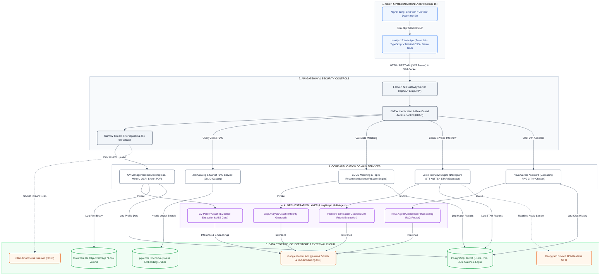
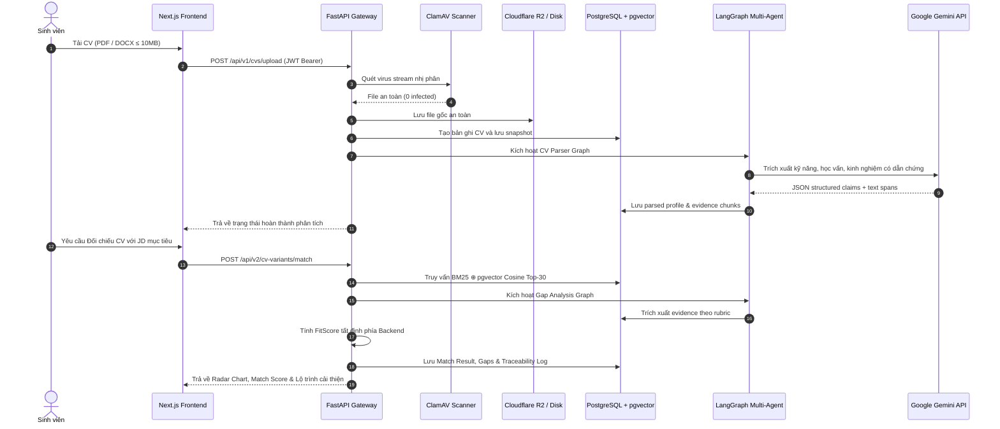

# System Architecture — Career Assistant X (P-041)

> **Dự án**: Career Assistant — Nền tảng Trợ lý Hướng nghiệp & Tối ưu CV/Phỏng vấn dựa trên bằng chứng thật  
> **Chương trình**: VinUni AI20K Build Phase — Cohort 3  
> **Deliverable**: #3 — Architecture Diagram & System Design Specification  

---

## 1. Tổng quan Kiến trúc Hệ thống (Executive Overview)

Career Assistant X được thiết kế theo kiến trúc **5 tầng phân lập (5-Tier Layered Architecture)** với nguyên tắc cốt lõi: **"Không evidence → không claim — AI không tự quyết định điểm số"**.

---

## 2. Chi tiết Thành phần Hệ thống (Component Specifications)

| Tầng | Công nghệ thực tế | Trách nhiệm & Quyết định kỹ thuật |
|---|---|---|
| **Presentation (Frontend)** | Next.js 15.5.x, React 18.3, TypeScript, Tailwind CSS | Cung cấp giao diện phân quyền 3 roles: Sinh viên, Cố vấn, Doanh nghiệp. Tích hợp Audio Recorder, Bento Grid và visualizer sóng âm. |
| **API Gateway** | FastAPI, Uvicorn, Pydantic v2, SQLAlchemy async | REST API `/api/v1/*`, `/api/v2/*` và WebSocket `/api/v1/ws/interview/{session_id}`. Xử lý Rate Limiting, Request Validation và Error Serialization. |
| **Bảo mật & Auth** | PyJWT, bcrypt, Google OAuth2, RBAC | Xác thực JWT Bearer, Token Revocation, phân quyền đa tầng và kiểm soát truy cập dữ liệu cá nhân hóa. |
| **Bảo vệ Mã độc** | ClamAV 1.4 Daemon (:3310) | Quét luồng stream nhị phân của mọi file PDF/DOCX tải lên trước khi đưa vào pipeline OCR. |
| **AI Multi-Agent** | LangGraph, LangChain Google GenAI | Điều phối 4 StateGraph độc lập: CV Parser, Gap Analysis, STAR Interviewer và Nova Conversational Agent. |
| **Cơ sở dữ liệu & Vector** | PostgreSQL 16 + pgvector | Lưu trữ dữ liệu quan hệ (Users, CVs, JDs, Matches, Interviews, Notifications, Logs) và chỉ mục vector cosine 768-chiều. |
| **Object Storage** | Cloudflare R2 (`boto3` S3 API) | Lưu trữ file CV/JD gốc và các bản PDF xuất tự động (`r2://<bucket>/...`) với cơ chế local volume fallback. |
| **Mô hình AI & Voice** | Google Gemini, Deepgram Nova-3, gTTS | Gemini Flash xử lý suy luận, Deepgram Nova-3 nhận dạng giọng nói realtime, gTTS phát âm tiếng Việt tự nhiên. |

---

## 3. Luồng Dữ liệu End-to-End (Data Flow Sequence)

---

## 4. Thuật toán Lõi & Quy trình Chống Ảo giác (Anti-Hallucination Pipeline)

### 4.1. CV–JD Hybrid Matching & FitScore Formula
1. **Trích xuất nguyên tử**: Tách JD thành các yêu cầu nguyên tử (Required Skills, Experience, Education, Domain).
2. **Hybrid Search**: Kết hợp tìm kiếm từ khóa BM25 và Vector Similarity (Cosine distance trên `pgvector`).
3. **Reciprocal Rank Fusion (RRF)**:
   $$\text{RRF\_Score}(d) = \sum_{m \in \{\text{BM25}, \text{Vector}\}} \frac{1}{60 + \text{Rank}_m(d)}$$
4. **FitScore tất định (Deterministic Backend Calculation)**:
   $$\text{FitScore} = 0.35 \times S_{\text{Skills}} + 0.30 \times S_{\text{Exp}} + 0.10 \times S_{\text{Edu}} + 0.10 \times S_{\text{Pref}} + 0.15 \times S_{\text{Domain}}$$
   *Mọi điểm số đều phải có evidence span trích xuất từ CV gốc — Không có evidence $\rightarrow$ 0 điểm.*

### 4.2. CV Optimizer (CP-SAT Constraint Programming)
- Sử dụng Google OR-Tools Constraint Programming (CP-SAT) để tối ưu hóa việc chọn lọc nội dung, bullet points và độ dài câu văn sao cho vừa khít khung 1–2 trang A4 chuẩn quốc tế, không làm tràn trang và không bịa đặt kinh nghiệm.

### 4.3. Nova Agent — Cascading RAG 3 Tầng
- **Tầng 1 (Direct DB Query)**: Trả lời tức thì các câu hỏi cấu trúc (trạng thái ứng tuyển, lịch phỏng vấn) không cần gọi LLM.
- **Tầng 2 (Verbatim Evidence Extraction)**: Trích xuất nguyên văn đoạn nội dung khi độ tương đồng Hybrid $\ge 70\%$.
- **Tầng 3 (Grounded LLM Generation)**: Gemini Flash chỉ được tổng hợp câu trả lời dựa trên Top-3 evidence chunks đã truy xuất, kèm trích dẫn nguồn (Attribution Citation).

---

## 5. Khung Kiểm soát An ninh & Vận hành (Security & DevOps)

1. **Bảo mật File & Dữ liệu**:
   - Quét mã độc tự động với ClamAV trước khi lưu trữ.
   - Cơ chế cách ly dữ liệu theo người dùng (`user_id` scoping ở mọi câu truy vấn SQL).
2. **Kiểm soát Tải & Khả năng phục hồi**:
   - Token-bucket Rate Limiter ngăn chặn bão request.
   - Cơ chế tự động fallback sang Local Hashing Embedding khi API Gemini chạm giới hạn quota.
3. **CI/CD Tự động hóa**:
   - GitHub Actions chạy 5 bước kiểm tra: ESLint, TypeScript Typecheck, Next.js Build, Ruff Lint, Pytest Suite (740+ backend tests, 159 frontend tests).
   - Frontend tự động triển khai trên Vercel Edge Network.
   - Backend tự động đóng gói Docker container và triển khai trên Render Cloud Platform.
