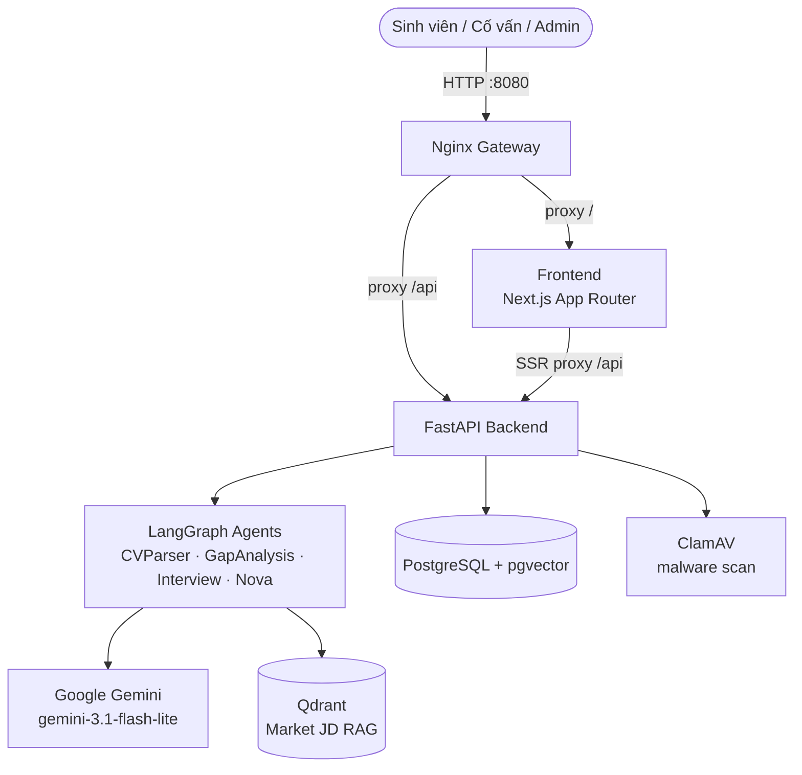
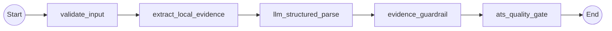
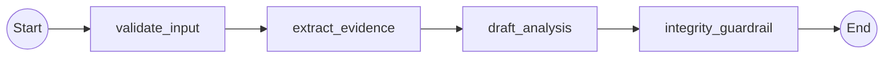
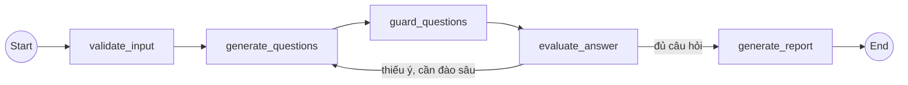
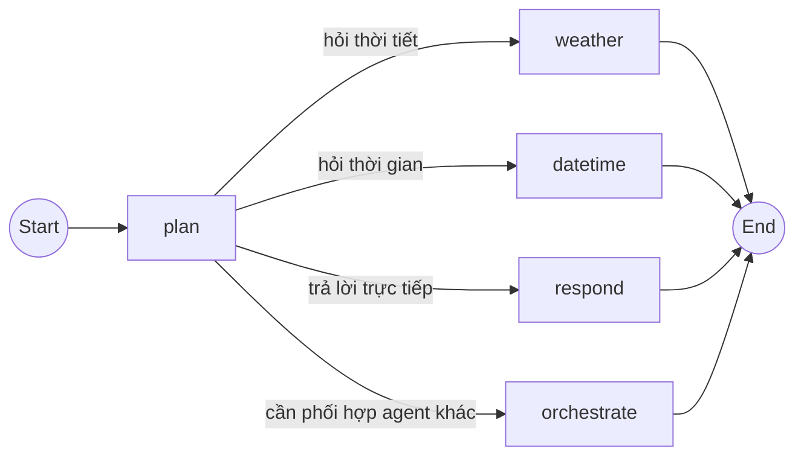
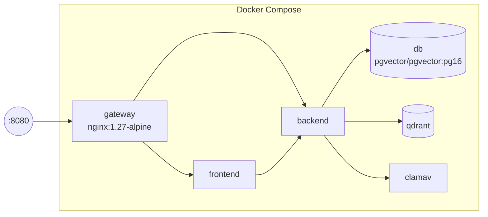

# Architecture Diagram

## System Overview

## Agent Flows (LangGraph, 4 graph độc lập)

### CVParserAgent — bóc tách CV thành JSON có evidence guardrail

### GapAnalysisAgent — so khớp CV↔JD, sinh gợi ý tối ưu

### InterviewAgent — phỏng vấn thử, chấm rubric STAR

### CareerAssistantAgent "Nova" — chatbot hội thoại

## Deployment (Docker Compose — 6 service)

## Component Details

| Component | Technology | Purpose |
|-----------|-----------|---------|
| Gateway | Nginx | Cổng publish duy nhất (`:8080`), proxy tới frontend/backend nội bộ |
| Frontend | Next.js 15 (App Router) + React 18 + TypeScript | Giao diện Sinh viên/Cố vấn/Admin |
| Backend | FastAPI + Uvicorn (async) | REST API `/api/v1/*`, JWT auth, điều phối agent |
| Agents | LangGraph (4 graph riêng) | CVParser, GapAnalysis, Interview, Career Assistant "Nova" |
| LLM | Google Gemini (`gemini-3.1-flash-lite`) | Sinh nội dung + embedding |
| Database | PostgreSQL + pgvector (Alembic migrations) | Dữ liệu quan hệ: users, CV, JD, matches, interviews, chat, HITL |
| Vector Store | Qdrant + Gemini Embedding | RAG ~98 JD thị trường, fallback catalog search nếu lỗi |
| Malware Scan | ClamAV | Quét bắt buộc mọi CV upload trước khi lưu/parse |

Chi tiết đầy đủ (data flow, bảng DB, security, design decisions): xem [`ARCHITECTURE.md`](../ARCHITECTURE.md).
