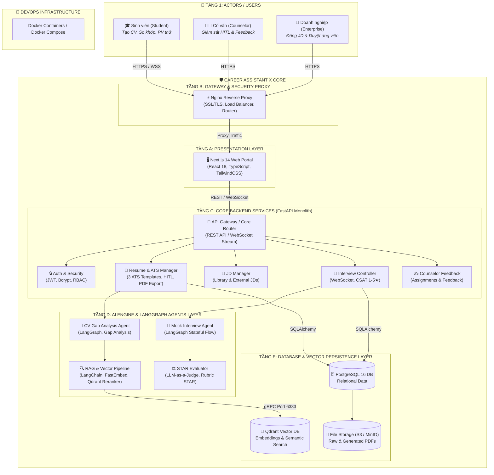

# 🏗️ Sơ đồ Kiến trúc Phân tầng Hệ thống (System Architecture)
> **Career Assistant X System - C4 Container Architecture Model**

## 1. Tổng quan Kiến trúc

Hệ thống **Career Assistant X** được thiết kế theo mô hình phân tầng đa lớp (Multi-tier Containerized Monolith & AI Engine) đảm bảo tính mở rộng, bảo mật cao, tích hợp Human-In-The-Loop (HITL) và xử lý thời gian thực qua WebSocket.

---

## 2. Chi tiết các Tầng Kiến trúc

### 2.1. Tầng Presentation (Frontend)
- **Công nghệ**: Next.js 14, React 18, TypeScript, TailwindCSS.
- **Vai trò**: Cung cấp giao diện cho 3 nhóm người dùng:
  - **Student Portal**: Quản lý CV, chọn ATS Template, xem điểm ATS & Gap Analysis, phòng phỏng vấn trực tuyến WebSocket.
  - **Counselor Portal**: Bảng giám sát sinh viên, gửi bài tập/nhận xét (HITL), duyệt nội dung AI.
  - **Enterprise Portal**: Quản lý tin tuyển dụng, xem danh sách Top Candidate CV.

### 2.2. Tầng Gateway & Security (Proxy)
- **Công nghệ**: Nginx Reverse Proxy.
- **Vai trò**: Điều phối luồng dữ liệu, mã hóa SSL/TLS, giới hạn băng thông (Rate-limiting), hỗ trợ kết nối WebSocket hai chiều cho phỏng vấn thử.

### 2.3. Tầng Core Backend Services (FastAPI Monolith)
- **Công nghệ**: Python 3.11, FastAPI, Pydantic, SQLAlchemy.
- **Các Module chính**:
  1. **Auth & Security**: Đăng ký, đăng nhập, JWT Token, mã hóa mật khẩu Bcrypt, phân quyền 3 Role (Student, Counselor, Enterprise).
  2. **Resume & ATS Manager**: Trích xuất dữ liệu CV, hỗ trợ 3 mẫu ATS standard, cơ chế HITL Accept/Reject gợi ý chỉnh sửa, xuất file PDF bằng ReportLab.
  3. **JD Manager**: Quản lý thư viện JD doanh nghiệp và dán JD từ nguồn ngoài.
  4. **Interview Controller**: Quản lý vòng đời phỏng vấn qua WebSocket, tính điểm tổng kết và khảo sát CSAT (1-5★).
  5. **Counselor Feedback**: Lưu trữ và truyền tải thông tin phản hồi từ cố vấn đến sinh viên.

### 2.4. Tầng AI Engine & LangGraph Agents Layer
- **Công nghệ**: LangGraph, LangChain, FastEmbed, OpenAI / Gemini / Local LLM.
- **Các thành phần Agent**:
  1. **CV Gap Analysis Agent**: So sánh CV và JD, phát hiện kỹ năng còn thiếu dựa trên kinh nghiệm THẬT của người dùng.
  2. **Mock Interview Agent**: Điều phối cuộc đối thoại đa vòng, tự động sinh câu hỏi gợi mở follow-up nếu câu trả lời quá ngắn.
  3. **STAR Evaluator**: Phân rã câu trả lời thành Situation - Task - Action - Result và chấm điểm theo Rubric.
  4. **RAG & Vector Pipeline**: Chunking tài liệu JD/ATS/Rubric và thực hiện Rerank kết quả tìm kiếm ngữ nghĩa.

### 2.5. Tầng Cơ sở dữ liệu & Lưu trữ (Persistence Layer)
- **PostgreSQL 16**: Lưu trữ toàn bộ dữ liệu quan hệ (Users, Resumes, Sessions, QA Logs, Reports, Feedbacks).
- **Qdrant Vector DB**: Cơ sở dữ liệu vector lưu trữ Embeddings của JD thị trường, Tiêu chí ATS và Rubric STAR.
- **File Storage (S3 / MinIO)**: Lưu trữ file CV PDF/DOCX gốc và file PDF được xuất từ hệ thống.
