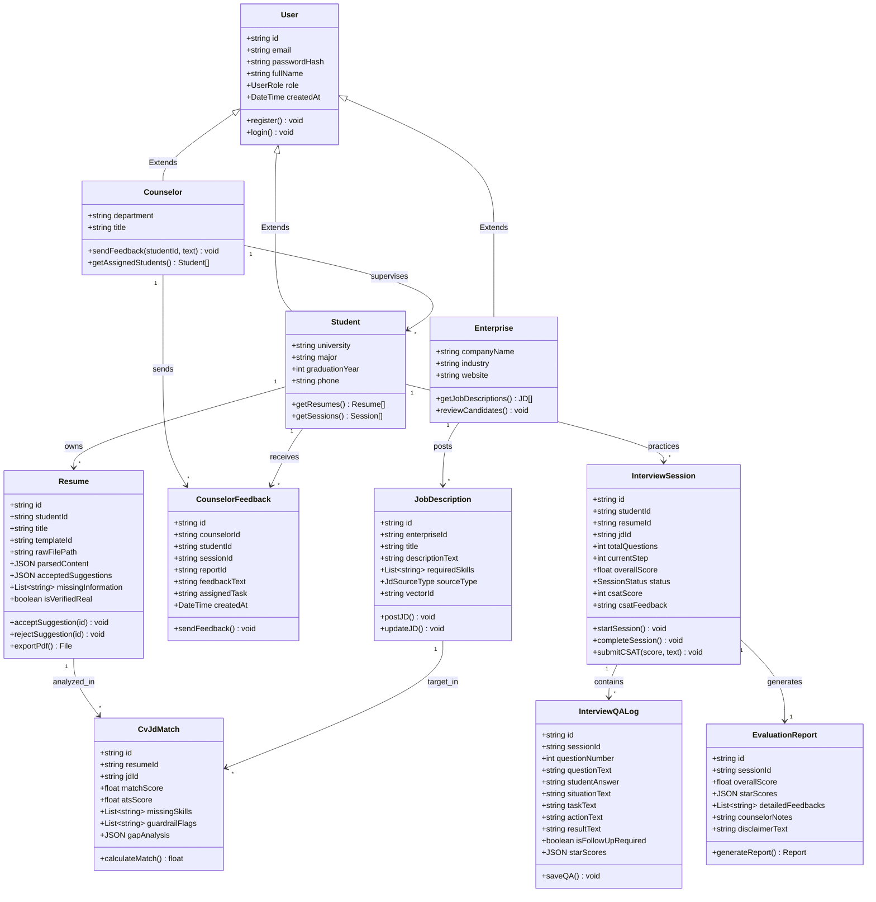

# 📐 Sơ đồ Lớp Chi tiết (UML Class Diagram)
> **Career Assistant X System - Detailed Object & Class Specifications**

## 1. Tổng quan Sơ đồ Lớp

Sơ đồ lớp thể hiện chi tiết cấu trúc đối tượng, các thuộc tính, phương thức và mối quan hệ giữa các Entity trong hệ thống **Career Assistant X System**.

---

## 2. Mô tả Chi tiết các Lớp chính

### 2.1. Nhóm Người dùng (User & Actors)
- **User (Base Class)**: Lớp cơ sở chứa thông tin định danh dùng chung (`id`, `email`, `passwordHash`, `fullName`, `role`).
- **Student**: Đại diện sinh viên ứng tuyển. Sở hữu các bài làm CV, danh sách phiên phỏng vấn và tiếp nhận phản hồi từ cố vấn.
- **Counselor**: Đại diện cố vấn hướng nghiệp (HITL). Giám sát tiến độ học tập, bổ sung ghi chú chuyên môn vào báo cáo phỏng vấn.
- **Enterprise**: Đại diện nhà tuyển dụng. Đăng tin tuyển dụng (JD) và xem danh sách ứng viên phù hợp.

### 2.2. Nhóm Quản lý Hồ sơ CV & JD
- **Resume**: Lưu giữ dữ liệu CV trích xuất, 3 Template ATS chuẩn, các gợi ý tối ưu đã duyệt (`acceptedSuggestions`), thông tin còn thiếu (`missingInformation`) và cờ xác thực thông tin thật (`isVerifiedReal`).
- **JobDescription**: Bài tuyển dụng với thông tin kỹ năng yêu cầu, loại nguồn (Nội bộ/Ngoại bộ) và mã định danh vector `vectorId` phục vụ RAG.
- **CvJdMatch**: Kết quả so khớp giữa CV và JD bao gồm Match Score %, ATS Score, danh sách kỹ năng thiếu và cảnh báo nghi vấn bịa đặt từ Guardrail Engine.

### 2.3. Nhóm Phỏng vấn & Đánh giá STAR
- **InterviewSession**: Quản lý vòng đời phỏng vấn mô phỏng, lưu giữ điểm CSAT (1-5 sao) và trạng thái phiên phỏng vấn.
- **InterviewQALog**: Nhật ký từng lượt Hỏi - Đáp giữa AI Agent và sinh viên. Phân rã câu trả lời theo chuẩn STAR (Situation, Task, Action, Result) và tự động ghi nhận cờ cần câu hỏi follow-up.
- **EvaluationReport**: Báo cáo tổng hợp đánh giá phỏng vấn sau khi kết thúc phiên phỏng vấn, tích hợp ghi chú bổ sung từ cố vấn.
- **CounselorFeedback**: Phản hồi, bài tập cá nhân hóa do cố vấn khởi tạo cho sinh viên.
