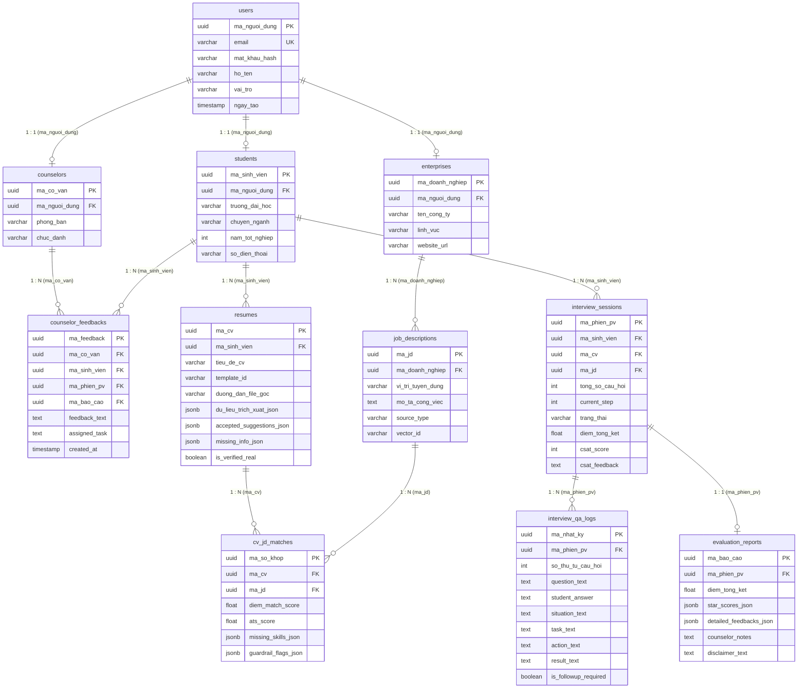

# 🗄️ Sơ đồ Cơ sở Dữ liệu (Database ERD Diagram)
> **Career Assistant X System - Relational Database Schema Specifications**

## 1. Sơ đồ ERD (Entity Relationship Diagram)

Sơ đồ ERD thể hiện mối quan hệ giữa 11 bảng cơ sở dữ liệu chính trong hệ thống PostgreSQL 16.

---

## 2. Chi tiết Danh mục Bảng Cơ sở Dữ liệu

| STT | Tên Bảng (`table_name`) | Mô tả Chức năng | Các Trường Khóa |
|---|---|---|---|
| 1 | `nguoi_dung` (`users`) | Tài khoản người dùng chung trong hệ thống | `ma_nguoi_dung` (PK), `email` (UK) |
| 2 | `sinh_vien` (`students`) | Thông tin hồ sơ sinh viên | `ma_sinh_vien` (PK), `ma_nguoi_dung` (FK) |
| 3 | `co_van` (`counselors`) | Thông tin hồ sơ cố vấn hướng nghiệp | `ma_co_van` (PK), `ma_nguoi_dung` (FK) |
| 4 | `doanh_nghiep` (`enterprises`) | Thông tin hồ sơ nhà tuyển dụng | `ma_doanh_nghiep` (PK), `ma_nguoi_dung` (FK) |
| 5 | `ho_so_cv` (`resumes`) | Danh sách CV, mẫu template ATS & dữ liệu trích xuất | `ma_cv` (PK), `ma_sinh_vien` (FK) |
| 6 | `counselor_feedbacks` | Phản hồi & bài tập cá nhân hóa do cố vấn gửi | `ma_feedback` (PK), `ma_co_van` (FK), `ma_sinh_vien` (FK) |
| 7 | `bai_tuyen_dung` (`job_descriptions`) | Danh sách công việc tuyển dụng và vector ID | `ma_jd` (PK), `ma_doanh_nghiep` (FK) |
| 8 | `ket_qua_so_khop` (`cv_jd_matches`) | Kết quả so khớp giữa CV và JD (Match %, ATS %, Gap) | `ma_so_khop` (PK), `ma_cv` (FK), `ma_jd` (FK) |
| 9 | `phien_phong_van` (`interview_sessions`) | Phiên phỏng vấn thử AI & khảo sát CSAT (1-5★) | `ma_phien_pv` (PK), `ma_sinh_vien` (FK) |
| 10 | `nhat_ky_hoi_dap` (`interview_qa_logs`) | Nhật ký từng câu hỏi, phản hồi STAR & cờ follow-up | `ma_nhat_ky` (PK), `ma_phien_pv` (FK) |
| 11 | `bao_cao_danh_gia` (`evaluation_reports`) | Báo cáo kết quả phỏng vấn tổng hợp & ý kiến cố vấn | `ma_bao_cao` (PK), `ma_phien_pv` (FK) |
