# 🌳 Sơ đồ Phân cấp Chức năng Hệ thống (Functional Hierarchy Diagram)
> **Career Assistant X System - Functional Hierarchy Structure**

## 1. Sơ đồ Phân cấp Chức năng Tổng thể

```mermaid
graph TD
    ROOT["🤖 HỆ THỐNG TRỢ LÝ NGHỀ NGHIỆP AI<br/>(CAREER ASSISTANT X)"]

    ROOT --> M1["1. Quản lý Tài khoản & Phân quyền"]
    M1 --> M1_1["1.1. Đăng ký & Đăng nhập (Email / Google)"]
    M1 --> M1_2["1.2. Phân quyền Sinh viên / Doanh nghiệp / Cố vấn"]
    M1 --> M1_3["1.3. Quản lý Hồ sơ cá nhân"]

    ROOT --> M2["2. Quản lý CV & Khởi tạo AI"]
    M2 --> M2_1["2.1. Tải lên tệp CV (PDF / Word)"]
    M2 --> M2_2["2.2. Nhập dữ liệu tạo CV bằng AI (3 Template ATS)"]
    M2 --> M2_3["2.3. Xem trước & Xác nhận thông tin THẬT (Anti-Hallucination)"]
    M2 --> M2_4["2.4. Tải CV đã tối ưu về máy (Export PDF)"]

    ROOT --> M3["3. So khớp CV & Gap Analysis"]
    M3 --> M3_1["3.1. So khớp CV với JD (Thư viện / Dán từ ngoài)"]
    M3 --> M3_2["3.2. Tính Match Score % & ATS Score"]
    M3 --> M3_3["3.3. Phân tích Kỹ năng còn thiếu (missingSkills)"]
    M3 --> M3_4["3.4. Guardrail Cảnh báo nghi vấn bịa đặt"]

    ROOT --> M4["4. Phòng Phỏng vấn Thử AI"]
    M4 --> M4_1["4.1. Khởi tạo phiên phỏng vấn (Bắt buộc CV + JD)"]
    M4 --> M4_2["4.2. Trích xuất thành phần STAR (Situation, Task, Action, Result)"]
    M4 --> M4_3["4.3. Đánh giá câu hỏi ngắn -> Đặt câu hỏi gợi mở"]
    M4 --> M4_4["4.4. Đánh giá điểm CSAT (1-5 sao) sau phiên"]
    M4 --> M4_5["4.5. Xuất Báo cáo tổng hợp & Đóng góp ý kiến"]

    ROOT --> M5["5. Cổng Doanh nghiệp Tuyển dụng"]
    M5 --> M5_1["5.1. Đăng bài tuyển dụng (Tích hợp Qdrant Vector ID)"]
    M5 --> M5_2["5.2. Dashboard xếp hạng Top Candidate CV"]
    M5 --> M5_3["5.3. Xem hồ sơ & Duyệt / Từ chối ứng viên"]
    M5 --> M5_4["5.4. Gửi Email thông báo & Đặt lịch phỏng vấn"]

    ROOT --> M6["6. Cổng Cố vấn Hướng nghiệp (HITL)"]
    M6 --> M6_1["6.1. Xem báo cáo & Giám sát tiến độ Sinh viên"]
    M6 --> M6_2["6.2. Gửi phản hồi / bài tập cá nhân hóa (CounselorFeedback)"]
    M6 --> M6_3["6.3. Bổ sung ghi chú cố vấn vào Báo cáo STAR"]
    M6 --> M6_4["6.4. Giám sát tính liêm chính & Đạo đức AI"]

    ROOT --> M7["7. AI Core & Vector Engine"]
    M7 --> M7_1["7.1. RAG + Reranker Vector Store (Qdrant)"]
    M7 --> M7_2["7.2. LangGraph Stateful Interview Agent"]
    M7 --> M7_3["7.3. STAR Rubric Evaluator (LLM-as-a-Judge)"]
    M7 --> M7_4["7.4. Anti-Hallucination Integrity Guardrail"]
```

---

## 2. Chi tiết Các Module Chức năng

### Module 1: Quản lý Tài khoản & Phân quyền
- **1.1. Đăng ký & Đăng nhập**: Hỗ trợ đăng nhập qua Email/Password mã hóa Bcrypt và OAuth Google.
- **1.2. Phân quyền RBAC**: Phân định 3 vai trò người dùng hệ thống: Sinh viên (Student), Cố vấn (Counselor), Doanh nghiệp (Enterprise).
- **1.3. Quản lý Hồ sơ cá nhân**: Cập nhật thông tin sinh viên (Trường, Chuyên ngành), cố vấn (Phòng ban, Chức danh), doanh nghiệp (Tên công ty, Lĩnh vực).

### Module 2: Quản lý CV & Khởi tạo AI
- **2.1. Tải lên CV**: Phân tích cú pháp tệp CV (.pdf, .docx).
- **2.2. Nhập dữ liệu tạo CV**: Tạo CV tự động dựa trên 3 mẫu ATS chuẩn (Standard ATS Templates).
- **2.3. Xem trước & Xác nhận thông tin THẬT**: Tích hợp cơ chế Anti-Hallucination đảm bảo sinh viên duyệt nội dung thực tế.
- **2.4. Xuất file PDF**: Xuất CV ra định dạng PDF chất lượng cao thông qua ReportLab engine.

### Module 3: So khớp CV & Gap Analysis
- **3.1. So khớp CV với JD**: So sánh hồ sơ ứng tuyển với JD trong thư viện hoặc nhập từ bên ngoài.
- **3.2. Tính Match Score & ATS Score**: Điểm phần trăm tương thích tổng thể và độ tối ưu ATS.
- **3.3. Phân tích Kỹ năng thiếu (missingSkills)**: Liệt kê chi tiết kỹ năng cần bổ sung.
- **3.4. Guardrail Cảnh báo nghi vấn bịa đặt**: Phát hiện điểm bất thường hoặc sai lệch thông tin trong CV.

### Module 4: Phòng Phỏng vấn Thử AI
- **4.1. Khởi tạo phiên phỏng vấn**: Yêu cầu bắt buộc đầu vào có đủ CV và JD.
- **4.2. Trích xuất thành phần STAR**: Tự động bóc tách Situation - Task - Action - Result từ câu trả lời.
- **4.3. Đặt câu hỏi gợi mở**: Tự động đặt câu hỏi follow-up nếu câu trả lời sinh viên quá ngắn hoặc chưa rõ ràng.
- **4.4. Đánh giá CSAT**: Thu thập điểm hài lòng CSAT (1 đến 5 sao) và nhận xét của sinh viên sau phỏng vấn.
- **4.5. Báo cáo tổng hợp**: Xuất báo cáo điểm phỏng vấn STAR chi tiết.

### Module 5: Cổng Doanh nghiệp Tuyển dụng
- **5.1. Đăng bài tuyển dụng**: Đăng JD và tự động đẩy embedding lên Qdrant Vector Store.
- **5.2. Dashboard xếp hạng**: Hiển thị danh sách Top CV ứng tuyển phù hợp nhất.
- **5.3. Duyệt/Từ chối ứng viên**: Xem chi tiết CV và thực hiện thao tác duyệt/từ chối.
- **5.4. Đặt lịch phỏng vấn**: Tự động gửi email thông báo kết quả và hẹn lịch phỏng vấn.

### Module 6: Cổng Cố vấn Hướng nghiệp (HITL - Human-In-The-Loop)
- **6.1. Giám sát tiến độ**: Xem danh sách và kết quả luyện tập của sinh viên phụ trách.
- **6.2. Phản hồi & Bài tập cá nhân hóa**: Gửi bài tập chỉnh sửa CV, bài tập phỏng vấn bù đắp kỹ năng thiếu.
- **6.3. Ghi chú cố vấn**: Bổ sung lời khuyên chuyên môn vào báo cáo STAR.
- **6.4. Giám sát liêm chính**: Kiểm soát đạo đức AI, tính xác thực thông tin.

### Module 7: AI Core & Vector Engine
- **7.1. RAG + Reranker Vector Store**: Quản lý cơ sở dữ liệu vector Qdrant.
- **7.2. LangGraph Stateful Agent**: Quản lý stateful flow phỏng vấn đa vòng.
- **7.3. STAR Rubric Evaluator**: LLM Judge chấm điểm câu trả lời theo bộ tiêu chuẩn Rubric.
- **7.4. Anti-Hallucination Integrity Guardrail**: Đảm bảo AI không tự bịa đặt trải nghiệm cho ứng viên.
