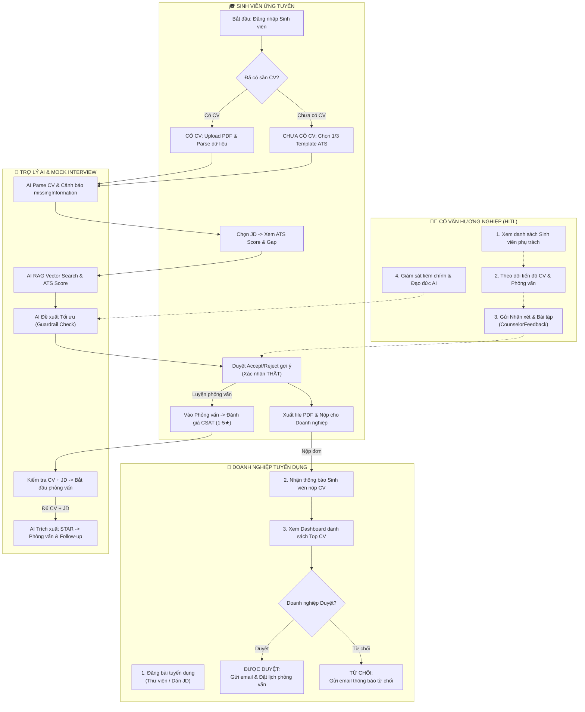

# 🔄 Sơ đồ Luồng Người dùng Chi tiết (User Flow Activity Diagram)
> **Career Assistant X System - Multi-Actor Workflow & Interaction Model**

## 1. Sơ đồ Luồng Công việc (Swimlane Workflow)

Sơ đồ thể hiện luồng hoạt động tương tác giữa 4 thành phần: **Doanh nghiệp tuyển dụng**, **Cố vấn hướng nghiệp (HITL)**, **Sinh viên ứng tuyển** và **Trợ lý AI Phỏng vấn**.

---

## 2. Diễn giải Luồng Thực thi (Step-by-Step Breakdown)

### Giai đoạn 1: Chuẩn bị Hồ sơ & Tối ưu CV bằng AI
1. **Sinh viên đăng nhập** và chọn trạng thái CV (Đã có file PDF hoặc Tạo mới từ 1/3 Template ATS chuẩn).
2. **AI Parse CV** phân tích thông tin, tự động phát hiện thông tin còn thiếu (`missingInformation`) và kiểm tra cờ thông tin thật.
3. **Sinh viên chọn JD** mục tiêu (trong ngân hàng tin tuyển dụng hoặc tự dán ngoài).
4. **AI Engine (RAG + Qdrant)** tiến hành tính toán điểm tương thích (Match Score %), điểm ATS, phân tích kỹ năng thiếu và chạy Anti-Hallucination Guardrail.
5. **Sinh viên xem gợi ý tối ưu**, chọn Duyệt (Accept) hoặc Từ chối (Reject) từng điểm sửa để xuất file CV PDF nộp cho nhà tuyển dụng.

### Giai đoạn 2: Nộp đơn & Doanh nghiệp Phê duyệt
1. Sinh viên nhấn **Nộp CV**, hệ thống ghi nhận hồ sơ và gửi thông báo tới Doanh nghiệp.
2. Nhà tuyển dụng xem **Dashboard Top Candidate CV** phân loại theo độ phù hợp.
3. Nhà tuyển dụng thực hiện **Duyệt/Từ chối**:
   - Nếu **Duyệt**: Hệ thống tự động kích hoạt tiến trình gửi email hẹn lịch phỏng vấn trực tiếp.
   - Nếu **Từ chối**: Hệ thống gửi email thông báo cảm ơn và kết quả.

### Giai đoạn 3: Phỏng vấn Thử AI & Đánh giá STAR
1. Sinh viên tham gia **Phòng phỏng vấn AI**. Hệ thống kiểm tra điều kiện bắt buộc (phải có cả CV và JD).
2. **Mock Interview Agent (LangGraph)** đóng vai nhà tuyển dụng hỏi-đáp đa vòng qua WebSocket thời gian thực.
3. Nếu sinh viên trả lời quá ngắn hoặc thiếu thông tin, AI tự động đưa ra **câu hỏi gợi mở (follow-up)**.
4. **STAR Evaluator** bóc tách câu trả lời theo 4 thành phần Situation, Task, Action, Result và chấm điểm theo Rubric.
5. Khi kết thúc, sinh viên đánh giá **CSAT (1-5 sao)** và nhận Báo cáo kết quả tổng hợp.

### Giai đoạn 4: Độc lập Giám sát của Cố vấn (HITL)
1. Cố vấn truy cập **Counselor Portal** xem danh sách sinh viên phụ trách và kết quả phỏng vấn.
2. Cố vấn gửi **Feedback / Bài tập cá nhân hóa** (`CounselorFeedback`) để giúp sinh viên cải thiện các kỹ năng còn thiếu.
3. Cố vấn giám sát tính **liêm chính và đạo đức AI**, bổ sung nhận xét thực tế vào báo cáo STAR.
