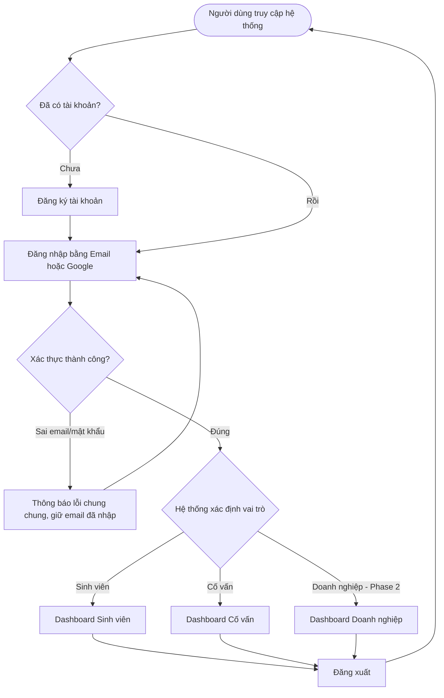
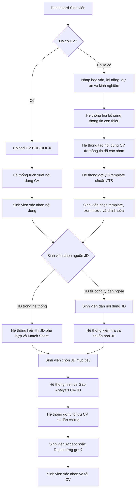
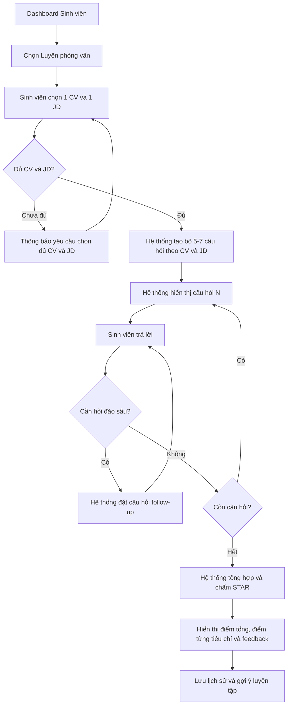
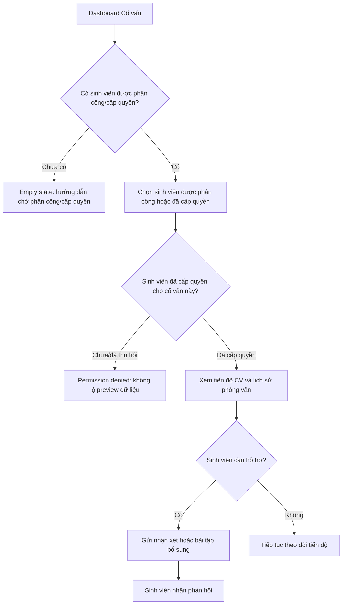
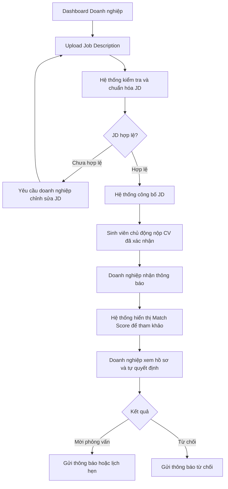

# 📋 Product Requirements Document (PRD) — CV ASSISTANT
> **Agent tối ưu CV và phỏng vấn thử cho sinh viên**  
> **Mã dự án:** P-041 | **Nhóm:** WinTop
> **Mentor:** Trần Vũ Anh (Andy)  
> **Phiên bản:** v1.0 | **Ngày cập nhật:** 02/08/2026  

---

## 1. Tổng quan dự án (Project Overview)

### 1.1 Tên & Định hướng sản phẩm
* **Tên dự án:** Trợ Lý Nghề Nghiệp X (Career Assistant X)
* **Định vị:** AI Agent hướng nghiệp thông minh giúp sinh viên tối ưu hóa CV theo từng Job Description (dựa trên kinh nghiệm thật, không bịa/thổi phồng) và luyện phỏng vấn thử theo rubric STAR, nâng cao tỷ lệ qua vòng hồ sơ và sự tự tin khi ứng tuyển.

### 1.2 Mục tiêu dự án & Chỉ số vận hành
* **Mục tiêu sản phẩm:** Xây dựng giải pháp AI Agent phản hồi cá nhân hóa, đo lường khoảng cách kỹ năng (Gap Analysis) và mô phỏng phòng phỏng vấn thực tế.
* **Mục tiêu vận hành:**
  * Tỷ lệ sinh viên mục tiêu sử dụng sản phẩm: $\ge 60\%$
  * Chỉ số hài lòng người dùng (CSAT): $\ge 4.0 / 5.0$

### 1.3 Đội ngũ thực hiện & Phân công vai trò

| Thành viên | Vai trò chính | Phụ trách cụ thể |
|---|---|---|
| **Nguyễn Minh Quân** | Trưởng nhóm / Product & Frontend Integration | Định hướng sản phẩm, quản lý PRD/backlog/sprint, phát triển UI Next.js, tích hợp frontend-backend và chuẩn bị demo |
| **Vũ Hữu Trường** | AI / Backend Lead | Xây dựng FastAPI, LangGraph Agents (CV Gap Analysis & Mock Interview), RAG/Qdrant, database và API |
| **Nguyễn Thị Thanh Hiền** | Product Research / UX & Documentation | Nghiên cứu persona/user flow, thiết kế wireframe & UX copy, thu thập tài nguyên RAG, viết tài liệu và nội dung pitching |
| **Vũ Xuân Đức** | QA / Evaluation & DevOps | Xây dựng test plan, guardrails, LLM-as-Judge, CSAT/KPI, Docker, CI/CD, deploy và monitoring |

**Nguyên tắc phối hợp:** Nhóm áp dụng mô hình *Primary Owner + Cross-review*. Mỗi thành viên sở hữu một mảng chính, đồng thời review ít nhất một mảng khác; mọi tính năng phải được demo end-to-end trước khi hoàn thành.

---

## 2. Vấn đề & Giải pháp (Problem & Solution)

### 2.1 Vấn đề của thị trường & Sinh viên
1. **CV chưa chuẩn hóa theo JD:** Sinh viên chuẩn bị đi làm/thực tập thường dùng 1 bản CV chung cho mọi vị trí, thiếu từ khóa ngành, cấu trúc yếu và thiếu bằng chứng định lượng phù hợp với Job Description (JD), dẫn đến việc bị loại ngay vòng lọc ATS ban đầu.
2. **Thiếu cơ hội cọ xát phỏng vấn:** Thiếu môi trường luyện tập phỏng vấn sát với thực tế từng JD, không có feedback chuyên sâu về kỹ năng trả lời, dẫn đến tâm lý lo âu, thiếu tự tin khi phỏng vấn thật.
3. **Giới hạn nguồn lực cố vấn:** Các trung tâm hướng nghiệp trường đại học khó cung cấp dịch vụ tư vấn 1-1 liên tục và cá nhân hóa ở quy mô lớn (hàng nghìn sinh viên).

### 2.2 Giải pháp AI Agent
* **CV Gap Analysis Agent:** So khớp CV với JD, chỉ ra các từ khóa/kỹ năng còn thiếu và đề xuất tối ưu câu từ — **chỉ dựa trên kinh nghiệm thật của sinh viên, tuyệt đối không bịa đặt hoặc thổi phồng**.
* **Mock Interview Agent:** Đóng vai nhà tuyển dụng tổ chức buổi phỏng vấn thử tương tác theo đúng vị trí ứng tuyển, đặt câu hỏi đào sâu và chấm điểm chi tiết theo rubric STAR (*Situation, Task, Action, Result*).
* **Vì sao AI hiệu quả hơn giải pháp truyền thống:** AI có khả năng phân tích và so khớp CV với hàng loạt tiêu chí JD trong vài giây, đưa ra phản hồi cá nhân hóa 24/7 và cho phép sinh viên phỏng vấn lặp lại không giới hạn số lần với chi phí tối ưu.

---

## 3. Đối tượng người dùng (User Personas)

| Vai trò | Loại người dùng | Mô tả & Nhu cầu chính |
|---|---|---|
| **Sinh viên** | Primary User | Sinh viên sắp tốt nghiệp hoặc chuẩn bị ứng tuyển thực tập/việc làm. Nhu cầu: Tối ưu CV theo JD, biết Match Score và luyện phỏng vấn thử để tăng sự tự tin. |
| **Cố vấn hướng nghiệp** | Supervisor (HITL) | Cố vấn/Giảng viên quản lý tiến độ sinh viên. Nhu cầu: Theo dõi số CV đã tối ưu, số JD ứng tuyển, giám sát tính liêm chính và hỗ trợ sinh viên khi cần. |
| **Doanh nghiệp** *(Mở rộng)* | Secondary User | Nhà tuyển dụng đối tác. Nhu cầu: Đăng tải JD, xem Dashboard xếp hạng Top CV theo Match Score, duyệt/từ chối hồ sơ ứng tuyển. |

---

## 4. Các tính năng chính & Tiêu chuẩn nghiệm thu (Core Features & Acceptance Criteria)

### 4.1 Tính năng MVP (Giai đoạn 1)

#### F-01: Đăng nhập & Phân quyền vai trò
* **Mô tả:** Hệ thống xác thực và phân quyền truy cập cho Sinh viên, Cố vấn hướng nghiệp và Doanh nghiệp.
* **Acceptance Criteria (AC):**
  * Đăng nhập qua Email/OAuth (Google).
  * Điều hướng đúng Dashboard theo quy mô quyền (Student View / Counselor View / Enterprise View).

#### F-02: Upload & Parse CV
* **Mô tả:** Tải lên CV có sẵn hoặc tự nhập thông tin cá nhân/kỹ năng/kinh nghiệm để AI hỗ trợ khởi tạo CV.
* **Acceptance Criteria (AC):**
  * Hỗ trợ định dạng `.pdf`, `.docx`, dung lượng $\le 10\text{ MB}$.
  * AI trích xuất chính xác các phần: Học vấn, Kỹ năng, Kinh nghiệm, Dự án với độ chính xác $\ge 90\%$.

#### F-03: CV Match Score & Gap Analysis
* **Mô tả:** Chọn JD mục tiêu và phân tích độ tương thích giữa CV và JD.
* **Acceptance Criteria (AC):**
  * Trả về Match Score (%) rõ ràng.
  * Hiển thị bảng so sánh kỹ năng có sẵn vs. kỹ năng JD yêu cầu (Hard skills, Soft skills, Tools, Keywords).

#### F-04: Đề xuất Tối ưu CV (Chân thật & Anti-Hallucination)
* **Mô tả:** AI đưa ra các gợi ý chỉnh sửa câu chữ, bổ sung từ khóa chuẩn ATS từ kinh nghiệm gốc của sinh viên.
* **Acceptance Criteria (AC):**
  * Gợi ý câu từ chuẩn hành động (Action Verbs + Quantifiable metrics).
  * **Strict Constraint:** Không tự tạo ra dự án, công ty hoặc kỹ năng sinh viên chưa khai báo. Sinh viên phải xác nhận (Accept/Reject) trước khi tải file.

#### F-05: Phòng Phỏng Vấn Thử (Mock Interview Engine)
* **Mô tả:** Agent tạo bộ câu hỏi theo JD và CV, thực hiện phỏng vấn tương tác dạng Chat/Voice.
* **Acceptance Criteria (AC):**
  * Kiểm tra điều kiện đầu vào: Bắt buộc chọn đủ 1 CV + 1 JD mới được bắt đầu.
  * Mỗi phiên gồm 5–7 câu hỏi phù hợp với vị trí ứng tuyển.
  * Đánh giá câu trả lời của sinh viên: Nếu câu trả lời quá ngắn hoặc thiếu ý, AI sẽ đặt câu hỏi gợi mở (Follow-up question).

#### F-06: Báo Cáo Phỏng Vấn theo Rubric STAR
* **Mô tả:** Đánh giá chi tiết buổi phỏng vấn và đưa ra đề xuất cải thiện.
* **Acceptance Criteria (AC):**
  * Chấm điểm theo 4 tiêu chí STAR (*Situation, Task, Action, Result*) trên thang điểm 100.
  * Báo cáo bao gồm: Điểm tổng, Điểm mạnh, Điểm cần cải thiện, và Gợi ý câu trả lời mẫu tối ưu.

#### F-07: Dashboard Cố vấn hướng nghiệp (HITL)
* **Mô tả:** Giao diện cho phép cố vấn xem tiến độ và kết quả của sinh viên.
* **Acceptance Criteria (AC):**
  * Thống kê tổng số CV đã tối ưu, số lượt phỏng vấn thử, điểm phỏng vấn trung bình.
  * Xem báo cáo phỏng vấn của từng sinh viên được phân công.

---

## 5. Luồng người dùng chi tiết (User Flows)

### 5.0 Điểm vào chung: Đăng nhập và phân quyền

Tất cả người dùng đều bắt đầu tại cùng một điểm vào: **Đăng nhập hệ thống** bằng Email hoặc Google. Sau khi xác thực, hệ thống xác định vai trò và chuyển người dùng đến dashboard tương ứng:

- **Sinh viên:** Dashboard CV, JD và phòng phỏng vấn thử.
- **Cố vấn hướng nghiệp:** Dashboard giám sát các sinh viên đã được phân công hoặc đã cấp quyền.
- **Doanh nghiệp:** Dashboard đăng JD và xử lý hồ sơ *(Phase 2)*.



### 5.1 Sinh viên — Tối ưu CV theo JD



**Nguyên tắc liêm chính:** Hệ thống chỉ dùng thông tin sinh viên đã upload hoặc đã xác nhận. Khi thiếu bằng chứng cho kỹ năng, dự án, thành tích hoặc số liệu, hệ thống phải hỏi lại; không tự tạo claim mới.

**Nguồn JD:** Sinh viên có thể chọn JD từ thư viện hệ thống hoặc dán JD của một công ty bên ngoài. Với JD được dán, hệ thống kiểm tra nội dung tối thiểu, chuẩn hóa thông tin vị trí/yêu cầu và chỉ dùng JD đó trong phiên phân tích của sinh viên.

### 5.2 Sinh viên — Phỏng vấn thử



Báo cáo phỏng vấn gồm điểm tổng, điểm theo Situation-Task-Action-Result, điểm mạnh, điểm cần cải thiện, kỹ năng cần bổ sung và gợi ý luyện tập. Feedback chỉ hỗ trợ sinh viên cấu trúc hóa thông tin thật, không tạo câu trả lời chứa thành tích không có căn cứ.

### 5.3 Cố vấn hướng nghiệp — Giám sát HITL



Cố vấn chỉ được xem dữ liệu của sinh viên đã cấp quyền hoặc được phân công. Cố vấn đưa nhận xét và hỗ trợ; sinh viên vẫn là người duyệt nội dung CV cuối cùng.

### 5.4 Doanh nghiệp — Đăng JD và xử lý hồ sơ *(Phase 2)*



Match Score chỉ là thông tin tham khảo. Hệ thống không tự động loại hồ sơ hoặc ra quyết định tuyển dụng; doanh nghiệp tự xem hồ sơ và đưa ra quyết định cuối cùng.

---

## 6. Kiến trúc Kỹ thuật & AI Agent (Tech Stack)

### 6.1 Công nghệ lựa chọn (Tech Stack)

| Thành phần | Công nghệ / Thư viện sử dụng |
|---|---|
| **AI Model & Agent Core** | OpenAI GPT-4o / Claude 3.5 Sonnet, LangGraph (Graph Orchestration) |
| **Vector DB & RAG** | Qdrant (Lưu trữ JD, Tiêu chí ATS, Mẫu câu hỏi phỏng vấn), Embeddings Text-004 |
| **Backend Framework** | Python 3.11, FastAPI, Pydantic, SQLAlchemy |
| **Frontend Framework** | Next.js 14 (React, Tailwind CSS, TypeScript) |
| **Evaluation & Guardrails** | LLM-as-Judge, AI Log Hook (`phoenix.note`), Anti-hallucination Prompt Enforcement |
| **Deployment** | Docker, Docker Compose, Cloud Infrastructure (GCP / AWS) |

### 6.2 LangGraph State Schema
Agent State lưu trữ thông tin xuyên suốt phiên xử lý:
```python
class AgentState(TypedDict):
    user_id: str
    cv_raw_text: str
    cv_parsed_json: dict
    selected_jd_id: str
    jd_text: str
    match_score: float
    gap_analysis_result: dict
    optimized_cv_suggestions: list[dict]
    interview_questions: list[str]
    current_question_index: int
    chat_history: list[dict]
    star_scores: dict
    final_report: dict
```

---

## 7. Yêu cầu Phi Chức Năng (Non-Functional Requirements)

* **Hiệu năng & Độ trễ (Performance):**
  * Thời gian parse CV và gợi ý Gap Analysis $\le 5$ giây.
  * Thời gian phản hồi câu hỏi phỏng vấn của Agent $\le 3$ giây.
* **Độ tin cậy & Xử lý lỗi (Reliability):**
  * Xử lý ngoại lệ mượt mà khi LLM bị rate-limit hoặc timeout; không crash server backend.
  * Có cơ chế lưu nháp trạng thái phỏng vấn nếu mất kết nối mạng.
* **Bảo mật & Quyền riêng tư (Security & Privacy):**
  * Toàn bộ API Keys quản lý qua biến môi trường (`.env`). Không hardcode vào kho lưu mã nguồn.
  * Bảo vệ thông tin cá nhân (PII) trên CV sinh viên; tuân thủ quy định bảo mật dữ liệu.
* **Chất lượng Mã nguồn (Code Quality):**
  * Backend tuân thủ tiêu chuẩn PEP8, type hints đầy đủ.
  * Frontend tuân thủ ESLint & TypeScript strict mode.

---

## 8. Tiêu chí Thành công (Success Metrics)

| Tiêu chí | Chỉ số đo lường (KPI) | Ngưỡng mục tiêu |
|---|---|---|
| **Mức độ áp dụng** | Tỷ lệ sinh viên sử dụng hệ thống | $\ge 60\%$ sinh viên mục tiêu |
| **Trải nghiệm người dùng** | Đánh giá CSAT khảo sát sau phiên dùng | $\ge 4.0 / 5.0$ |
| **Hiệu quả tối ưu CV** | Match Score CV–JD trước vs. sau tối ưu | Tăng trung bình $\ge 25\%$ |
| **Chất lượng phỏng vấn** | Điểm Rubric STAR qua các lần luyện | Xu hướng tăng qua từng lượt |
| **Chất lượng AI** | LLM-as-Judge eval score | $\ge 8.5 / 10$ trên test dataset |
| **Độ trễ hệ thống** | Latency phản hồi trung bình của Agent | $< 3.0$ giây / lượt tương tác |

---

## 9. Danh sách User Stories (User Story Mapping)

> **Đã hợp nhất mã US** với sheet "Danh sách User Story" trong `docs/team041_project_management_template.xlsx` (nguồn chi tiết, bám sát sơ đồ mục 5) — mã US ở bảng dưới đây là **mã chuẩn duy nhất** dùng cho toàn dự án (backlog mục 10, task, test case). Đã bổ sung US-018, US-019 (2 story còn thiếu so với sơ đồ) và tách rõ US-007/US-011 để không còn trùng phạm vi "tải CV".

| Mã US | Tên User Story | Description / User Story | Priority | Sprint | Mã đặc tả (FEAT) |
|---|---|---|---|---|---|
| **US-001** | Đăng ký và đăng nhập | Là người dùng, tôi muốn đăng ký, đăng nhập và đăng xuất an toàn (Email/Google) để hệ thống xác định đúng vai trò, điều hướng đến dashboard phù hợp và bảo vệ dữ liệu cá nhân. | P0 | Sprint 1 | FEAT-001 |
| **US-002** | Tìm kiếm JD | Là sinh viên, tôi muốn tìm kiếm và lọc JD trong thư viện hệ thống để nhanh chóng chọn vị trí phù hợp với mục tiêu ứng tuyển. | P0 | Sprint 2 | FEAT-002 |
| **US-003** | Đánh giá mức độ phù hợp JD | Là sinh viên, tôi muốn xem Match Score của các JD trong thư viện để ưu tiên những vị trí phù hợp với mình. | P1 | Sprint 2 | FEAT-002 |
| **US-004** | Upload và trích xuất CV | Là sinh viên đã có CV, tôi muốn tải CV PDF/DOCX và xác nhận nội dung trích xuất để AI phân tích đúng hồ sơ của tôi. | P0 | Sprint 2 | FEAT-002 |
| **US-005** | Phân tích CV theo JD (Gap Analysis) | Là sinh viên, tôi muốn nhận phân tích khoảng cách giữa CV và JD đã chọn để biết hồ sơ của mình phù hợp ở đâu và còn thiếu gì. | P0 | Sprint 2–3 | FEAT-002 |
| **US-006** | Tối ưu CV theo JD | Là sinh viên, tôi muốn nhận gợi ý tối ưu CV dựa trên thông tin thật để phù hợp hơn với JD mà không bịa kinh nghiệm. | P0 | Sprint 2–3 | FEAT-002 |
| **US-007** | Xác nhận và tải CV đã tối ưu | Là sinh viên, tôi muốn Accept/Reject từng gợi ý, xác nhận nội dung cuối và tải CV đã tối ưu (từ CV có sẵn) để tự chịu trách nhiệm trước khi nộp hồ sơ. | P0 | Sprint 2 | FEAT-002 |
| **US-008** | Tạo CV từ biểu mẫu | Là sinh viên chưa có CV, tôi muốn điền học vấn, dự án, kinh nghiệm và kỹ năng theo biểu mẫu để AI hỗ trợ tạo CV ban đầu. | P0 | Sprint 2 | FEAT-002 |
| **US-009** | Xử lý thông tin còn thiếu | Là sinh viên, tôi muốn hệ thống hỏi lại khi thông tin chưa đủ thay vì tự thêm kinh nghiệm hoặc thành tích vào CV. | P0 | Sprint 2 | FEAT-002 |
| **US-010** | Đề xuất template CV | Là sinh viên, tôi muốn nhận ba template CV chuẩn ATS để chọn cách trình bày phù hợp với hồ sơ của mình. | P0 | Sprint 2 | FEAT-002 |
| **US-011** | Chọn và chỉnh sửa CV theo template mới | Là sinh viên, tôi muốn chọn template, xem trước và chỉnh sửa CV vừa tạo để có bản CV hoàn chỉnh, sẵn sàng chọn JD và tối ưu trước khi tải (dùng chung bước tải cuối với US-007). | P0 | Sprint 2 | FEAT-002 |
| **US-012** | Upload JD của doanh nghiệp *(Phase 2)* | Là nhà tuyển dụng, tôi muốn upload JD để hệ thống chuẩn hóa và đưa cơ hội việc làm đến sinh viên. | P2 — Phase 2 | Phase 2 | Chưa có spec (ngoài MVP) |
| **US-013** | Công bố JD lên hệ thống *(Phase 2)* | Là nhà tuyển dụng, tôi muốn JD được AI chuẩn hóa và công bố trên hệ thống để sinh viên có thể tìm kiếm. | P2 — Phase 2 | Phase 2 | Chưa có spec (ngoài MVP) |
| **US-014** | Bắt đầu phỏng vấn thử | Là sinh viên, tôi muốn chọn đủ 1 CV và 1 JD để bắt đầu mock interview 5–7 câu theo JD nhằm chuẩn bị tốt hơn cho phỏng vấn thực tế. | P0 | Sprint 2 | FEAT-003 |
| **US-015** | Nhận điểm và feedback STAR | Là sinh viên, tôi muốn nhận điểm tổng, điểm theo 4 tiêu chí STAR và feedback sau phỏng vấn để biết chính xác cần luyện phần nào. | P0 | Sprint 2–3 | FEAT-003 |
| **US-016** | Giám sát tiến độ sinh viên (HITL) | Là cố vấn hướng nghiệp, tôi muốn xem tiến độ CV và lịch sử phỏng vấn của sinh viên đã cấp quyền để nắm được tình hình và hỗ trợ đúng lúc. | P1 | Sprint 3 | FEAT-004 |
| **US-017** | Gửi phản hồi cho sinh viên | Là cố vấn hướng nghiệp, tôi muốn gửi nhận xét hoặc bài tập bổ sung cho sinh viên để hỗ trợ cá nhân hóa, trong khi sinh viên vẫn là người duyệt nội dung CV cuối cùng. | P1 | Sprint 3 | FEAT-004 |
| **US-018** | Dán JD từ công ty bên ngoài | Là sinh viên, tôi muốn dán nội dung JD của công ty bên ngoài để hệ thống kiểm tra và chuẩn hóa, nhằm phân tích Gap Analysis cả với JD ngoài thư viện hệ thống. | P0 | Sprint 2 | FEAT-002 |
| **US-019** | Được AI hỏi đào sâu khi trả lời thiếu ý | Là sinh viên, tôi muốn AI đặt câu hỏi follow-up khi câu trả lời của tôi quá ngắn hoặc thiếu ý trong lúc phỏng vấn thử, để trả lời đầy đủ hơn và được đánh giá chính xác hơn. | P0 | Sprint 2 | FEAT-003 |

---

## 10. Kế hoạch Phát triển & Backlog theo Sprint (6 Tuần)

| STT | Mã việc | Tên công việc | Mã US | Mô tả chi tiết | Sprint | Ưu tiên | Dự kiến (giờ) | Người phụ trách | Trạng thái |
|---|---|---|---|---|---|---|---|---|---|
| **Sprint 1: Khởi động, Kiến trúc & Auth (W1-W2)** |
| 1 | T-001 | Lập Project Charter & PRD | US-001 | Hoàn thiện tài liệu PRD, Brief, Wireframe & Architecture | Sprint 1 | P0 | 4 | Nguyễn Thị Thanh Hiền | Đang làm |
| 2 | T-002 | Thiết lập GitHub & CI/CD | — | Cấu hình repo, branch protection, linter, Docker setup | Sprint 1 | P0 | 2 | Vũ Hữu Trường | Chưa làm |
| 3 | T-003 | Thiết kế Kiến trúc & DB Schema | US-001 | Thiết kế FastAPI, DB Postgres/Qdrant, LangGraph State | Sprint 1 | P0 | 6 | Vũ Hữu Trường | Chưa làm |
| 4 | T-004 | Gặp Đối tác & Thu thập Yêu cầu | — | Phỏng vấn nhu cầu cố vấn hướng nghiệp và sinh viên | Sprint 1 | P0 | 2 | Nguyễn Thị Thanh Hiền | Chưa làm |
| 5 | T-005 | Xây dựng Knowledge Base & Vector DB | US-002, US-003 | Ingest danh sách JD mẫu, tiêu chí ATS vào Qdrant | Sprint 1 | P1 | 8 | Vũ Hữu Trường | Chưa làm |
| **Sprint 2: Core Agent Engine - CV Gap Analysis (W2-W3)** |
| 6 | T-006 | API Endpoint Upload & Parse CV | US-004 | Viết service parse PDF/Word và trích xuất JSON | Sprint 2 | P0 | 10 | Vũ Hữu Trường | Chưa làm |
| 7 | T-007 | Giao diện Dashboard & Upload CV | US-004 | Dựng UI Next.js trang upload, xem thông tin CV | Sprint 2 | P0 | 10 | Nguyễn Minh Quân | Chưa làm |
| 8 | T-008 | Agent CV Gap Analysis & Match Score | US-002, US-003, US-005, US-006 | Phát triển LangGraph Agent so khớp CV-JD & đề xuất sửa | Sprint 2 | P0 | 8 | Vũ Hữu Trường | Chưa làm |
| 9 | T-009 | Triển khai AI Log Hook & Demo 1 | — | Tích hợp phoenix logging, kịch bản Demo lần 1 | Sprint 2 | P0 | 4 | Vũ Xuân Đức | Chưa làm |
| **Sprint 3: Mock Interview Agent & Evaluation (W4-W5)** |
| 10 | T-010 | Xử lý Phản hồi Demo 1 | — | Cải thiện UI/UX và prompt theo góp ý | Sprint 3 | P0 | 6 | Nguyễn Thị Thanh Hiền | Chưa làm |
| 11 | T-011 | Phát triển Mock Interview Agent | US-014, US-015, US-019 | LangGraph Agent phỏng vấn STAR & sinh báo cáo | Sprint 3 | P0 | 8 | Vũ Hữu Trường | Chưa làm |
| 12 | T-012 | UI Phòng Phỏng Vấn & Evaluation | US-014, US-016 | Dựng UI chat phỏng vấn, Dashboard cố vấn, LLM-as-Judge | Sprint 3 | P0 | 6 | Nguyễn Minh Quân / Vũ Xuân Đức | Chưa làm |
| **Sprint 4: Hoàn thiện, Testing & Bàn giao (W6)** |
| 13 | T-013 | Triển khai Production & Cloud | — | Dockerize, deploy Cloud, cấu hình HTTPS & Domain | Sprint 4 | P0 | 4 | Vũ Hữu Trường | Chưa làm |
| 14 | T-014 | System Testing & Tinh chỉnh UI | — | Test luồng end-to-end, sửa bug UI, kiểm tra guardrails | Sprint 4 | P0 | 6 | Vũ Xuân Đức / Nguyễn Minh Quân | Chưa làm |
| 15 | T-015 | Viết Tài liệu & Guidebook | — | Hoàn thiện README, API docs, Hướng dẫn người dùng | Sprint 4 | P1 | 4 | Nguyễn Thị Thanh Hiền | Chưa làm |
| 16 | T-016 | Chuẩn bị Demo Day & Pitching | — | Slide thuyết trình, Video demo, Báo cáo đánh giá | Sprint 4 | P0 | 4 | Nguyễn Thị Thanh Hiền | Chưa làm |

---

## 11. Hồ sơ Quản lý Dự án (Project Metadata)

* **Tên dự án:** Trợ lý nghề nghiệp X: Agent tối ưu CV và phỏng vấn thử cho sinh viên
* **Mã nhóm / Repo:** G06 | P-041
* **Kho lưu mã nguồn (GitHub):** [https://github.com/AI20K-Build-Phase-Cohort-3/P-041.git](https://github.com/AI20K-Build-Phase-Cohort-3/P-041.git)
* **Thời gian thực hiện:** 02/08/2026 – 13/09/2026 (6 tuần)
* **Trưởng nhóm:** Nguyễn Minh Quân (PM)
* **Mentor phụ trách:** Trần Vũ Anh (Andy)
