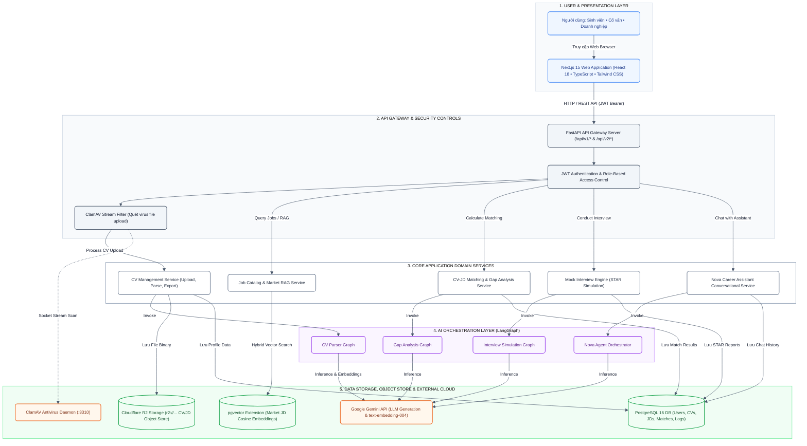
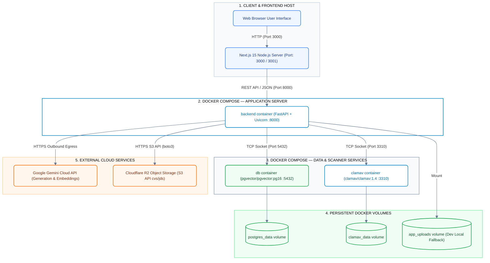

# System Architecture Documentation — Career Assistant X (P-041)

Tài liệu kiến trúc hệ thống P-041 được chuẩn hóa theo chuẩn **C4 Model (Container Level)** và **Azure Architecture Center**, phản ánh chính xác cấu trúc thực tế của codebase (`backend/src`, `frontend/src`, `docker-compose.yml`, `backend/src/services/object_storage.py`).

> **Khắc phục triệt để lỗi chồng đè (Overlap) & Đứt nét:**
> 1. **100% Node-to-Node Connections**: Tuyệt đối không nối dây vào tên `subgraph` (nguyên nhân gây đứt đường nối và mũi tên trôi dạt).
> 2. **Đồng nhất chiều dọc (`direction TB`)**: Không dùng `direction LR` lồng bên trong để tránh các box nằm đè lên nhau.
> 3. **Tách cụm rõ ràng**: Dịch vụ nghiệp vụ và AI Agent được xếp song song theo cặp logic (CV $\rightarrow$ CV Parser, Match $\rightarrow$ Gap Analysis, Interview $\rightarrow$ Interview Agent, Nova $\rightarrow$ Nova Agent).

---

## 1. System Architecture Overview (Tổng quan kiến trúc hệ thống)

---

## 2. Core Technical & AI Pipeline (Luồng kỹ thuật và AI Pipeline)

```mermaid
%%{init: {
  'theme': 'base',
  'themeVariables': {
    'fontFamily': 'Inter, -apple-system, BlinkMacSystemFont, Segoe UI, Roboto, sans-serif',
    'fontSize': '12px',
    'primaryColor': '#FFFFFF',
    'primaryBorderColor': '#CBD5E1',
    'lineColor': '#475569'
  }
}}%%

flowchart TB
    %% ================= STYLES =================
    classDef inputNode fill:#EFF6FF,stroke:#3B82F6,stroke-width:1.5px,rx:6px,color:#1E3A8A;
    classDef procNode fill:#F8FAFC,stroke:#64748B,stroke-width:1px,rx:4px,color:#0F172A;
    classDef guardNode fill:#FEF2F2,stroke:#EF4444,stroke-width:1.5px,rx:4px,color:#991B1B;
    classDef aiNode fill:#FAF5FF,stroke:#8B5CF6,stroke-width:1.5px,rx:6px,color:#4C1D95;
    classDef dataNode fill:#F0FDF4,stroke:#16A34A,stroke-width:1.5px,rx:6px,color:#14532D;

    %% ================= PIPELINE 1 =================
    subgraph P1 ["PIPELINE 1: CV INGESTION, CLOUDFLARE R2 & PARSING"]
        style P1 fill:#FFFFFF,stroke:#CBD5E1,stroke-width:1.5px
        P1_IN["Tải tệp CV (PDF/DOCX)"]:::inputNode
        P1_SCAN{"Quét virus ClamAV"}:::guardNode
        P1_STORE_R2[("Lưu Cloudflare R2 (r2://...)")]:::dataNode
        P1_EXT["Trích xuất Text & OCR"]:::procNode
        P1_LLM["LangGraph: CV Parser (Gemini Schema)"]:::aiNode
        P1_GUARD{"Evidence Guardrail"}:::guardNode
        P1_DB[("Lưu PostgreSQL DB")]:::dataNode

        P1_IN --> P1_SCAN
        P1_SCAN --> P1_STORE_R2
        P1_STORE_R2 --> P1_EXT
        P1_EXT --> P1_LLM
        P1_LLM --> P1_GUARD
        P1_GUARD --> P1_DB
    end

    %% ================= PIPELINE 2 =================
    subgraph P2 ["PIPELINE 2: TWO-STAGE HYBRID RETRIEVAL & GAP MATCHING"]
        style P2 fill:#FFFFFF,stroke:#CBD5E1,stroke-width:1.5px
        P2_IN["Parsed Candidate Profile"]:::inputNode
        P2_BM25["1. BM25 Lexical Keyword Search"]:::procNode
        P2_VEC["2. pgvector Semantic Search"]:::dataNode
        P2_RRF["Reciprocal Rank Fusion (RRF) Ranking"]:::procNode
        P2_GAP["LangGraph: Gap Analysis Graph"]:::aiNode
        P2_GUARD{"Integrity Guardrail"}:::guardNode
        P2_OUT["Báo cáo Điểm phù hợp & Lộ trình phát triển"]:::inputNode

        P2_IN --> P2_BM25
        P2_IN --> P2_VEC
        P2_BM25 --> P2_RRF
        P2_VEC --> P2_RRF
        P2_RRF --> P2_GAP
        P2_GAP --> P2_GUARD
        P2_GUARD --> P2_OUT
    end

    %% ================= PIPELINE 3 =================
    subgraph P3 ["PIPELINE 3: MOCK INTERVIEW SIMULATION (STAR METHOD)"]
        style P3 fill:#FFFFFF,stroke:#CBD5E1,stroke-width:1.5px
        P3_IN["Ngữ cảnh JD mục tiêu + Hồ sơ CV"]:::inputNode
        P3_GEN["LangGraph: Sinh câu hỏi tình huống"]:::aiNode
        P3_GUARD{"Question Guard"}:::guardNode
        P3_EVAL["LangGraph: Chấm điểm STAR Rubric"]:::aiNode
        P3_REPORT["Báo cáo phân tích năng lực & khuyến nghị"]:::dataNode

        P3_IN --> P3_GEN
        P3_GEN --> P3_GUARD
        P3_GUARD --> P3_EVAL
        P3_EVAL --> P3_REPORT
    end
```

---

## 3. Runtime & Deployment Architecture (Kiến trúc triển khai Container & Cloud)

---

## 4. Bảng tổng hợp thành phần và liên kết hệ thống

| Tầng / Phân hệ | Thành phần thực tế trong Codebase | Công nghệ | Vai trò & Kết nối |
|---|---|---|---|
| **Presentation** | `frontend/src/app` | Next.js 15.5, React 18, Tailwind CSS | Giao diện ba role: Sinh viên, Cố vấn, Doanh nghiệp. Tương tác với Backend qua Fetch client kèm Bearer JWT. |
| **API & Gateway** | `backend/src/api`, `backend/src/main.py` | FastAPI, Uvicorn, Pydantic | Cung cấp REST endpoints (`/api/v1/*`, `/api/v2/*`), xác thực PyJWT, CORS filter và Dependency Injection. |
| **File Security** | `backend/src/services/file_security.py` | ClamAV Daemon (`clamd`) | Quét virus stream cho file upload trước khi lưu trữ. |
| **Object Storage** | `backend/src/services/object_storage.py` | Cloudflare R2 (S3 API qua `boto3`), Local Fallback | Lưu trữ toàn bộ CV và JD tải lên (`r2://<bucket>/...`) hoặc fallback disk `/app/data/uploads`. |
| **Domain Services** | `backend/src/services/` | Python 3.11+, SQLAlchemy Async | Quản lý logic nghiệp vụ: CV/JD lifecycle, matching, interview evaluation, notifications. |
| **AI Orchestration** | `backend/src/agents/` | LangGraph, LangChain Google GenAI | Điều phối 4 workflow thông minh độc lập: CV Parser, Gap Analysis, Mock Interview, Nova Assistant. |
| **RAG & Search Engine** | `backend/src/services/job_rag.py` | BM25 + pgvector Cosine Search + RRF | Tìm kiếm việc làm thị trường bằng thuật toán Hybrid Ranking; fallback an toàn khi LLM/Vector offline. |
| **Storage Tier** | `backend/src/db/`, `docker-compose.yml` | PostgreSQL 16, pgvector, Docker Volumes | Lưu trữ toàn bộ dữ liệu quan hệ, embedding vector 768 chiều. |
| **AI Cloud** | External Service | Google Gemini Developer API | Cung cấp mô hình ngôn ngữ lớn và vector embedding (`text-embedding-004`). |
