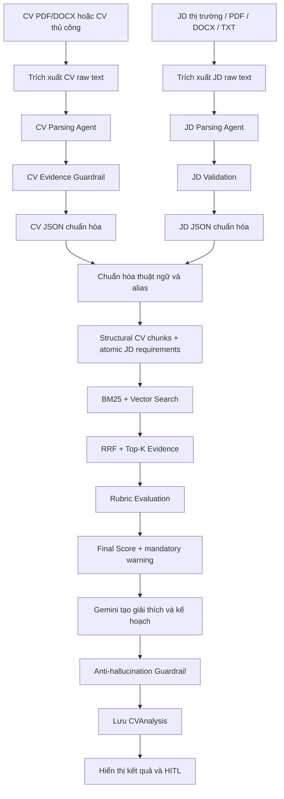
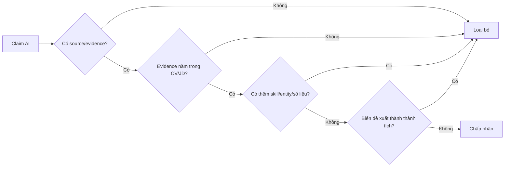
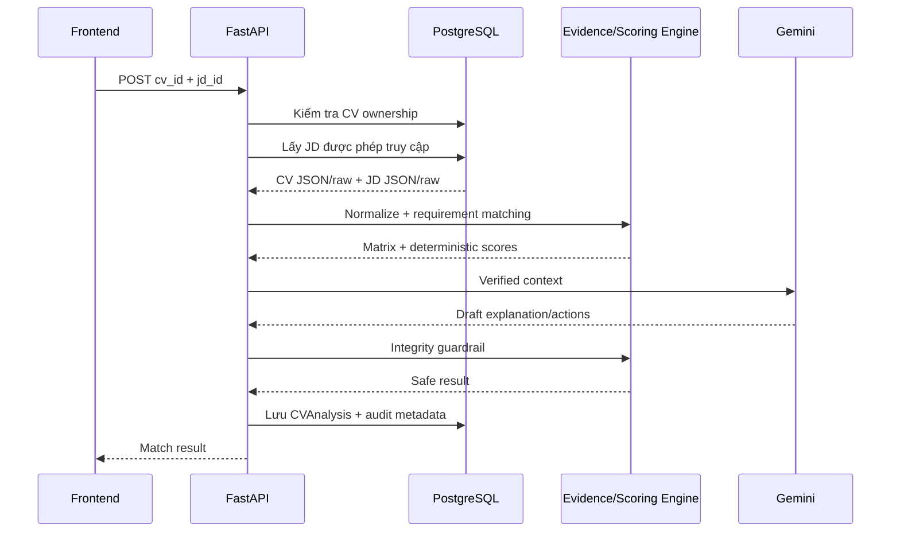

# Pipeline phân tích mức độ phù hợp CV–JD

> Tài liệu triển khai theo **Technical Specification — CV–JD Matching & Evaluation Pipeline v1.0**. Pipeline ưu tiên bằng chứng, khả năng giải thích và chống bịa thông tin. Match Score là chỉ báo hỗ trợ người dùng, không phải quyết định tuyển dụng tự động.

## 1. Mục tiêu

Pipeline phải trả lời được các câu hỏi:

1. JD yêu cầu những năng lực nào và yêu cầu nào là bắt buộc?
2. CV có bằng chứng nào đáp ứng từng yêu cầu?
3. Yêu cầu nào đã đáp ứng, đáp ứng một phần, chưa có bằng chứng hoặc không đủ dữ liệu để kết luận?
4. Mức độ phù hợp tổng thể là bao nhiêu và điểm được tạo ra như thế nào?
5. Người dùng nên cải thiện điều gì mà không đưa thông tin chưa có thật vào CV?

Đầu ra phải có `Match Score`, `Confidence Score`, bảng yêu cầu–bằng chứng và giải thích cho từng kết luận. Gemini không được tự đặt hoặc sửa điểm.

## 2. Kiến trúc tổng thể



Pipeline được chia thành tám giai đoạn:

1. Tiếp nhận và parse CV.
2. Tiếp nhận và parse JD.
3. Chuẩn hóa dữ liệu.
4. Xây dựng ma trận yêu cầu–bằng chứng.
5. Phân loại mức đáp ứng.
6. Tính criterion score, weighted score và Final Score.
7. Sinh phần giải thích có kiểm soát.
8. Lưu kết quả, hiển thị và nhận phản hồi người dùng.

## 3. Đầu vào

### 3.1. CV

Nguồn CV được hỗ trợ:

- PDF có text layer;
- DOCX;
- CV tạo hoặc nhập thủ công trên hệ thống.

Kiểm tra đầu vào:

- đúng định dạng và giới hạn dung lượng;
- có nội dung văn bản hợp lệ;
- loại null byte, khoảng trắng thừa và ký tự điều khiển;
- không thực thi nội dung hoặc chỉ dẫn nằm trong tài liệu;
- lưu `raw_text` làm nguồn bằng chứng gốc.

### 3.2. JD

Nguồn JD được hỗ trợ:

- JD thị trường trong `data/jds` và Qdrant;
- JD do doanh nghiệp đăng;
- JD do người dùng dán nội dung;
- file PDF, DOCX hoặc TXT.

Qdrant chỉ hỗ trợ tìm kiếm JD thị trường trước khi người dùng chọn. Khi phân tích một cặp CV–JD cụ thể, pipeline sử dụng dữ liệu CV và JD đã chọn từ PostgreSQL.

## 4. Parse và kiểm chứng CV

### 4.1. Workflow

```text
CV file
→ extract raw text
→ validate_input
→ extract_local_evidence
→ llm_structured_parse
→ evidence_guardrail
→ ats_quality_gate
→ CV JSON
```

### 4.2. Schema CV mục tiêu

```json
{
  "personal_info": {
    "full_name": "",
    "email": "",
    "phone": "",
    "location": ""
  },
  "target_roles": ["Backend Developer"],
  "summary": "",
  "hard_skills": [
    {
      "canonical_name": "FastAPI",
      "original_text": "FastAPI",
      "proficiency": "unknown",
      "evidence": [
        {
          "section": "projects",
          "quote": "Built REST APIs using FastAPI",
          "source_id": "project-01"
        }
      ]
    }
  ],
  "soft_skills": [],
  "experience": [
    {
      "id": "experience-01",
      "title": "Backend Intern",
      "organization": "ABC",
      "start_date": "2025-01",
      "end_date": "2025-06",
      "duration_months": 6,
      "responsibilities": [],
      "skills": [],
      "evidence_quote": ""
    }
  ],
  "projects": [],
  "education": [],
  "certifications": [],
  "languages": [],
  "missing_information": [],
  "parse_quality": {
    "score": 0,
    "status": "needs_review"
  }
}
```

### 4.3. Quy tắc kiểm chứng CV

- Mỗi kỹ năng, kinh nghiệm, dự án, học vấn và chứng chỉ phải có bằng chứng trong `raw_text`.
- Công ty, chức danh, mốc thời gian và số liệu không được suy đoán.
- Nếu CV không ghi trình độ kỹ năng, dùng `unknown`.
- Nếu CV không ghi số năm kinh nghiệm, thời lượng chỉ được tính từ mốc thời gian hợp lệ.
- Claim do LLM tạo nhưng không tìm thấy trong CV phải bị loại.
- Nếu Gemini không khả dụng, sử dụng parser local và đánh dấu `fallback_used=true`.

Điểm ATS/parse quality chỉ đo độ đầy đủ và chất lượng parse CV; nó không phải Match Score CV–JD.

## 5. Parse và kiểm chứng JD

### 5.1. Workflow

```text
JD raw text
→ validate_input
→ extract_job_metadata
→ extract_requirements
→ classify_must_have_and_nice_to_have
→ normalize_requirements
→ JD JSON
```

### 5.2. Schema JD mục tiêu

```json
{
  "title": "Backend Developer",
  "company": "ABC Technology",
  "job_level": "Junior",
  "domain": "Backend",
  "must_have_skills": [
    {
      "id": "req-skill-01",
      "name": "Python",
      "importance": 5,
      "required_level": "intermediate",
      "evidence_quote": "Strong Python programming skills"
    }
  ],
  "nice_to_have_skills": [
    {
      "id": "req-skill-02",
      "name": "Docker",
      "importance": 2,
      "evidence_quote": "Docker is a plus"
    }
  ],
  "responsibilities": [
    {
      "id": "req-resp-01",
      "text": "Phát triển và duy trì REST API",
      "importance": 4
    }
  ],
  "min_years_experience": 2,
  "education_requirements": [],
  "certification_requirements": [],
  "language_requirements": [],
  "soft_skill_requirements": [],
  "work_constraints": {
    "location": "Hồ Chí Minh",
    "remote_type": "Hybrid",
    "employment_type": "Full-time"
  },
  "parse_quality": {
    "score": 0,
    "ambiguous_requirements": []
  }
}
```

### 5.3. Quy tắc parse JD

- Phân biệt rõ `must-have` và `nice-to-have` dựa trên câu gốc trong JD.
- Không tự chuyển yêu cầu ưu tiên thành yêu cầu bắt buộc.
- Nếu JD không nêu số năm kinh nghiệm, dùng `null`, không tự đặt giá trị.
- Mỗi yêu cầu phải giữ `evidence_quote` hoặc vị trí trong JD gốc.
- Các cụm mơ hồ như “strong”, “good knowledge” phải được lưu lại để giảm confidence.
- Prompt injection hoặc chỉ dẫn không liên quan trong JD được coi là dữ liệu không tin cậy và không được thay đổi workflow/scoring.

## 6. Chuẩn hóa thuật ngữ

Trước khi so sánh, hai phía phải đi qua cùng một taxonomy.

Ví dụ alias tương đương:

| Dữ liệu gốc | Tên chuẩn |
|---|---|
| JS | JavaScript |
| ReactJS | React |
| NodeJS | Node.js |
| Postgres | PostgreSQL |
| RESTful API | REST API |
| Amazon Web Services | AWS |
| CI CD | CI/CD |

Các loại quan hệ cần phân biệt:

- `equivalent`: Postgres và PostgreSQL;
- `related`: MySQL và PostgreSQL;
- `parent_child`: SQL và PostgreSQL;
- `unrelated`: Java và JavaScript.

Chỉ quan hệ `equivalent` được tính match hoàn toàn. `related` và `parent_child` chỉ có thể tạo `Partial` nếu có bằng chứng phù hợp.

## 7. Ma trận Requirement–Evidence

Đây là nguồn dữ liệu trung tâm của toàn bộ phân tích. Với mỗi yêu cầu JD, pipeline tìm bằng chứng trong CV theo thứ tự:

1. Kinh nghiệm làm việc.
2. Dự án.
3. Chứng chỉ hoặc khóa học có sản phẩm.
4. Học vấn.
5. Danh sách kỹ năng.
6. Summary.

Schema của một kết quả đối chiếu:

```json
{
  "requirement_id": "req-skill-01",
  "requirement": "FastAPI",
  "requirement_type": "must_have_skill",
  "importance": 5,
  "status": "matched",
  "evidence_strength": "strong",
  "evidence": [
    {
      "section": "projects",
      "quote": "Developed REST APIs using FastAPI",
      "source_id": "project-01"
    }
  ],
  "reason": "CV có bằng chứng trực tiếp sử dụng FastAPI trong dự án.",
  "confidence": 0.96
}
```

Không được tạo trạng thái `matched` nếu không có ít nhất một bằng chứng hoặc quan hệ tương đương đã được xác minh.

## 8. Phân loại mức đáp ứng

### 8.1. Matched

Có bằng chứng trực tiếp và đáp ứng đầy đủ yêu cầu.

```text
JD: FastAPI
CV: “Developed REST APIs using FastAPI”
```

### 8.2. Partial

Có năng lực liên quan nhưng chưa đủ mức JD yêu cầu.

```text
JD: PostgreSQL
CV: SQL và MySQL
```

Hoặc:

```text
JD: tối thiểu 3 năm kinh nghiệm
CV: 1,5 năm kinh nghiệm liên quan
```

### 8.3. Missing

Không tìm thấy bằng chứng về yêu cầu trong CV.

```text
JD: Kubernetes
CV: không đề cập Kubernetes hoặc công nghệ tương đương
```

### 8.4. Unknown

Không đủ dữ liệu để kết luận. Trạng thái này đặc biệt quan trọng với kỹ năng mềm và yêu cầu mơ hồ.

```text
JD: giao tiếp tốt
CV: không có ví dụ đủ rõ để đánh giá
```

Kết quả phải ghi “chưa tìm thấy bằng chứng”, không được kết luận ứng viên không có kỹ năng.

## 9. Sức mạnh bằng chứng

| Bằng chứng | Mức | Điểm gợi ý |
|---|---|---:|
| Đã dùng trong kinh nghiệm hoặc dự án cụ thể | Strong | 100 |
| Chứng chỉ/khóa học kèm sản phẩm thực hành | Medium | 85 |
| Chỉ liệt kê trong phần Skills | Declared | 70 |
| Chỉ xuất hiện trong Summary | Weak | 50 |
| Kỹ năng liên quan nhưng không tương đương | Partial | 40–60 |
| Không có bằng chứng | Missing | 0 |

Các mức điểm này phải được hiệu chỉnh lại bằng bộ Eval có nhãn chuyên gia trước khi sử dụng production.

## 10. Tính điểm

### 10.1. Điểm criterion

```text
Criterion Raw Score = trung bình requirement score thuộc criterion
Criterion Weighted Score = Raw Score / 100 × Weight
Final Score = Σ Criterion Weighted Score
```

Yêu cầu có trạng thái `Unknown` không được tự động nhận điểm trung bình. Tùy trường hợp, nó bị loại khỏi mẫu số hoặc làm giảm Confidence Score.

### 10.2. Trọng số đề xuất

| Thành phần | Trọng số |
|---|---:|
| Required Skills | 35% |
| Relevant Experience | 30% |
| Education | 10% |
| Preferred Skills | 10% |
| Domain Experience | 15% |

```text
Final Score =
Required Skills × 35%
+ Relevant Experience × 30%
+ Education × 10%
+ Preferred Skills × 10%
+ Domain Experience × 15%
```

Nếu JD không có một thành phần, loại thành phần đó và chuẩn hóa lại tổng trọng số về 100%. Không dùng điểm mặc định để lấp dữ liệu thiếu.

## 11. Mandatory Requirement Warning

Điểm tổng cao không được che giấu việc thiếu yêu cầu cốt lõi, nhưng evaluation layer không được tự ra quyết định tuyển/loại.

Quy tắc đề xuất:

```text
mandatory = true và status = NOT_FOUND/CONFLICTING
→ mandatory_requirement_failed = true
→ thêm warnings
→ không cap Final Score, không tự động đưa về 0
```

Ví dụ:

```text
Final Score: 62
Mandatory requirement failed: true
Warning: không tìm thấy evidence cho Docker bắt buộc.
```

## 12. Confidence Score

Match Score và Confidence Score là hai giá trị khác nhau:

- `Match Score`: ứng viên đáp ứng JD đến mức nào;
- `Confidence Score`: hệ thống có đủ bằng chứng để tin vào kết luận hay không.

Confidence được tính từ:

- chất lượng parse CV;
- chất lượng parse JD;
- tỷ lệ yêu cầu có bằng chứng;
- tỷ lệ yêu cầu `Unknown`;
- mức rõ ràng của must-have/nice-to-have;
- sự nhất quán giữa JSON và raw text;
- số claim bị evidence guardrail loại bỏ.

Ví dụ:

```json
{
  "match_score": 76,
  "confidence_score": 0.89,
  "confidence_level": "high"
}
```

Nếu confidence dưới 0,5, giao diện phải hiển thị “Không đủ dữ liệu để kết luận chắc chắn” thay vì đưa ra kết luận tuyệt đối.

## 13. Mức độ phù hợp

| Điều kiện | Kết luận |
|---|---|
| Điểm ≥ 80 và must-have coverage ≥ 85% | Match cao |
| Điểm 60–79 và must-have coverage ≥ 65% | Có thể ứng tuyển |
| Điểm 40–59 hoặc thiếu một yêu cầu cốt lõi | Match một phần |
| Điểm < 40 hoặc thiếu nhiều must-have | Match thấp |
| Confidence < 0,5 | Không đủ dữ liệu để kết luận |

Kết luận phải dựa đồng thời trên điểm tổng, must-have coverage và confidence.

## 14. Gemini Draft

Gemini chỉ chạy sau khi scoring engine đã tạo kết quả có bằng chứng. Input cho Gemini gồm:

- raw CV và raw JD cần thiết;
- Match Score và score breakdown;
- Requirement–Evidence Matrix;
- matched, partial, missing và unknown requirements;
- các ràng buộc liêm chính.

Gemini được phép tạo:

- executive summary;
- điểm mạnh có bằng chứng;
- rủi ro chính;
- hành động ưu tiên;
- lộ trình học kỹ năng còn thiếu;
- chứng chỉ nên cân nhắc;
- dự án portfolio tương lai;
- đề xuất cải thiện từng section CV;
- gợi ý viết lại câu có sẵn trong CV.

Gemini không được phép:

- thay đổi Match Score hoặc trạng thái requirement;
- biến `Missing` thành `Matched`;
- thêm kỹ năng, kinh nghiệm, công ty hoặc chức danh;
- thêm số liệu hoặc thành tích;
- mô tả dự án/chứng chỉ đề xuất như đã hoàn thành.

Nếu Gemini không hoạt động, pipeline dùng nội dung deterministic từ Requirement–Evidence Matrix.

## 15. Anti-hallucination Guardrail

Mỗi claim do Gemini tạo phải qua kiểm tra:



Guardrail phải kiểm tra:

- `original_text` tồn tại trong CV;
- số liệu mới là tập con của số liệu trong câu gốc;
- kỹ năng trong câu viết lại đã được CV xác minh;
- công ty, chức danh, bằng cấp và chứng chỉ không bị thêm mới;
- kỹ năng thiếu chỉ xuất hiện trong learning plan;
- dự án tương lai có trạng thái `recommended_not_completed`;
- claim không hợp lệ bị loại hoặc thay bằng fallback;
- số claim bị loại được lưu để audit.

## 16. Output cuối cùng

```json
{
  "cv_id": "...",
  "jd_id": "...",
  "pipeline_version": "1.0",
  "final_score": 76.0,
  "match_score": 76.0,
  "rating": "GOOD",
  "mandatory_requirement_failed": false,
  "criteria": [
    {
      "criterion_id": "CRIT_REQUIRED_SKILL",
      "raw_score": 80.0,
      "weight": 35.0,
      "weighted_score": 28.0,
      "reason": "4/5 requirement được hỗ trợ đầy đủ."
    }
  ],
  "match_level": "application_ready",
  "confidence_score": 0.89,
  "must_have_coverage": 0.8,
  "score_breakdown": {"required_skill": 80, "experience": 65},
  "retrieval_results": [],
  "evidence": [],
  "versions": {
    "embedding_model": "local-hashing-embedding-v1",
    "retrieval": "1.0-bm25-vector-rrf",
    "rubric": "1.0"
  },
  "requirement_evidence": [
    {
      "requirement": "Python",
      "status": "matched",
      "evidence_strength": "strong",
      "evidence": []
    },
    {
      "requirement": "PostgreSQL",
      "status": "partial",
      "evidence_strength": "partial",
      "evidence": []
    },
    {
      "requirement": "Docker",
      "status": "missing",
      "evidence_strength": "missing",
      "evidence": []
    }
  ],
  "strengths": [],
  "risks": [],
  "priority_actions": [],
  "learning_recommendations": [],
  "certification_recommendations": [],
  "project_recommendations": [],
  "cv_section_recommendations": [],
  "rewrite_suggestions": [],
  "integrity_guardrail": {
    "status": "passed",
    "rejected_claims": 0
  }
}
```

## 17. Lưu trữ

PostgreSQL là nguồn sự thật cho:

- CV raw text và CV JSON;
- JD raw text và JD JSON;
- Requirement–Evidence Matrix;
- Match Score, Confidence Score và score breakdown;
- nội dung giải thích đã qua guardrail;
- quyết định Accept/Reject của người dùng;
- pipeline/model version và audit metadata.

Qdrant là index có thể dựng lại từ nguồn JD, dùng cho tìm kiếm JD thị trường. Không lưu dữ liệu CV cá nhân vào Qdrant mặc định nếu chưa có yêu cầu và chính sách riêng.

## 18. API và trình tự xử lý

Request phân tích:

```http
POST /api/v1/analysis/gap-analysis
Content-Type: application/json
Authorization: Bearer <token>
```

```json
{
  "cv_id": "cv-id",
  "jd_id": "jd-id"
}
```

Trình tự backend:



API phải trả lỗi phù hợp khi:

- CV/JD không tồn tại hoặc người dùng không có quyền;
- tài liệu không đủ nội dung để parse;
- JD không có yêu cầu có thể đánh giá;
- pipeline không thể tạo kết quả an toàn.

Lỗi Gemini không làm toàn bộ request thất bại nếu scoring deterministic đã hoàn thành.

## 19. Hiển thị trên giao diện

Giao diện không chỉ hiển thị một con số. Kết quả tối thiểu gồm:

```text
Match Score: 76/100
Confidence: 89%
Kết luận: Có thể ứng tuyển
Must-have coverage: 80%

Đã đáp ứng:
✓ Python — bằng chứng tại dự án A
✓ FastAPI — bằng chứng tại kinh nghiệm B

Đáp ứng một phần:
△ PostgreSQL — có SQL/MySQL nhưng chưa có PostgreSQL trực tiếp

Chưa có bằng chứng:
✗ Docker
✗ AWS

Rủi ro chính:
- Docker là một yêu cầu bắt buộc.
- Kinh nghiệm liên quan thấp hơn JD khoảng 6 tháng.

Hành động ưu tiên:
1. Hoàn thành một dự án Docker hóa FastAPI.
2. Chỉ bổ sung Docker vào CV sau khi đã thực sự sử dụng.
3. Làm rõ bằng chứng sử dụng SQL hiện có.
```

Người dùng phải có thể:

- xem câu bằng chứng của từng kết luận;
- mở nội dung CV/JD liên quan;
- Accept/Reject và chỉnh sửa từng rewrite suggestion;
- báo kết quả sai để phục vụ Eval;
- chạy lại phân tích khi CV hoặc JD thay đổi.

## 20. Vai trò của Qdrant và Hybrid Search

### Tìm JD thị trường

Qdrant được dùng để:

```text
CV/query
→ dense semantic retrieval
→ lexical/skill scoring
→ reranking
→ danh sách JD phù hợp
```

### Phân tích một CV–JD đã chọn

Không dùng vector similarity làm Match Score. Hybrid retrieval là bước bắt buộc của matching pipeline v1:

```text
Mỗi requirement trong JD
→ BM25 top_k=20
+ vector cosine top_k=20, min_score=0.45
→ RRF k=60, top_k=10
→ tối đa 3 evidence
→ rubric evaluation
```

Quyết định `SUPPORTED/PARTIALLY_SUPPORTED/NOT_FOUND/CONFLICTING/UNCERTAIN` và Final Score vẫn phải đến từ evidence đã xác minh.

## 21. Fallback và khả năng phục hồi

| Sự cố | Cách xử lý |
|---|---|
| Gemini parse CV lỗi | Dùng local parser, giảm confidence |
| Gemini parse JD lỗi | Dùng parser deterministic hoặc yêu cầu người dùng review |
| Gemini draft analysis lỗi | Trả kết quả và kế hoạch deterministic |
| Qdrant không khả dụng | Tìm JD bằng catalog/keyword fallback |
| Không nhận diện được requirement | Trả `Unknown`, không cấp điểm mặc định |
| Claim AI không có bằng chứng | Loại claim và ghi audit |
| CV/JD thay đổi | Đánh dấu analysis cũ stale và chạy lại |

## 22. Bảo mật và quyền riêng tư

- CV chỉ được truy cập bởi chủ sở hữu hoặc vai trò có consent hợp lệ.
- JD riêng tư chỉ được truy cập bởi người tạo và đối tượng được cấp quyền.
- Không đưa API key, system prompt hoặc dữ liệu người khác vào output.
- Raw CV/JD được coi là untrusted input.
- Log production cần masking email, số điện thoại và dữ liệu nhạy cảm.
- Cần chính sách retention cho CV, audit log và kết quả phân tích.
- Không dùng Match Score làm quyết định loại ứng viên tự động.

## 23. Observability và versioning

Mỗi lượt phân tích cần ghi:

- `pipeline_version`;
- parser/model/embedding version;
- thời gian xử lý từng stage;
- LLM success/fallback;
- số requirement mỗi trạng thái;
- số claim bị guardrail loại;
- Match Score và Confidence Score;
- lỗi đã được xử lý;
- phản hồi Accept/Reject của người dùng.

Khi taxonomy, trọng số hoặc model thay đổi, phải tăng phiên bản pipeline. Kết quả cũ không được âm thầm tính lại.

## 24. Eval bắt buộc

Pipeline phải được đánh giá trên bộ dữ liệu CV–JD có nhãn chuẩn.

Metric tối thiểu:

| Metric | Mục tiêu ban đầu |
|---|---:|
| F1 kỹ năng CV | ≥ 0,80 |
| F1 yêu cầu JD | ≥ 0,85 |
| F1 matched requirements | ≥ 0,85 |
| Recall missing must-have | ≥ 0,90 |
| Match level accuracy | ≥ 0,80 |
| Điểm nằm trong khoảng chuyên gia | ≥ 75% |
| Hallucination rate | ≤ 2% |
| Guardrail chặn claim sai | ≥ 95% |
| Hoàn thành khi Gemini lỗi | 100% |

Bộ Eval phải bao phủ:

- match cao, trung bình và thấp;
- Intern/Fresher và Senior;
- CV chỉ có dự án;
- CV/JD song ngữ;
- alias và kỹ năng liên quan;
- JD thiếu thông tin;
- prompt injection;
- claim có số liệu;
- fallback không có Gemini.

## 25. Tiêu chí hoàn thành

Pipeline được coi là hoàn chỉnh khi:

1. CV và JD đều có schema versioned và evidence quote.
2. JD phân biệt được must-have và nice-to-have.
3. Mỗi yêu cầu có trạng thái và bằng chứng giải thích được.
4. Match Score được tính deterministic và có score breakdown.
5. Có mandatory warning, không cap điểm, và Confidence Score.
6. Gemini không có quyền sửa điểm hoặc evidence matrix.
7. Output AI luôn qua guardrail bằng code.
8. Có fallback khi LLM/Qdrant không khả dụng.
9. Kết quả được lưu cùng pipeline/model version.
10. Bộ Eval đạt các ngưỡng đã thống nhất.

## 26. Tóm tắt pipeline

```text
Parse CV có bằng chứng
→ Parse JD thành yêu cầu chi tiết
→ Chuẩn hóa alias và taxonomy
→ Chunk CV theo cấu trúc và tách JD thành atomic requirements
→ BM25 + vector retrieval cho từng requirement
→ RRF và chọn evidence
→ SUPPORTED / PARTIALLY_SUPPORTED / NOT_FOUND / CONFLICTING / UNCERTAIN
→ Chấm rubric và cộng weighted criterion score
→ Cảnh báo mandatory failure mà không cap điểm
→ Tính Confidence Score
→ Gemini giải thích và lập kế hoạch
→ Guardrail chống bịa
→ Lưu kết quả có version
→ Người dùng review và phản hồi
→ Eval và hiệu chỉnh định kỳ
```

## 27. Trạng thái triển khai theo Technical Specification v1.0

Các thành phần bắt buộc đã được nối vào luồng production:

- PDF/DOCX/JPG/JPEG/PNG, PDF scan render từng trang bằng PyMuPDF rồi OCR Gemini; giữ marker `[PAGE n]`.
- Kiểm tra 20 MB, 20 trang, magic bytes và quét malware. Docker Compose chạy ClamAV ở chế độ fail-closed.
- CV taxonomy đầy đủ từ `CV_PROFILE` đến `CV_OTHER`; nội dung chưa phân loại không bị bỏ.
- JD có `job`, work constraints, language/domain, atomic requirements và `source_page`.
- Mỗi requirement chạy BM25 và semantic embedding độc lập, hợp nhất RRF; production ưu tiên `gemini-embedding-2`, dev/test có hashing fallback xác định.
- Rubric kiểm tra tổng trọng số 100%, vô hiệu criterion không áp dụng và phân phối lại trọng số.
- State machine đủ `PENDING → PARSING → EXTRACTING → NORMALIZING → CHUNKING → INDEXING → RETRIEVING → EVALUATING → COMPLETED/FAILED`.
- Lưu riêng candidate/document, normalized CV/JD, embeddings, chunks, requirements, retrieval, evidence, rubric, criteria và match result.
- API bất đồng bộ: `POST /api/v1/matches`, `GET /matches/{id}`, `/evidence`, `/report`.
- API tương thích đặc tả: `POST /api/v1/candidates/{candidate_id}/cv` và `POST /api/v1/jobs`.
- Mã lỗi CV–JD dùng envelope `{"error":{"code","message","retryable"}}`; log theo trace/match/step và metrics tại `/api/v1/metrics/cv-jd`.
- Eval deterministic hiện có 15 ca, kiểm tra alias, negative pairs, partial match, state machine, traceability và score separation.

### 27.1 Bảng dữ liệu triển khai

`users/cvs/job_descriptions` tiếp tục là nguồn tài khoản, CV và JD của ứng dụng. Pipeline bổ sung các bảng:

```text
candidates, jobs, documents, cv_profiles, cv_experiences, cv_projects,
cv_skills, cv_education, cv_certifications, cv_languages, cv_chunks,
jd_requirements, rubrics, rubric_criteria, matches, retrieval_results,
evidences, criterion_evaluations, match_results
```

`cv_chunks.embedding_json` lưu vector cùng model version để tái lập và debug. Việc dùng vector không thay đổi nguyên tắc: vector score chỉ phục vụ retrieval, không phải Final Score.

### 27.2 Cấu hình production quan trọng

```env
CV_JD_EMBEDDING_PROVIDER=gemini
CV_JD_EMBEDDING_MODEL=gemini-embedding-2
CV_JD_EMBEDDING_DIMENSIONS=768
MALWARE_SCAN_MODE=required
CLAMAV_HOST=clamav
DOCUMENT_MAX_FILE_SIZE_MB=20
DOCUMENT_MAX_PAGES=20
MAX_REQUEST_BODY_MB=22
```

TLS phải được kết thúc tại load balancer/reverse proxy của môi trường triển khai; mã hóa ổ đĩa/volume PostgreSQL và backup thuộc lớp hạ tầng. Ứng dụng không log full CV trong log pipeline và mọi truy vấn match đều kiểm tra chủ sở hữu.

### 27.3 Chạy kiểm chứng

```powershell
python -m pytest -q
python -m eval.benchmark_cv_jd
ruff check src tests eval scripts
```

Kết quả benchmark được ghi tại `eval/results/cv_jd_report.json`.
